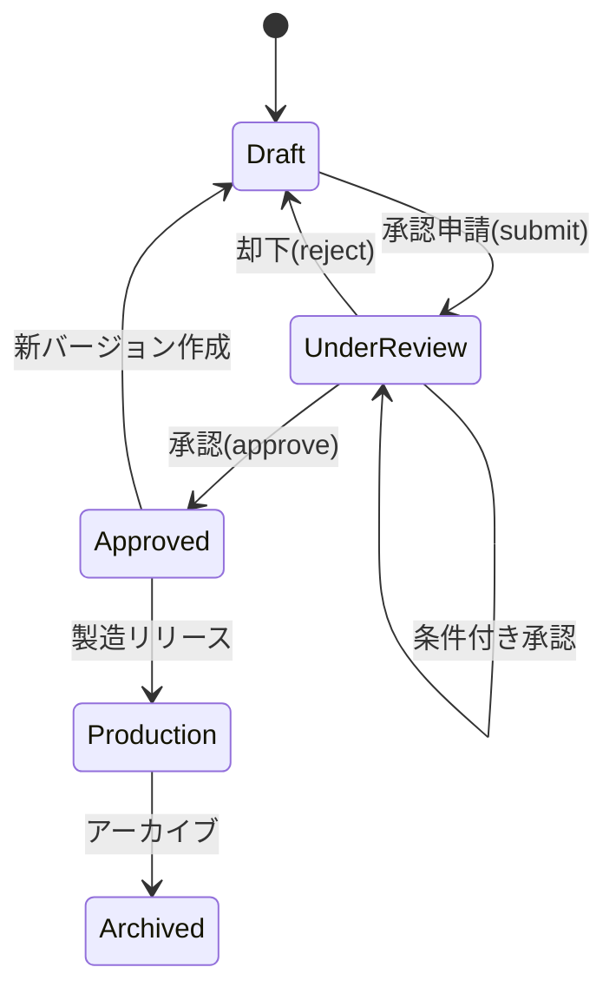

# Use Case: 処方承認 (Approve Recipe)

## 概要

| 項目 | 内容 |
|------|------|
| UC ID | BC2-UC-002 |
| 名称 | 処方承認 |
| アクター | 品質管理マネージャー、製品開発責任者 |
| トリガー | 処方の承認申請時 |
| 関連集約 | Recipe, QualityStandard |

---

## ユースケース記述

### 事前条件 (Preconditions)

1. アクターは認証済みで、処方承認権限を持つ
2. 対象処方のステータスが「UnderReview」
3. 品質基準（QualityStandard）が定義済み
4. 官能評価が完了している（推奨）

### 事後条件 (Postconditions)

**承認の場合:**
1. 処方ステータスが「Approved」に変更
2. RecipeApprovedイベントが発行される
3. VS3 BrandPortfolioへ通知（VS間イベント）
4. 処方は編集不可となる（新バージョン作成のみ可）

**却下の場合:**
1. 処方ステータスが「Draft」に戻る
2. RecipeRejectedイベントが発行される
3. 却下理由が記録される

### 基本フロー (Main Flow)

1. **開始**: 承認者が承認待ちリストから処方を選択
2. **処方内容確認**:
   - 基本情報（製品名、コンセプト）
   - 原料構成（配合比率、サプライヤー）
   - 製造仕様（発酵条件、熟成条件）
   - 目標風味プロファイル
3. **品質基準確認**:
   - 理化学規格（アルコール度数、苦味価等）
   - 官能規格（目標スコア、許容範囲）
   - 微生物規格
   - 賞味期限規格
4. **官能評価結果確認**:
   - 評価スコア
   - パネル一致度
   - 目標との乖離
5. **承認判断**:
   - 承認条件の充足確認
   - 承認/却下/条件付き承認の選択
6. **承認実行**:
   - 承認コメント入力（任意）
   - デジタル署名
7. **完了**: 承認完了通知を関係者に送信

### 代替フロー (Alternative Flows)

**A1: 条件付き承認**
- ステップ5で「条件付き承認」を選択
- 条件内容を入力（例：「官能評価の再実施後に本承認」）
- ステータスは「UnderReview」のまま、条件をフラグ

**A2: 差し戻し**
- ステップ5で「差し戻し」を選択
- 修正依頼内容を入力
- ステータスを「Draft」に戻す
- 申請者に修正依頼通知

**A3: エスカレーション**
- 承認者の権限を超える場合
- 上位承認者へエスカレーション
- 承認チェーンを継続

### 例外フロー (Exception Flows)

**E1: 品質基準未定義**
- 対象処方に品質基準が紐付いていない場合
- エラーメッセージ：「品質基準が定義されていません」
- 品質基準定義画面へのリンク表示

**E2: 官能評価未完了**
- 官能評価が一度も完了していない場合
- 警告：「官能評価が未完了です」
- 承認を続行するか確認（強制承認可能）

**E3: 承認権限不足**
- 特定製品タイプに対する承認権限がない場合
- エラーメッセージと適切な承認者へのルーティング

---

## ビジネスルール

| BR ID | ルール | 検証タイミング |
|-------|--------|----------------|
| BR-110 | 承認にはQualityStandard定義が必須 | 承認実行時 |
| BR-111 | 承認者は申請者と異なる必要がある | 承認実行時 |
| BR-112 | Production処方は上位承認者の承認が必要 | 承認実行時 |
| BR-113 | 承認済み処方は変更不可 | 更新試行時 |
| BR-114 | 却下時は理由記載必須 | 却下実行時 |
| BR-115 | 承認履歴は完全に保持 | 常時 |

---

## 承認ワークフロー



---

## データ要件

### 入力データ

```yaml
ApproveRecipeInput:
  recipeId: uuid (required)
  decision: enum [Approve, Reject, ConditionalApprove] (required)
  comment: string (optional for Approve, required for Reject)
  conditions: array<string> (required for ConditionalApprove)
  digitalSignature: SignatureData (required)
```

### 出力データ

```yaml
ApproveRecipeOutput:
  recipeId: uuid
  recipeCode: string
  status: RecipeStatus
  approvedBy: UserId
  approvedAt: datetime
  comment: string
  notifiedParties: array<string>
```

---

## 非機能要件

| 項目 | 要件 |
|------|------|
| 応答時間 | 承認処理: 2秒以内 |
| 監査ログ | 全承認操作を完全記録（改ざん防止） |
| 通知 | 承認完了後30秒以内に関係者通知 |
| 署名 | デジタル署名による否認防止 |

---

## 関連API

- GET `/recipes/{recipeId}` - 処方詳細取得
- GET `/recipes/{recipeId}/quality-standard` - 品質基準取得
- GET `/recipes/{recipeId}/sensory-evaluations` - 官能評価結果取得
- POST `/recipes/{recipeId}/approve` - 承認実行
- POST `/recipes/{recipeId}/reject` - 却下実行

---

## 関連ドメインイベント

| イベント | 発行タイミング | 購読者 |
|----------|----------------|--------|
| RecipeApproved | 承認成功時 | BC3 BrandPortfolio, BC5 ProductInnovation |
| RecipeRejected | 却下時 | 申請者への通知システム |
| ProductApproved | 全品質基準クリア時 | BC3 BrandPortfolio |

---

## 承認権限マトリクス

| 製品タイプ | 必要権限レベル | 承認者ロール |
|-----------|---------------|--------------|
| Beer | Level 2 | 製品開発責任者 |
| LowMaltBeer | Level 2 | 製品開発責任者 |
| NonAlcohol | Level 1 | 品質管理マネージャー |
| RTD | Level 1 | 品質管理マネージャー |
| Spirits | Level 3 | 事業部長 |

---

**作成日**: 2025-11-28
**VS/BC**: VS2/BC2 Product Recipe
