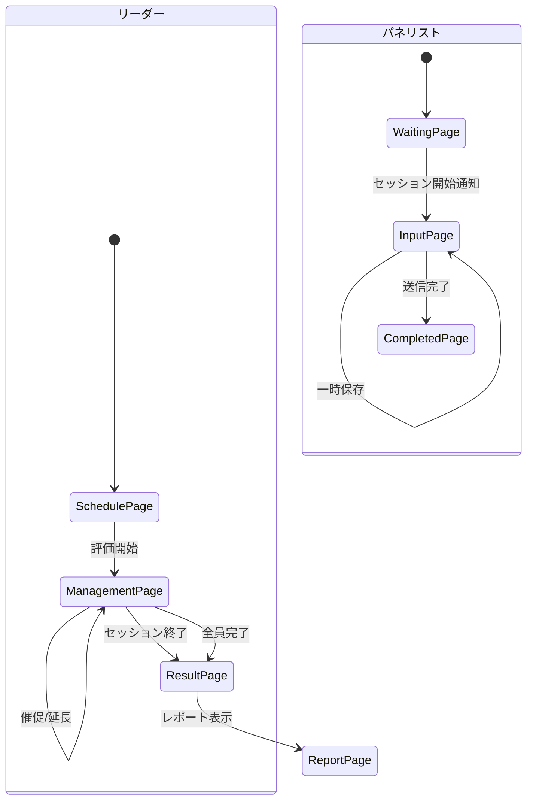

# Page Definition: 官能評価実施画面

## 概要

| 項目 | 内容 |
|------|------|
| ページID | BC2-PG-003 |
| 名称 | 官能評価実施 |
| URL | /product-development/sensory-evaluations/{evaluationId} |
| 関連UC | BC2-UC-003 |

---

## 画面構成（リーダー向け管理画面）

```
┌─────────────────────────────────────────────────────────────────────┐
│ [ヘッダー] 官能評価セッション管理                                   │
│ 評価ID: SE-2024-0089 / Super Dry 新処方                            │
├─────────────────────────────────────────────────────────────────────┤
│ ステータス: 評価中  開始: 14:00  経過: 23分                         │
├─────────────────────────────────────────────────────────────────────┤
│                                                                     │
│  ┌─────────────────────────────────────────────────────────────┐   │
│  │ パネリスト進捗状況                              5/7名 完了  │   │
│  │                                                               │   │
│  │ ┌─────────┬────────────────────────────────┬──────┬───────┐ │   │
│  │ │ パネリスト │ 進捗                          │状態  │ 操作  │ │   │
│  │ ├─────────┼────────────────────────────────┼──────┼───────┤ │   │
│  │ │ 田中一郎 │ [████████████████████] 100%  │完了  │ [詳細]│ │   │
│  │ │ 佐藤二郎 │ [████████████████████] 100%  │完了  │ [詳細]│ │   │
│  │ │ 鈴木三子 │ [████████████████████] 100%  │完了  │ [詳細]│ │   │
│  │ │ 高橋四郎 │ [████████████████████] 100%  │完了  │ [詳細]│ │   │
│  │ │ 伊藤五子 │ [████████████████████] 100%  │完了  │ [詳細]│ │   │
│  │ │ 渡辺六郎 │ [████████████░░░░░░░░] 60%   │入力中│ [催促]│ │   │
│  │ │ 山本七子 │ [████░░░░░░░░░░░░░░░░] 20%   │入力中│ [催促]│ │   │
│  │ └─────────┴────────────────────────────────┴──────┴───────┘ │   │
│  └─────────────────────────────────────────────────────────────┘   │
│                                                                     │
│  ┌─────────────────────────────────────────────────────────────┐   │
│  │ リアルタイム集計（暫定）                                     │   │
│  │                                                               │   │
│  │ 総合スコア: 7.6 (±0.8)   パネル一致度: Medium               │   │
│  │                                                               │   │
│  │ 属性別平均スコア:                                            │   │
│  │ 外観     [████████░░] 8.2                                   │   │
│  │ 香り     [███████░░░] 7.4                                   │   │
│  │ 味       [███████░░░] 7.8                                   │   │
│  │ 口当たり [████████░░] 7.6                                   │   │
│  │ 後味     [███████░░░] 7.2                                   │   │
│  │ バランス [████████░░] 7.8                                   │   │
│  │                                                               │   │
│  │ ⚠ 「香り」で意見が分かれています (σ=1.2)                    │   │
│  └─────────────────────────────────────────────────────────────┘   │
│                                                                     │
│           [全員に催促]  [時間延長]  [セッション終了]               │
└─────────────────────────────────────────────────────────────────────┘
```

---

## 画面構成（パネリスト向け入力画面）

```
┌─────────────────────────────────────────────────────────────────────┐
│ [ヘッダー] 官能評価入力                          残り時間: 12:34   │
│ サンプル: #A03                                                      │
├─────────────────────────────────────────────────────────────────────┤
│ 進捗: [████████████░░░░░░░░] 60% (9/15項目)                        │
├─────────────────────────────────────────────────────────────────────┤
│                                                                     │
│  ┌─ 外観 ─────────────────────────────────────────────────────┐    │
│  │                                                             │    │
│  │ 色調                                                       │    │
│  │ 非常に悪い ○──○──○──○──●──○──○──○──○──○ 非常に良い         │    │
│  │            1   2   3   4   5   6   7   8   9  10           │    │
│  │                                                             │    │
│  │ 透明度                                                     │    │
│  │ 非常に悪い ○──○──○──○──○──○──●──○──○──○ 非常に良い         │    │
│  │            1   2   3   4   5   6   7   8   9  10           │    │
│  │                                                             │    │
│  │ 泡立ち・泡持ち                                             │    │
│  │ 非常に悪い ○──○──○──○──○──○──○──●──○──○ 非常に良い         │    │
│  │            1   2   3   4   5   6   7   8   9  10           │    │
│  └─────────────────────────────────────────────────────────────┘    │
│                                                                     │
│  ┌─ 香り ─────────────────────────────────────────────────────┐    │
│  │                                                             │    │
│  │ ホップ香                                                   │    │
│  │ 非常に弱い ○──○──○──○──○──●──○──○──○──○ 非常に強い         │    │
│  │            1   2   3   4   5   6   7   8   9  10           │    │
│  │                                                             │    │
│  │ ... (続く)                                                 │    │
│  └─────────────────────────────────────────────────────────────┘    │
│                                                                     │
│  ┌─ コメント ─────────────────────────────────────────────────┐    │
│  │ [________________________________________________________] │    │
│  │ [________________________________________________________] │    │
│  └─────────────────────────────────────────────────────────────┘    │
│                                                                     │
│                          [一時保存]  [評価を送信]                   │
└─────────────────────────────────────────────────────────────────────┘
```

---

## UI要素定義

### リーダー管理画面

| 要素ID | 種類 | ラベル |
|--------|------|--------|
| panelistProgress | ProgressTable | パネリスト進捗 |
| nudgeButton | Button | 催促 |
| viewDetailButton | LinkButton | 詳細 |
| realtimeSummary | Panel | リアルタイム集計 |
| attributeScores | BarChart | 属性別スコア |
| consensusWarnings | AlertList | 一致度警告 |
| nudgeAllButton | Button | 全員に催促 |
| extendTimeButton | Button | 時間延長 |
| endSessionButton | PrimaryButton | セッション終了 |

### パネリスト入力画面

| 要素ID | 種類 | ラベル | 必須 | バリデーション |
|--------|------|--------|------|----------------|
| remainingTime | Timer | 残り時間 | - | - |
| progressBar | ProgressBar | 入力進捗 | - | - |
| scoreSlider | Slider | スコア入力 | Yes | 1.0-10.0, 0.5刻み |
| commentInput | TextArea | コメント | No | 0-500文字 |
| saveButton | SecondaryButton | 一時保存 | - | - |
| submitButton | PrimaryButton | 評価を送信 | - | 全項目入力時 |

---

## 評価項目構成

```typescript
const evaluationSections = [
  {
    id: 'appearance',
    name: '外観',
    attributes: [
      { id: 'color', name: '色調', anchorLow: '非常に悪い', anchorHigh: '非常に良い' },
      { id: 'clarity', name: '透明度', anchorLow: '非常に悪い', anchorHigh: '非常に良い' },
      { id: 'foam', name: '泡立ち・泡持ち', anchorLow: '非常に悪い', anchorHigh: '非常に良い' }
    ]
  },
  {
    id: 'aroma',
    name: '香り',
    attributes: [
      { id: 'hopAroma', name: 'ホップ香', anchorLow: '非常に弱い', anchorHigh: '非常に強い' },
      { id: 'maltAroma', name: 'モルト香', anchorLow: '非常に弱い', anchorHigh: '非常に強い' },
      { id: 'ester', name: 'エステル香', anchorLow: '非常に弱い', anchorHigh: '非常に強い' },
      { id: 'offFlavor', name: 'オフフレーバー', anchorLow: 'なし', anchorHigh: '非常に強い' }
    ]
  },
  {
    id: 'taste',
    name: '味',
    attributes: [
      { id: 'bitterness', name: '苦味', anchorLow: '非常に弱い', anchorHigh: '非常に強い' },
      { id: 'sweetness', name: '甘味', anchorLow: '非常に弱い', anchorHigh: '非常に強い' },
      { id: 'acidity', name: '酸味', anchorLow: '非常に弱い', anchorHigh: '非常に強い' },
      { id: 'umami', name: 'うま味', anchorLow: '非常に弱い', anchorHigh: '非常に強い' }
    ]
  },
  // ... 続く
];
```

---

## 画面遷移



---

## イベント定義

### リーダー画面

| イベント | トリガー | アクション |
|----------|----------|------------|
| onSessionStart | 開始ボタン | WebSocket接続、リアルタイム同期開始 |
| onProgressUpdate | パネリスト入力 | 進捗表示更新、暫定集計更新 |
| onNudgePanelist | 催促クリック | プッシュ通知送信 |
| onExtendTime | 時間延長クリック | タイムリミット更新 |
| onEndSession | 終了クリック | 集計確定、結果画面遷移 |

### パネリスト画面

| イベント | トリガー | アクション |
|----------|----------|------------|
| onScoreChange | スライダー変更 | ローカル保存、進捗更新 |
| onAutoSave | 30秒経過 | サーバーに一時保存 |
| onSubmit | 送信クリック | バリデーション、スコア送信 |
| onTimeWarning | 残り5分 | 警告表示 |
| onTimeUp | タイムアウト | 自動送信 or 警告 |

---

## API連携

### スコア送信（パネリスト）

```typescript
// POST /sensory-evaluations/{evaluationId}/scores
const submitScore = async (evaluationId: string, scores: ScoreInput) => {
  const response = await fetch(
    `/api/v1/sensory-evaluations/${evaluationId}/scores`,
    {
      method: 'POST',
      headers: {
        'Content-Type': 'application/json',
        'Authorization': `Bearer ${token}`
      },
      body: JSON.stringify({
        panelistId: currentUser.panelistId,
        scores: scores.attributeScores,
        comments: scores.comments
      })
    }
  );
  return response.json();
};
```

### リアルタイム進捗（WebSocket）

```typescript
// WebSocket接続
const connectToSession = (evaluationId: string) => {
  const ws = new WebSocket(
    `wss://api.asahi-pd.internal/ws/sensory-evaluations/${evaluationId}`
  );

  ws.onmessage = (event) => {
    const data = JSON.parse(event.data);
    switch (data.type) {
      case 'PROGRESS_UPDATE':
        updatePanelistProgress(data.progress);
        break;
      case 'SCORE_SUBMITTED':
        updateRealtimeSummary(data.summary);
        break;
      case 'TIME_EXTENDED':
        updateRemainingTime(data.newEndTime);
        break;
    }
  };
};
```

---

## レスポンシブ対応

```typescript
// タブレット最適化（パネリスト入力）
const mobileStyles = {
  scoreSlider: {
    height: '48px',  // タッチ操作に最適化
    touchAction: 'none'
  },
  submitButton: {
    position: 'fixed',
    bottom: '16px',
    width: 'calc(100% - 32px)'
  }
};
```

---

## オフライン対応

```typescript
// Service Worker でオフライン対応
const cacheScores = async (scores: ScoreInput) => {
  const cache = await caches.open('sensory-scores');
  await cache.put(
    `/offline-scores/${evaluationId}`,
    new Response(JSON.stringify(scores))
  );
};

// オンライン復帰時に同期
const syncOfflineScores = async () => {
  const cache = await caches.open('sensory-scores');
  const keys = await cache.keys();
  for (const request of keys) {
    const response = await cache.match(request);
    const scores = await response.json();
    await submitScore(scores.evaluationId, scores);
    await cache.delete(request);
  }
};
```

---

## エラー表示

| エラーコード | メッセージ | 表示方法 |
|--------------|------------|----------|
| SESSION_NOT_STARTED | 評価セッションがまだ開始されていません | ページ全体 |
| ALL_SCORES_REQUIRED | すべての項目を評価してください | トースト |
| SUBMISSION_FAILED | 送信に失敗しました。再試行してください | トースト |
| TIME_EXPIRED | 評価時間が終了しました | モーダル |

---

**作成日**: 2025-11-28
**VS/BC**: VS2/BC2 Product Recipe
