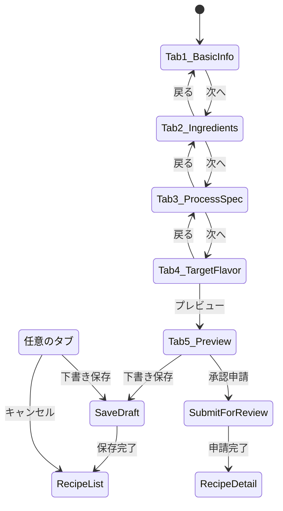

# Page Definition: 処方作成画面

## 概要

| 項目 | 内容 |
|------|------|
| ページID | BC2-PG-001 |
| 名称 | 処方作成 |
| URL | /product-development/recipes/new |
| 関連UC | BC2-UC-001 |

---

## 画面構成

```
┌─────────────────────────────────────────────────────────────────────┐
│ [ヘッダー] 新規処方作成                      [下書き保存] [キャンセル]│
├─────────────────────────────────────────────────────────────────────┤
│ タブ: [基本情報] [原料構成] [製造仕様] [目標風味] [プレビュー]      │
├─────────────────────────────────────────────────────────────────────┤
│                                                                     │
│  ┌─────────────────────────────────────────────────────────────┐   │
│  │ [タブ1: 基本情報]                                            │   │
│  │                                                               │   │
│  │ 製品名 *         [________________________________]          │   │
│  │                                                               │   │
│  │ 製品タイプ *     [Beer ▼]                                    │   │
│  │                                                               │   │
│  │ ─────────────────────────────────────────────────────────    │   │
│  │ 製品コンセプト                                               │   │
│  │                                                               │   │
│  │ 製品説明 *       [________________________________]          │   │
│  │                  [________________________________]          │   │
│  │                                                               │   │
│  │ ターゲット *     [________________________________]          │   │
│  │                                                               │   │
│  │ ポジショニング   [________________________________]          │   │
│  │                                                               │   │
│  │ 主要特徴         [+ 特徴を追加]                              │   │
│  │                  ├ キレのある辛口               [×]          │   │
│  │                  └ 爽快な飲みごたえ             [×]          │   │
│  │                                                               │   │
│  │ ブランド紐付け   [ブランドを選択... ▼]                       │   │
│  │                                                               │   │
│  └─────────────────────────────────────────────────────────────┘   │
│                                                                     │
│                                              [戻る] [次へ: 原料構成] │
└─────────────────────────────────────────────────────────────────────┘
```

---

## タブ別画面構成

### タブ2: 原料構成

```
┌─────────────────────────────────────────────────────────────────────┐
│ 原料構成                                    配合比率合計: 100.0%   │
├─────────────────────────────────────────────────────────────────────┤
│                                                                     │
│  ┌────────────┬───────────────────────┬────────┬─────────────────┐ │
│  │ 原料タイプ │ 原料名                │ 配合率 │ 操作           │ │
│  ├────────────┼───────────────────────┼────────┼─────────────────┤ │
│  │ Malt       │ ピルスナーモルト      │ 85.0%  │ [編集][削除]   │ │
│  │ Malt       │ カラメルモルト        │ 5.0%   │ [編集][削除]   │ │
│  │ Adjunct    │ コーンスターチ        │ 8.0%   │ [編集][削除]   │ │
│  │ Water      │ 仕込み水             │ 2.0%   │ [編集][削除]   │ │
│  └────────────┴───────────────────────┴────────┴─────────────────┘ │
│                                                                     │
│  [+ 原料を追加]                                                     │
│                                                                     │
│  ホップ添加                                                         │
│  ┌─────────────────────────────────────────────────────────────┐   │
│  │ ホップ品種      │ 添加量  │ 添加時間    │ 目的          │     │
│  ├─────────────────┼─────────┼─────────────┼───────────────┤     │
│  │ ザーツ          │ 15g/hL │ 煮沸開始時  │ Bittering     │     │
│  │ ハラタウ        │ 8g/hL  │ 残り15分    │ Aroma         │     │
│  └─────────────────────────────────────────────────────────────┘   │
│                                                                     │
│  [+ ホップを追加]                                                   │
│                                                                     │
└─────────────────────────────────────────────────────────────────────┘
```

### タブ3: 製造仕様

```
┌─────────────────────────────────────────────────────────────────────┐
│ 製造仕様                                                           │
├─────────────────────────────────────────────────────────────────────┤
│                                                                     │
│  ┌─ 糖化仕様 ─────────────────────────────────────────────────┐    │
│  │ マッシュイン温度   [52] °C                                 │    │
│  │ 仕込水比           [3.0] L/kg                              │    │
│  │                                                             │    │
│  │ 糖化ステップ:                                               │    │
│  │ [1] プロテインレスト  52°C × 20分  [編集][削除]            │    │
│  │ [2] 糖化休止          65°C × 45分  [編集][削除]            │    │
│  │ [3] マッシュアウト    78°C × 10分  [編集][削除]            │    │
│  │ [+ ステップ追加]                                           │    │
│  └─────────────────────────────────────────────────────────────┘    │
│                                                                     │
│  ┌─ 煮沸仕様 ─────────────────────────────────────────────────┐    │
│  │ 煮沸時間           [60] 分                                 │    │
│  │ 蒸発率             [8] %                                   │    │
│  └─────────────────────────────────────────────────────────────┘    │
│                                                                     │
│  ┌─ 発酵仕様 ─────────────────────────────────────────────────┐    │
│  │ 酵母株 *           [ASH-2024-0042 Asahi-A1 ▼] [詳細]      │    │
│  │ 接種量             [1.0E7] cells/mL                        │    │
│  │ 発酵温度           [12] °C                                 │    │
│  │ 発酵期間           [7] 日                                  │    │
│  │ 目標発酵度         [82] %                                  │    │
│  │                                                             │    │
│  │ ⓘ 選択酵母の推奨条件: 10-15°C, 発酵度75-85%                │    │
│  └─────────────────────────────────────────────────────────────┘    │
│                                                                     │
│  ┌─ 熟成仕様 ─────────────────────────────────────────────────┐    │
│  │ 熟成温度           [0] °C                                  │    │
│  │ 熟成期間           [14] 日                                 │    │
│  └─────────────────────────────────────────────────────────────┘    │
│                                                                     │
└─────────────────────────────────────────────────────────────────────┘
```

---

## UI要素定義

### タブ1: 基本情報

| 要素ID | 種類 | ラベル | 必須 | バリデーション |
|--------|------|--------|------|----------------|
| name | TextInput | 製品名 | Yes | 1-200文字 |
| productType | Select | 製品タイプ | Yes | 選択必須 |
| description | TextArea | 製品説明 | Yes | 1-1000文字 |
| targetConsumer | TextInput | ターゲット | Yes | 1-200文字 |
| positioning | TextInput | ポジショニング | No | 0-200文字 |
| keyFeatures | TagInput | 主要特徴 | No | 最大10個 |
| brandId | SearchSelect | ブランド | No | 有効なブランドID |

### タブ2: 原料構成

| 要素ID | 種類 | ラベル | 必須 | バリデーション |
|--------|------|--------|------|----------------|
| ingredients | EditableTable | 原料一覧 | Yes | 最低1件 |
| ingredientType | Select | 原料タイプ | Yes | 選択必須 |
| ingredientName | TextInput | 原料名 | Yes | 1-100文字 |
| ratio | NumberInput | 配合率 | Yes | 0-100%, 合計100% |
| hopAdditions | EditableTable | ホップ添加 | No | - |

### タブ3: 製造仕様

| 要素ID | 種類 | ラベル | 必須 | バリデーション |
|--------|------|--------|------|----------------|
| mashInTemperature | NumberInput | マッシュイン温度 | Conditional | 20-80°C |
| mashSteps | DynamicList | 糖化ステップ | Conditional | 最低1件 |
| boilDuration | NumberInput | 煮沸時間 | Yes | 0-180分 |
| yeastStrainId | SearchSelect | 酵母株 | Yes | 有効な株ID |
| pitchRate | ScientificInput | 接種量 | Yes | 1E6-1E9 |
| fermentationTemperature | NumberInput | 発酵温度 | Yes | -5〜30°C |
| fermentationDuration | NumberInput | 発酵期間 | Yes | 1-90日 |
| attenuationTarget | NumberInput | 目標発酵度 | No | 0-100% |

---

## 画面遷移



---

## イベント定義

| イベント | トリガー | アクション |
|----------|----------|------------|
| onProductTypeChange | 製品タイプ変更 | 原料・仕様フォームの条件表示切替 |
| onIngredientAdd | 原料追加クリック | 原料入力行を追加 |
| onRatioChange | 配合率変更 | 合計値を再計算、100%超過時に警告 |
| onYeastStrainSelect | 酵母株選択 | 推奨条件を表示、発酵仕様にプリセット |
| onAutoSave | 5分経過 | 現在のドラフトを自動保存 |
| onSaveDraft | 下書き保存クリック | バリデーション、API呼び出し |
| onTabChange | タブ切替 | 入力内容のローカル保存 |

---

## 原料追加モーダル

```
┌─────────────────────────────────────────────────┐
│ 原料を追加                               [×]   │
├─────────────────────────────────────────────────┤
│                                                 │
│ 原料タイプ *    [Malt ▼]                       │
│                                                 │
│ 原料名 *        [________________________]     │
│                                                 │
│ 配合比率 *      [___] %                        │
│                                                 │
│ ───────────────────────────────────────────    │
│ スペック詳細（任意）                           │
│                                                 │
│ グレード        [________________________]     │
│ 産地            [________________________]     │
│ サプライヤー    [選択... ▼]                    │
│                                                 │
│                      [キャンセル] [追加する]   │
└─────────────────────────────────────────────────┘
```

---

## API連携

### 処方作成

```typescript
// POST /recipes
const createRecipe = async (input: CreateRecipeInput) => {
  const response = await fetch('/api/v1/recipes', {
    method: 'POST',
    headers: {
      'Content-Type': 'application/json',
      'Authorization': `Bearer ${token}`
    },
    body: JSON.stringify(input)
  });

  if (response.status === 201) {
    return response.json();
  }
  throw new ApiError(await response.json());
};
```

### 酵母株検索（BC1連携）

```typescript
// GET /vs1/yeast-strains?status=validated,production
const searchYeastStrains = async (query: string) => {
  const response = await fetch(
    `/api/v1/vs1/yeast-strains?keyword=${query}&status=validated,production`
  );
  return response.json();
};
```

### 自動保存

```typescript
// PUT /recipes/{recipeId}/draft
const autoSaveDraft = async (recipeId: string, data: RecipeData) => {
  await fetch(`/api/v1/recipes/${recipeId}/draft`, {
    method: 'PUT',
    headers: { 'Content-Type': 'application/json' },
    body: JSON.stringify(data)
  });
};
```

---

## バリデーションルール

```typescript
const validationRules = {
  tab1: {
    name: { required: true, maxLength: 200 },
    productType: { required: true },
    description: { required: true, maxLength: 1000 },
    targetConsumer: { required: true, maxLength: 200 }
  },
  tab2: {
    ingredients: {
      required: true,
      minItems: 1,
      customRule: (items) => {
        const total = items.reduce((sum, i) => sum + i.ratio, 0);
        return Math.abs(total - 100) < 0.01; // 100%チェック
      }
    }
  },
  tab3: {
    yeastStrainId: { required: true },
    pitchRate: { required: true, min: 1e6, max: 1e9 },
    fermentationTemperature: { required: true, min: -5, max: 30 },
    fermentationDuration: { required: true, min: 1, max: 90 }
  }
};
```

---

## エラー表示

| エラーコード | メッセージ | 表示方法 |
|--------------|------------|----------|
| RATIO_NOT_100 | 配合比率の合計が100%ではありません | タブ2上部に警告バナー |
| YEAST_INVALID | 選択された酵母株は使用できません | フィールド下部に赤文字 |
| DRAFT_CONFLICT | 他のユーザーが編集中です | モーダルダイアログ |
| AUTO_SAVE_FAILED | 自動保存に失敗しました | トースト通知 |

---

**作成日**: 2025-11-28
**VS/BC**: VS2/BC2 Product Recipe
