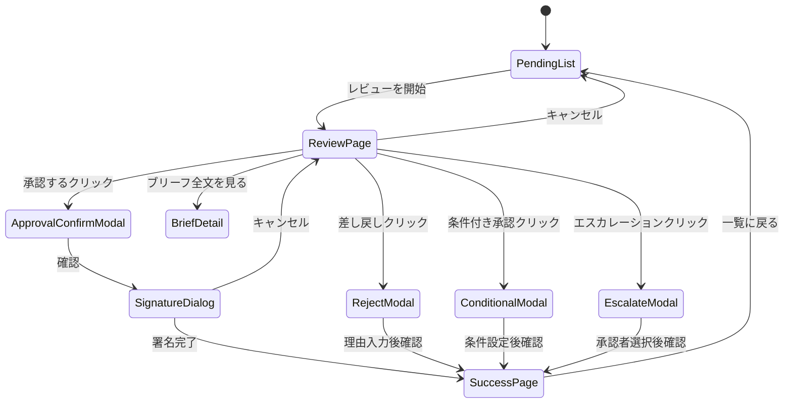

# Page Definition: キャンペーン承認画面

## 概要

| 項目 | 内容 |
|------|------|
| ページID | BC3-PG-003 |
| 名称 | キャンペーン承認 |
| URL | /brand-portfolio/campaigns/{campaignId}/review |
| 関連UC | BC3-UC-003 |

---

## 画面構成（承認待ち一覧）

```
┌─────────────────────────────────────────────────────────────────────┐
│ [ヘッダー] キャンペーン承認                                         │
├─────────────────────────────────────────────────────────────────────┤
│                                                                     │
│  承認待ち: 5件  条件付き承認: 2件  エスカレーション: 1件           │
│                                                                     │
│  ┌─────────────────────────────────────────────────────────────┐   │
│  │ 承認待ちキャンペーン                                         │   │
│  │                                                               │   │
│  │ ┌─────────────────────────────────────────────────────────┐ │   │
│  │ │ 🔴 スーパードライ 冬季キャンペーン                       │ │   │
│  │ │    ブランド: スーパードライ                              │ │   │
│  │ │    予算: ¥150M  期間: 12/1-12/31                        │ │   │
│  │ │    申請者: 田中太郎  申請日: 2024-11-20                  │ │   │
│  │ │    優先度: 高 (ローンチまで10日)                         │ │   │
│  │ │                                        [レビューを開始]  │ │   │
│  │ └─────────────────────────────────────────────────────────┘ │   │
│  │                                                               │   │
│  │ ┌─────────────────────────────────────────────────────────┐ │   │
│  │ │ 🟡 新製品発売キャンペーン                                │ │   │
│  │ │    ブランド: 本生ドラフト                                │ │   │
│  │ │    予算: ¥80M  期間: 1/15-2/28                          │ │   │
│  │ │    申請者: 佐藤花子  申請日: 2024-11-22                  │ │   │
│  │ │    優先度: 中 (ローンチまで55日)                         │ │   │
│  │ │                                        [レビューを開始]  │ │   │
│  │ └─────────────────────────────────────────────────────────┘ │   │
│  │                                                               │   │
│  │ ┌─────────────────────────────────────────────────────────┐ │   │
│  │ │ 🟢 春季ブランドリフトキャンペーン                        │ │   │
│  │ │    ブランド: アサヒビール (Master)                       │ │   │
│  │ │    予算: ¥200M  期間: 3/1-4/30                          │ │   │
│  │ │    申請者: 鈴木一郎  申請日: 2024-11-25                  │ │   │
│  │ │    優先度: 低 (ローンチまで95日)                         │ │   │
│  │ │    ⚠ 予算超過: Level 3承認必要                          │ │   │
│  │ │                                        [レビューを開始]  │ │   │
│  │ └─────────────────────────────────────────────────────────┘ │   │
│  │                                                               │   │
│  └─────────────────────────────────────────────────────────────┘   │
│                                                                     │
└─────────────────────────────────────────────────────────────────────┘
```

---

## 画面構成（承認レビュー画面）

```
┌─────────────────────────────────────────────────────────────────────┐
│ [ヘッダー] キャンペーン承認レビュー                                 │
│ CMP-ASD-202411-001 / スーパードライ 冬季キャンペーン               │
├─────────────────────────────────────────────────────────────────────┤
│ ステータス: 承認待ち  申請者: 田中太郎  申請日: 2024-11-20          │
├─────────────────────────────────────────────────────────────────────┤
│                                                                     │
│  ┌───────────────────────────────┬─────────────────────────────┐   │
│  │ キャンペーン詳細              │ 承認チェックリスト          │   │
│  │                               │                             │   │
│  │ [基本情報]                   │ ブランド適合                │   │
│  │ ブランド: スーパードライ     │ ☑ ガイドライン適合確認     │   │
│  │ 目的: Awareness              │ ☑ ロゴ・タグライン使用規定 │   │
│  │ 期間: 12/1 - 12/31 (31日間)  │                             │   │
│  │                               │ 法務・コンプライアンス     │   │
│  │ [ターゲット]                 │ ☑ 酒類広告規制対応         │   │
│  │ 25-45歳 男女                 │ ☑ 景品表示法対応           │   │
│  │ 推定リーチ: 45万人           │                             │   │
│  │                               │ 予算                       │   │
│  │ [詳細を展開...]              │ ☑ 年間予算枠内             │   │
│  │                               │ ☑ チャネル配分妥当        │   │
│  └───────────────────────────────┤                             │   │
│                                   │ スケジュール               │   │
│  ┌─────────────────────────────┐ │ ☑ タイムライン実現性       │   │
│  │ ブリーフサマリー             │ │                             │   │
│  │                               │ │ KPI                        │   │
│  │ 背景:                        │ │ ☑ 目標値の妥当性           │   │
│  │ 冬季の需要喚起と年末商戦に  │ │ ☐ 測定方法の明確性         │   │
│  │ 向けたブランド認知強化...    │ │                             │   │
│  │                               │ │ ─────────────────────────  │   │
│  │ キーメッセージ:              │ │                             │   │
│  │ 「この冬、キレで乾杯」       │ │ チェック状況: 8/9 完了     │   │
│  │                               │ │                             │   │
│  │ [ブリーフ全文を見る]         │ │                             │   │
│  └─────────────────────────────┘ └─────────────────────────────┘   │
│                                                                     │
│  ┌─────────────────────────────────────────────────────────────┐   │
│  │ 予算・KPIサマリー                                            │   │
│  │                                                               │   │
│  │ ┌────────────────────────┐  ┌────────────────────────────┐ │   │
│  │ │ 総予算: ¥150,000,000   │  │ 主要KPI                    │ │   │
│  │ │                        │  │                            │ │   │
│  │ │ TV      : ¥60M (40%)  │  │ Reach      : 5,000万人    │ │   │
│  │ │ OOH     : ¥30M (20%)  │  │ Impressions: 1.2億回      │ │   │
│  │ │ Digital : ¥40M (27%)  │  │ Brand Lift : +5pt         │ │   │
│  │ │ Social  : ¥20M (13%)  │  │ CTR        : 0.8%         │ │   │
│  │ │                        │  │                            │ │   │
│  │ │ 予備費  : ¥15M        │  │ 予測達成率 : 78%          │ │   │
│  │ └────────────────────────┘  └────────────────────────────┘ │   │
│  │                                                               │   │
│  │ ✓ 予算枠内  ✓ 配分妥当  ⚠ KPI測定方法の明確化推奨          │   │
│  └─────────────────────────────────────────────────────────────┘   │
│                                                                     │
│  ┌─────────────────────────────────────────────────────────────┐   │
│  │ 承認コメント                                                 │   │
│  │ [________________________________________________________]   │   │
│  │ [________________________________________________________]   │   │
│  └─────────────────────────────────────────────────────────────┘   │
│                                                                     │
│    [差し戻し]   [条件付き承認]   [エスカレーション]   [承認する]   │
│                                                                     │
└─────────────────────────────────────────────────────────────────────┘
```

---

## UI要素定義

### 承認待ち一覧

| 要素ID | 種類 | ラベル |
|--------|------|--------|
| pendingList | CardList | 承認待ちキャンペーン |
| priorityBadge | Badge | 優先度 |
| budgetWarning | AlertBadge | 予算警告 |
| reviewButton | PrimaryButton | レビューを開始 |
| filterStatus | TabBar | ステータスフィルター |

### キャンペーン詳細パネル

| 要素ID | 種類 | ラベル |
|--------|------|--------|
| campaignInfo | ReadOnly | キャンペーン基本情報 |
| targetSummary | ReadOnly | ターゲットサマリー |
| briefSummary | CollapsiblePanel | ブリーフサマリー |
| viewFullBrief | LinkButton | ブリーフ全文を見る |
| budgetBreakdown | PieChart | 予算内訳 |
| kpiSummary | MetricList | KPIサマリー |
| forecastRate | ProgressBar | 予測達成率 |

### 承認チェックリスト

| 要素ID | 種類 | ラベル | 自動チェック |
|--------|------|--------|--------------|
| checkGuideline | Checkbox | ガイドライン適合確認 | No |
| checkLogoUsage | Checkbox | ロゴ・タグライン使用規定 | No |
| checkAlcoholReg | Checkbox | 酒類広告規制対応 | Yes (警告) |
| checkPremiseAct | Checkbox | 景品表示法対応 | No |
| checkBudgetLimit | Checkbox | 年間予算枠内 | Yes |
| checkAllocation | Checkbox | チャネル配分妥当 | No |
| checkTimeline | Checkbox | タイムライン実現性 | Yes (警告) |
| checkKpiTarget | Checkbox | 目標値の妥当性 | No |
| checkKpiMethod | Checkbox | 測定方法の明確性 | No |
| checklistProgress | ProgressText | チェック状況 | - |

### 承認アクション

| 要素ID | 種類 | ラベル | 有効条件 |
|--------|------|--------|----------|
| commentInput | TextArea | 承認コメント | 常時 |
| returnButton | SecondaryButton | 差し戻し | 常時 |
| conditionalButton | SecondaryButton | 条件付き承認 | 常時 |
| escalateButton | SecondaryButton | エスカレーション | 常時 |
| approveButton | PrimaryButton | 承認する | チェック完了時 |

---

## 画面遷移



---

## モーダルダイアログ

### 承認確認モーダル

```
┌─────────────────────────────────────────────────┐
│ キャンペーンを承認しますか？              [×]  │
├─────────────────────────────────────────────────┤
│                                                 │
│ CMP-ASD-202411-001                             │
│ スーパードライ 冬季キャンペーン                │
│                                                 │
│ この操作により:                                │
│ • キャンペーンステータスが「承認済み」になります │
│ • クリエイティブ・メディアチームに通知されます │
│ • ローンチ準備が開始可能になります             │
│                                                 │
│ 予算: ¥150,000,000                             │
│ ローンチ日: 2024/12/01                         │
│                                                 │
│                 [キャンセル] [承認を続行]       │
└─────────────────────────────────────────────────┘
```

### デジタル署名ダイアログ

```
┌─────────────────────────────────────────────────┐
│ デジタル署名                              [×]  │
├─────────────────────────────────────────────────┤
│                                                 │
│ 承認を確定するためにパスワードを入力して       │
│ ください。                                      │
│                                                 │
│ 承認者: 鈴木花子 (マーケティング責任者)        │
│ 承認権限: Level 2 (〜¥200M)                    │
│                                                 │
│ パスワード: [********************]             │
│                                                 │
│             [キャンセル] [署名して承認]        │
└─────────────────────────────────────────────────┘
```

### 差し戻しモーダル

```
┌─────────────────────────────────────────────────┐
│ キャンペーンを差し戻し                    [×]  │
├─────────────────────────────────────────────────┤
│                                                 │
│ 差し戻し理由 *                                  │
│ [________________________________________]     │
│ [________________________________________]     │
│ [________________________________________]     │
│                                                 │
│ 修正依頼事項                                   │
│ [+ 項目を追加]                                 │
│ • KPI測定方法を明確にしてください              │
│ • クリエイティブ方向性を具体化してください     │
│                                                 │
│ 差し戻し理由は申請者に通知されます。           │
│                                                 │
│                    [キャンセル] [差し戻しを確定]│
└─────────────────────────────────────────────────┘
```

### 条件付き承認モーダル

```
┌─────────────────────────────────────────────────┐
│ 条件付き承認                              [×]  │
├─────────────────────────────────────────────────┤
│                                                 │
│ 以下の条件を満たした後、本承認となります。     │
│                                                 │
│ 承認条件 *                                      │
│ [+ 条件を追加]                                 │
│ • クリエイティブ最終確認後に本承認             │
│ • メディアプラン詳細確定後                     │
│                                                 │
│ 条件確認担当者                                 │
│ [田中太郎 (申請者) ▼]                          │
│                                                 │
│ 条件クリア期限                                 │
│ [2024/11/25 📅]                                │
│                                                 │
│ コメント                                       │
│ [________________________________________]     │
│                                                 │
│             [キャンセル] [条件付きで承認]      │
└─────────────────────────────────────────────────┘
```

### エスカレーションモーダル

```
┌─────────────────────────────────────────────────┐
│ 上位承認者へエスカレーション              [×]  │
├─────────────────────────────────────────────────┤
│                                                 │
│ 予算が承認権限を超えているため、上位承認者への │
│ エスカレーションが必要です。                   │
│                                                 │
│ 申請予算: ¥200,000,000                         │
│ あなたの権限: 〜¥150,000,000 (Level 2)         │
│ 必要権限: Level 3 以上                         │
│                                                 │
│ エスカレーション先 *                            │
│ [山田部長 (Level 3) ▼]                         │
│                                                 │
│ エスカレーション理由                           │
│ [________________________________________]     │
│                                                 │
│ あなたの推奨                                   │
│ ○ 承認を推奨  ○ 要検討  ○ 却下を推奨         │
│                                                 │
│               [キャンセル] [エスカレーション]  │
└─────────────────────────────────────────────────┘
```

---

## イベント定義

| イベント | トリガー | アクション |
|----------|----------|------------|
| onPageLoad | ページ読み込み | キャンペーン詳細、チェックリスト状態取得 |
| onChecklistChange | チェックボックス変更 | 承認ボタンの有効/無効切替 |
| onApproveClick | 承認するクリック | 確認モーダル表示 |
| onConfirmApproval | 承認確認 | 署名ダイアログ表示 |
| onSignatureSubmit | 署名送信 | API呼び出し、承認処理実行 |
| onRejectClick | 差し戻しクリック | 理由入力モーダル表示 |
| onConditionalClick | 条件付き承認クリック | 条件設定モーダル表示 |
| onEscalateClick | エスカレーションクリック | 承認者選択モーダル表示 |

---

## API連携

### キャンペーン承認

```typescript
// POST /campaigns/{campaignId}/approve
const approveCampaign = async (campaignId: string, input: ApproveInput) => {
  const response = await fetch(`/api/v1/campaigns/${campaignId}/approve`, {
    method: 'POST',
    headers: {
      'Content-Type': 'application/json',
      'Authorization': `Bearer ${token}`
    },
    body: JSON.stringify({
      comment: input.comment,
      digitalSignature: input.signature
    })
  });

  if (response.ok) {
    showSuccessToast('キャンペーンを承認しました');
    navigate('/brand-portfolio/campaigns/pending');
    return response.json();
  }
  throw new ApiError(await response.json());
};
```

### 差し戻し

```typescript
// POST /campaigns/{campaignId}/reject
const rejectCampaign = async (campaignId: string, reason: string, items: string[]) => {
  const response = await fetch(`/api/v1/campaigns/${campaignId}/reject`, {
    method: 'POST',
    headers: {
      'Content-Type': 'application/json',
      'Authorization': `Bearer ${token}`
    },
    body: JSON.stringify({ reason, revisionItems: items })
  });

  if (response.ok) {
    showSuccessToast('キャンペーンを差し戻しました');
    navigate('/brand-portfolio/campaigns/pending');
    return response.json();
  }
  throw new ApiError(await response.json());
};
```

### エスカレーション

```typescript
// POST /campaigns/{campaignId}/escalate
const escalateCampaign = async (
  campaignId: string,
  escalateTo: string,
  reason: string,
  recommendation: 'approve' | 'review' | 'reject'
) => {
  const response = await fetch(`/api/v1/campaigns/${campaignId}/escalate`, {
    method: 'POST',
    headers: {
      'Content-Type': 'application/json',
      'Authorization': `Bearer ${token}`
    },
    body: JSON.stringify({ escalateTo, reason, recommendation })
  });

  if (response.ok) {
    showSuccessToast('上位承認者へエスカレーションしました');
    navigate('/brand-portfolio/campaigns/pending');
    return response.json();
  }
  throw new ApiError(await response.json());
};
```

---

## アクセス制御

```typescript
const canApprove = (user: User, campaign: Campaign): boolean => {
  // 申請者と承認者が異なることを確認
  if (campaign.createdBy === user.id) return false;

  // 予算に応じた承認レベル確認
  const requiredLevel = getRequiredApprovalLevel(campaign.budget.totalAmount);
  return user.approvalLevel >= requiredLevel;
};

const getRequiredApprovalLevel = (budget: number): number => {
  if (budget <= 10_000_000) return 1;      // 〜¥10M
  if (budget <= 50_000_000) return 2;      // 〜¥50M
  if (budget <= 200_000_000) return 3;     // 〜¥200M
  return 4;                                  // ¥200M〜
};
```

---

## エラー表示

| エラーコード | メッセージ | 表示方法 |
|--------------|------------|----------|
| BRIEF_NOT_SET | ブリーフが設定されていません | アラートバナー |
| KPI_NOT_SET | KPIが設定されていません | アラートバナー |
| SELF_APPROVAL_NOT_ALLOWED | 自身の申請は承認できません | モーダル |
| INSUFFICIENT_LEVEL | 承認権限が不足しています（エスカレーションが必要） | モーダル |
| SIGNATURE_INVALID | 署名の検証に失敗しました | フィールドエラー |
| CAMPAIGN_ALREADY_APPROVED | このキャンペーンは既に承認済みです | モーダル |

---

**作成日**: 2025-11-28
**VS/BC**: VS3/BC3 Brand Portfolio
