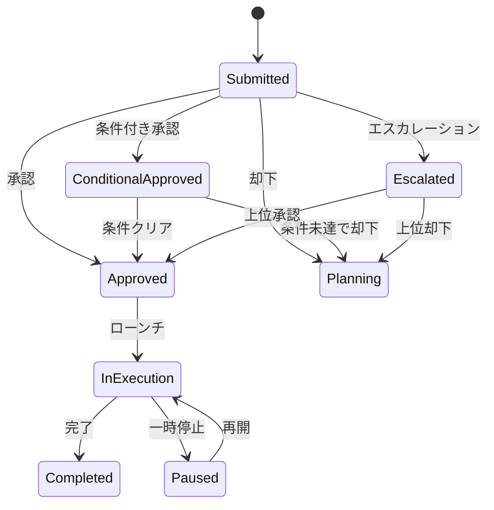

# Use Case: キャンペーン承認 (Approve Campaign)

## 概要

| 項目 | 内容 |
|------|------|
| UC ID | BC3-UC-003 |
| 名称 | キャンペーン承認 |
| アクター | マーケティング責任者、ブランドディレクター |
| トリガー | キャンペーン企画の承認申請 |
| 関連集約 | Campaign, Brand |

---

## ユースケース記述

### 事前条件 (Preconditions)

1. アクターは認証済みで、キャンペーン承認権限を持つ
2. 対象キャンペーンのステータスが「Submitted」
3. 必須項目（ブリーフ、予算、KPI）が設定済み
4. アクターは申請者と異なる

### 事後条件 (Postconditions)

**承認の場合:**
1. キャンペーンステータスが「Approved」に変更
2. CampaignApprovedイベントが発行される
3. 関連チーム（クリエイティブ、メディア）に通知
4. ローンチ準備が開始可能になる

**却下の場合:**
1. キャンペーンステータスが「Planning」に戻る
2. CampaignRejectedイベントが発行される
3. 却下理由が記録される
4. 申請者に修正依頼通知

### 基本フロー (Main Flow)

1. **開始**: 承認者が承認待ちリストからキャンペーンを選択
2. **キャンペーン概要確認**:
   - ブランド情報
   - キャンペーン名・目的
   - 期間
3. **ターゲット確認**:
   - ターゲットオーディエンス定義
   - 推定リーチ
4. **ブリーフ確認**:
   - 背景・課題
   - キーメッセージ
   - クリエイティブ方向性
   - ブランドガイドライン適合性
5. **予算確認**:
   - 総予算
   - チャネル別配分
   - 予算枠との整合性
6. **KPI確認**:
   - 目標指標と値
   - 測定方法
   - 達成可能性評価
7. **チェックリスト確認**:
   - ブランドガイドライン適合
   - 法規制対応
   - 予算承認
   - スケジュール実現性
8. **承認判断**:
   - 承認/却下/条件付き承認の選択
9. **承認実行**:
   - 承認コメント入力（任意）
   - デジタル署名
10. **完了**: 承認完了通知を関係者に送信

### 代替フロー (Alternative Flows)

**A1: 条件付き承認**
- ステップ8で「条件付き承認」を選択
- 条件内容を入力（例：「クリエイティブ確認後に最終承認」）
- ステータスは「Approved (Conditional)」
- 条件クリア後に本承認

**A2: 差し戻し**
- ステップ8で「差し戻し」を選択
- 修正依頼内容を入力
- ステータスを「Planning」に戻す
- 申請者に修正依頼通知

**A3: エスカレーション**
- 予算が承認権限を超える場合
- 上位承認者へエスカレーション
- 多段階承認チェーンを継続

**A4: 複数承認者ワークフロー**
- 大規模キャンペーンの場合
- マーケティング責任者 → 事業部長の順で承認
- 全員承認で「Approved」

### 例外フロー (Exception Flows)

**E1: 必須項目未設定**
- ブリーフまたはKPIが未設定の場合
- エラーメッセージ：「必須項目が設定されていません」
- 承認ブロック、差し戻しを促す

**E2: 予算超過**
- 申請予算が年間予算枠を超える場合
- 警告：「予算枠を超過しています」
- 上位承認者への自動エスカレーション

**E3: スケジュール不整合**
- ローンチ日が現実的でない場合
- 警告：「スケジュールの実現性を確認してください」
- 承認判断に考慮

**E4: 自己承認試行**
- 申請者と承認者が同一の場合
- エラー：「自身の申請は承認できません」
- 別の承認者を選択

---

## ビジネスルール

| BR ID | ルール | 検証タイミング |
|-------|--------|----------------|
| BR-321 | 承認にはブリーフ設定が必須 | 承認実行時 |
| BR-322 | 承認には最低1つのKPIが必須 | 承認実行時 |
| BR-323 | 承認者は申請者と異なる必要がある | 承認実行時 |
| BR-324 | 予算超過は上位承認者エスカレーション | 承認申請時 |
| BR-325 | 承認済みキャンペーンは基本情報変更不可 | 更新試行時 |
| BR-326 | 却下時は理由記載必須 | 却下実行時 |
| BR-327 | 承認履歴は完全に保持 | 常時 |

---

## 承認ワークフロー



---

## 承認権限マトリクス

| 予算規模 | 必要承認者 | 承認レベル |
|----------|-----------|------------|
| 〜¥10M | マーケティングマネージャー | Level 1 |
| ¥10M〜¥50M | マーケティング責任者 | Level 2 |
| ¥50M〜¥200M | ブランドディレクター | Level 3 |
| ¥200M〜 | CMO / 事業部長 | Level 4 |

---

## データ要件

### 入力データ

```yaml
ApproveCampaignInput:
  campaignId: uuid (required)
  decision: enum [Approve, Reject, ConditionalApprove, Escalate] (required)
  comment: string (optional for Approve, required for Reject)
  conditions: array<string> (required for ConditionalApprove)
  escalateTo: UserId (required for Escalate)
  digitalSignature: SignatureData (required for Approve)

ReviewChecklistInput:
  brandGuidelineCompliance: boolean
  regulatoryCompliance: boolean
  budgetApproval: boolean
  scheduleRealistic: boolean
  additionalNotes: string
```

### 出力データ

```yaml
ApproveCampaignOutput:
  campaignId: uuid
  campaignCode: string
  status: CampaignStatus
  approvedBy: UserId
  approvedAt: datetime
  comment: string
  conditions: array<string> (if conditional)
  nextApprover: UserId (if escalated)
  notifiedParties: array<string>
```

---

## 非機能要件

| 項目 | 要件 |
|------|------|
| 応答時間 | 承認処理: 2秒以内 |
| 監査ログ | 全承認操作を完全記録（改ざん防止） |
| 通知 | 承認完了後30秒以内に関係者通知 |
| 署名 | デジタル署名による否認防止 |
| 同時アクセス | 同一キャンペーンへの同時承認操作を防止 |

---

## 関連API

- GET `/campaigns/{campaignId}` - キャンペーン詳細取得
- GET `/campaigns/{campaignId}/review-checklist` - チェックリスト取得
- POST `/campaigns/{campaignId}/approve` - 承認実行
- POST `/campaigns/{campaignId}/reject` - 却下実行
- POST `/campaigns/{campaignId}/conditional-approve` - 条件付き承認
- POST `/campaigns/{campaignId}/escalate` - エスカレーション
- GET `/campaigns/pending-approval` - 承認待ち一覧

---

## 関連ドメインイベント

| イベント | 発行タイミング | 購読者 |
|----------|----------------|--------|
| CampaignApproved | 承認成功時 | クリエイティブチーム、メディアチーム、申請者 |
| CampaignRejected | 却下時 | 申請者、プランニングチーム |
| CampaignEscalated | エスカレーション時 | 上位承認者 |
| CampaignConditionSet | 条件付き承認時 | 申請者、条件管理者 |

---

## 承認チェックリスト項目

| カテゴリ | チェック項目 | 自動検証 |
|----------|-------------|----------|
| ブランド | ブランドガイドライン適合 | No |
| ブランド | タグライン・ロゴ使用規定 | No |
| 法務 | 酒類広告規制対応 | Yes (警告) |
| 法務 | 景品表示法対応 | No |
| 予算 | 年間予算枠内 | Yes |
| 予算 | チャネル配分の妥当性 | No |
| スケジュール | タイムライン実現性 | Yes (警告) |
| KPI | 目標値の妥当性 | No |
| KPI | 測定方法の明確性 | No |

---

**作成日**: 2025-11-28
**VS/BC**: VS3/BC3 Brand Portfolio
