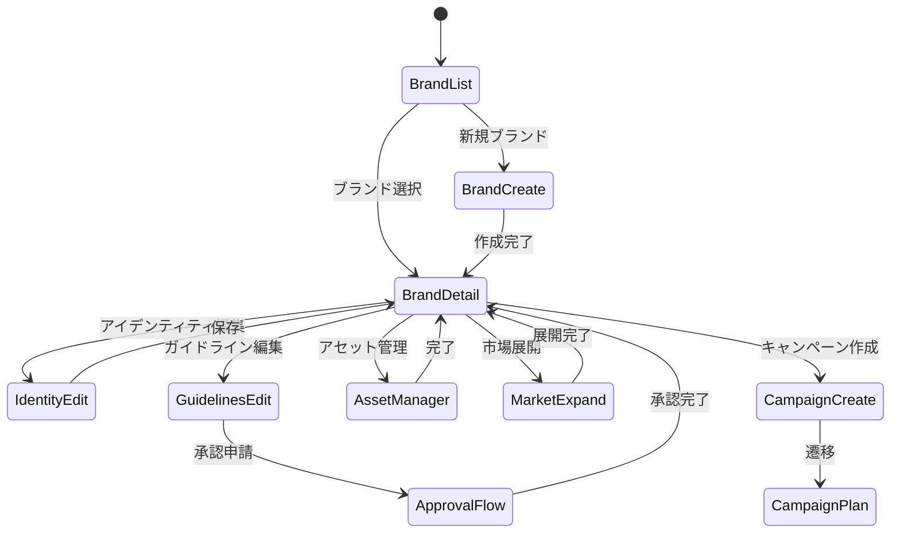

# Page Definition: ブランド管理画面

## 概要

| 項目 | 内容 |
|------|------|
| ページID | BC3-PG-001 |
| 名称 | ブランド管理 |
| URL | /brand-portfolio/brands/{brandId?} |
| 関連UC | BC3-UC-001 |

---

## 画面構成（ブランド一覧）

```
┌─────────────────────────────────────────────────────────────────────┐
│ [ヘッダー] ブランドポートフォリオ                    [+ 新規ブランド]│
├─────────────────────────────────────────────────────────────────────┤
│                                                                     │
│  フィルター: [タイプ ▼] [スコープ ▼] [ステータス ▼] [🔍 検索...]  │
│                                                                     │
│  ┌─────────────────────────────────────────────────────────────┐   │
│  │ ブランドヒエラルキービュー                         [リスト] │   │
│  │                                                               │   │
│  │  🏢 Asahi Group (Corporate)                                  │   │
│  │   ├─ 🍺 アサヒビール (Master) ────────────────── Active     │   │
│  │   │   ├─ スーパードライ (Sub) ──────────────── Active     │   │
│  │   │   │   ├─ Super Dry JP (Local:JP)                        │   │
│  │   │   │   ├─ Super Dry UK (Local:GB)                        │   │
│  │   │   │   └─ Super Dry AU (Local:AU)                        │   │
│  │   │   ├─ 本生ドラフト (Sub) ────────────────── Active     │   │
│  │   │   └─ プレミアム熟撰 (Sub) ──────────────── Sunset     │   │
│  │   │                                                          │   │
│  │   ├─ 🥤 アサヒ飲料 (Master) ─────────────────── Active     │   │
│  │   │   ├─ 三ツ矢サイダー (Sub)                               │   │
│  │   │   └─ WONDA (Sub)                                        │   │
│  │   │                                                          │   │
│  │   └─ 🍶 ニッカウヰスキー (Endorsed) ─────────── Active     │   │
│  │                                                               │   │
│  └─────────────────────────────────────────────────────────────┘   │
│                                                                     │
│  ┌─────────────────────────────────────────────────────────────┐   │
│  │ ポートフォリオサマリー                                       │   │
│  │                                                               │   │
│  │ グローバル: 12  リージョナル: 8  ローカル: 45               │   │
│  │ アクティブ: 58  サンセット: 4  アーカイブ: 3                │   │
│  └─────────────────────────────────────────────────────────────┘   │
│                                                                     │
└─────────────────────────────────────────────────────────────────────┘
```

---

## 画面構成（ブランド詳細・編集）

```
┌─────────────────────────────────────────────────────────────────────┐
│ [ヘッダー] スーパードライ                      [編集] [市場展開]    │
│ BRD-GLB-BEER-001 / Master Brand / Global                           │
├─────────────────────────────────────────────────────────────────────┤
│ タブ: [概要] [アイデンティティ] [ガイドライン] [アセット] [市場]   │
├─────────────────────────────────────────────────────────────────────┤
│                                                                     │
│  ┌─ [タブ: 概要] ─────────────────────────────────────────────┐    │
│  │                                                             │    │
│  │  ┌───────────────────────────┬─────────────────────────┐  │    │
│  │  │ ブランド情報              │ ヘルススコア            │  │    │
│  │  │                           │                         │  │    │
│  │  │ ステータス: [Active ✓]   │    ┌─────────────┐      │  │    │
│  │  │ タイプ: Master Brand     │    │             │      │  │    │
│  │  │ スコープ: Global         │    │     85      │      │  │    │
│  │  │ 親ブランド: Asahi Beer   │    │    /100     │      │  │    │
│  │  │                           │    └─────────────┘      │  │    │
│  │  │ 展開市場: 12市場          │                         │  │    │
│  │  │ 子ブランド: 5件           │ 認知度: 78%             │  │    │
│  │  │                           │ 好感度: 72%             │  │    │
│  │  │ 作成: 2020-04-01         │ ロイヤルティ: 65%       │  │    │
│  │  │ 更新: 2024-11-15         │                         │  │    │
│  │  └───────────────────────────┴─────────────────────────┘  │    │
│  │                                                             │    │
│  │  ┌─────────────────────────────────────────────────────┐  │    │
│  │  │ クイックアクション                                   │  │    │
│  │  │                                                       │  │    │
│  │  │ [キャンペーン作成]  [ガイドラインDL]  [アセット管理] │  │    │
│  │  └─────────────────────────────────────────────────────┘  │    │
│  │                                                             │    │
│  └─────────────────────────────────────────────────────────────┘    │
│                                                                     │
└─────────────────────────────────────────────────────────────────────┘
```

---

## タブ別画面構成

### タブ: アイデンティティ

```
┌─────────────────────────────────────────────────────────────────────┐
│ ブランドアイデンティティ                                 [編集]    │
├─────────────────────────────────────────────────────────────────────┤
│                                                                     │
│  ┌─ ミッション ───────────────────────────────────────────────┐    │
│  │ 「最高の品質と味で、お客様に感動と満足を届ける」           │    │
│  └─────────────────────────────────────────────────────────────┘    │
│                                                                     │
│  ┌─ ビジョン ─────────────────────────────────────────────────┐    │
│  │ 「日本が世界に誇るビールブランドとして、グローバルNo.1を │    │
│  │  目指す」                                                   │    │
│  └─────────────────────────────────────────────────────────────┘    │
│                                                                     │
│  ┌─ 価値観 ───────────────────────────────────────────────────┐    │
│  │ [品質第一] [革新] [誠実] [チャレンジ精神]                  │    │
│  └─────────────────────────────────────────────────────────────┘    │
│                                                                     │
│  ┌─ パーソナリティ ───────────────────────────────────────────┐    │
│  │                                                             │    │
│  │ 特性: [Innovative] [Bold] [Sophisticated]                  │    │
│  │ アーキタイプ: [Hero] [Creator]                             │    │
│  │ トーン: 自信に満ちた、洗練された、本格派                   │    │
│  └─────────────────────────────────────────────────────────────┘    │
│                                                                     │
│  ┌─ ポジショニング ───────────────────────────────────────────┐    │
│  │ 「キレのある辛口」で他ブランドとの差別化を図り、          │    │
│  │ 品質にこだわる大人の男性をメインターゲットとする           │    │
│  └─────────────────────────────────────────────────────────────┘    │
│                                                                     │
│  ┌─ タグライン ───────────────────────────────────────────────┐    │
│  │ 「辛口。それがうまい。」                                   │    │
│  └─────────────────────────────────────────────────────────────┘    │
│                                                                     │
└─────────────────────────────────────────────────────────────────────┘
```

### タブ: ガイドライン

```
┌─────────────────────────────────────────────────────────────────────┐
│ ブランドガイドライン                v2.3 (2024-11-01) [履歴] [DL]  │
├─────────────────────────────────────────────────────────────────────┤
│                                                                     │
│  ┌─ ビジュアルアイデンティティ ───────────────────────────────┐    │
│  │                                                             │    │
│  │ プライマリカラー                                           │    │
│  │ ┌─────────┬─────────┬─────────┐                           │    │
│  │ │ ■ Gold │ ■ Black │ ■ Silver│                           │    │
│  │ │ #C9A227 │ #1A1A1A │ #E8E8E8│                            │    │
│  │ └─────────┴─────────┴─────────┘                           │    │
│  │                                                             │    │
│  │ タイポグラフィ                                             │    │
│  │ 見出し: Noto Sans JP Bold                                  │    │
│  │ 本文: Noto Sans JP Regular                                 │    │
│  │ 英文: Helvetica Neue                                       │    │
│  │                                                             │    │
│  │ ロゴ使用規定                                               │    │
│  │ [ロゴプレビュー]  最小サイズ: 24px  余白: ロゴ高さの25%   │    │
│  └─────────────────────────────────────────────────────────────┘    │
│                                                                     │
│  ┌─ ボイス&トーン ────────────────────────────────────────────┐    │
│  │                                                             │    │
│  │ ボイス属性: [自信] [本格派] [洗練]                        │    │
│  │                                                             │    │
│  │ ✓ Do's                          ✗ Don'ts                  │    │
│  │ • 品質への自信を示す            • 軽薄な表現を使う        │    │
│  │ • 簡潔で力強い表現             • 過度な装飾語を使う      │    │
│  │ • 事実に基づく主張             • 競合を直接批判する      │    │
│  └─────────────────────────────────────────────────────────────┘    │
│                                                                     │
└─────────────────────────────────────────────────────────────────────┘
```

### タブ: アセット

```
┌─────────────────────────────────────────────────────────────────────┐
│ ブランドアセット                                      [+ アップロード]│
├─────────────────────────────────────────────────────────────────────┤
│                                                                     │
│  フィルター: [タイプ ▼] [用途 ▼] [フォーマット ▼]                 │
│                                                                     │
│  ┌─────────────────────────────────────────────────────────────┐   │
│  │ ロゴ (6ファイル)                                             │   │
│  │                                                               │   │
│  │ ┌─────────┐ ┌─────────┐ ┌─────────┐ ┌─────────┐           │   │
│  │ │ [Logo] │ │ [Logo] │ │ [Logo] │ │ [Logo] │           │   │
│  │ │ Primary │ │ White  │ │ Black  │ │ Minimal│           │   │
│  │ │ .ai/.png│ │ .ai/.png│ │ .ai/.png│ │ .svg   │           │   │
│  │ └─────────┘ └─────────┘ └─────────┘ └─────────┘           │   │
│  │                                      [すべて表示 →]          │   │
│  └─────────────────────────────────────────────────────────────┘   │
│                                                                     │
│  ┌─────────────────────────────────────────────────────────────┐   │
│  │ イメージ (24ファイル)                                        │   │
│  │                                                               │   │
│  │ ┌─────────┐ ┌─────────┐ ┌─────────┐ ┌─────────┐           │   │
│  │ │ [Img]  │ │ [Img]  │ │ [Img]  │ │ [Img]  │           │   │
│  │ │Product │ │Lifestyle│ │ Hero   │ │ Banner │           │   │
│  │ └─────────┘ └─────────┘ └─────────┘ └─────────┘           │   │
│  │                                      [すべて表示 →]          │   │
│  └─────────────────────────────────────────────────────────────┘   │
│                                                                     │
│  ┌─────────────────────────────────────────────────────────────┐   │
│  │ テンプレート (8ファイル)                                     │   │
│  │                                                               │   │
│  │ • PowerPointテンプレート.pptx                               │   │
│  │ • 広告バナーテンプレート.psd                                │   │
│  │ • SNS投稿テンプレート.ai                                    │   │
│  │                                      [すべて表示 →]          │   │
│  └─────────────────────────────────────────────────────────────┘   │
│                                                                     │
└─────────────────────────────────────────────────────────────────────┘
```

---

## UI要素定義

### ブランド一覧

| 要素ID | 種類 | ラベル |
|--------|------|--------|
| brandHierarchy | TreeView | ブランドヒエラルキー |
| filterType | Select | タイプフィルター |
| filterScope | Select | スコープフィルター |
| filterStatus | Select | ステータスフィルター |
| searchInput | SearchInput | ブランド検索 |
| newBrandButton | PrimaryButton | 新規ブランド |
| portfolioSummary | StatPanel | ポートフォリオサマリー |

### ブランド詳細

| 要素ID | 種類 | ラベル |
|--------|------|--------|
| brandStatus | Badge | ステータス |
| healthScore | RadialChart | ヘルススコア |
| brandMetrics | MetricList | ブランド指標 |
| editButton | SecondaryButton | 編集 |
| expandMarketButton | SecondaryButton | 市場展開 |
| createCampaignButton | LinkButton | キャンペーン作成 |
| downloadGuidelinesButton | LinkButton | ガイドラインDL |

### アイデンティティ編集

| 要素ID | 種類 | ラベル | 必須 | バリデーション |
|--------|------|--------|------|----------------|
| missionInput | TextArea | ミッション | No | 0-500文字 |
| visionInput | TextArea | ビジョン | No | 0-500文字 |
| valuesInput | TagInput | 価値観 | No | 最大10個 |
| personalityTraits | MultiSelect | パーソナリティ特性 | No | - |
| archetypes | MultiSelect | アーキタイプ | No | - |
| positioningInput | TextArea | ポジショニング | No | 0-500文字 |
| taglineInput | TextInput | タグライン | No | 0-100文字 |
| storyInput | RichTextEditor | ブランドストーリー | No | 0-2000文字 |

### ガイドライン編集

| 要素ID | 種類 | ラベル | 必須 |
|--------|------|--------|------|
| primaryColors | ColorPicker | プライマリカラー | Yes |
| secondaryColors | ColorPicker | セカンダリカラー | No |
| typography | TypographyEditor | タイポグラフィ | Yes |
| logoUsage | RichTextEditor | ロゴ使用規定 | Yes |
| voiceAttributes | TagInput | ボイス属性 | No |
| dosList | ListEditor | Do's | No |
| dontsList | ListEditor | Don'ts | No |

---

## 画面遷移



---

## モーダルダイアログ

### 新規ブランド作成モーダル

```
┌─────────────────────────────────────────────────┐
│ 新規ブランド作成                          [×]  │
├─────────────────────────────────────────────────┤
│                                                 │
│ ブランド名 *        [________________________] │
│                                                 │
│ ブランドタイプ *    [Master Brand ▼]          │
│                                                 │
│ 展開スコープ *      [Global ▼]                │
│                                                 │
│ 親ブランド          [アサヒビール ▼]          │
│                      ⓘ サブブランドの場合必須   │
│                                                 │
│ ──────────────────────────────────────────     │
│                                                 │
│ ブランドコード      BRD-GLB-BEER-XXX (自動生成)│
│                                                 │
│                 [キャンセル] [作成して編集]    │
└─────────────────────────────────────────────────┘
```

### 市場展開モーダル

```
┌─────────────────────────────────────────────────┐
│ 市場展開: スーパードライ                  [×]  │
├─────────────────────────────────────────────────┤
│                                                 │
│ 展開先市場 *        [🇬🇧 イギリス ▼]           │
│                                                 │
│ ──────────────────────────────────────────     │
│ ローカライズ情報                               │
│                                                 │
│ 現地ブランド名 *    [Super Dry UK____________]│
│                                                 │
│ 現地タグライン      [The Dry Taste of Japan__]│
│                                                 │
│ 言語                [English ▼]               │
│                                                 │
│ 規制対応メモ        [________________________]│
│                      [________________________]│
│                                                 │
│                   [キャンセル] [市場展開を実行]│
└─────────────────────────────────────────────────┘
```

---

## イベント定義

| イベント | トリガー | アクション |
|----------|----------|------------|
| onBrandSelect | ブランドクリック | 詳細画面表示 |
| onCreateBrand | 新規ブランドクリック | 作成モーダル表示 |
| onSaveIdentity | アイデンティティ保存 | API呼び出し、イベント発行 |
| onSaveGuidelines | ガイドライン保存 | 承認フロー開始 |
| onAssetUpload | アセットアップロード | ファイル検証、保存 |
| onExpandMarket | 市場展開実行 | MarketPresence作成 |
| onStatusChange | ステータス変更 | バリデーション、更新 |

---

## API連携

### ブランド作成

```typescript
// POST /brands
const createBrand = async (input: CreateBrandInput) => {
  const response = await fetch('/api/v1/brands', {
    method: 'POST',
    headers: {
      'Content-Type': 'application/json',
      'Authorization': `Bearer ${token}`
    },
    body: JSON.stringify(input)
  });

  if (response.status === 201) {
    showSuccessToast('ブランドを作成しました');
    return response.json();
  }
  throw new ApiError(await response.json());
};
```

### ブランドヘルススコア取得

```typescript
// GET /brands/{brandId}/health
const getBrandHealth = async (brandId: string) => {
  const response = await fetch(`/api/v1/brands/${brandId}/health`);
  return response.json();
  // Returns: { healthScore, awareness, preference, loyalty, recommendations }
};
```

### アセットアップロード

```typescript
// POST /brands/{brandId}/assets
const uploadAsset = async (brandId: string, file: File, metadata: AssetMetadata) => {
  const formData = new FormData();
  formData.append('file', file);
  formData.append('metadata', JSON.stringify(metadata));

  const response = await fetch(`/api/v1/brands/${brandId}/assets`, {
    method: 'POST',
    headers: { 'Authorization': `Bearer ${token}` },
    body: formData
  });

  return response.json();
};
```

---

## エラー表示

| エラーコード | メッセージ | 表示方法 |
|--------------|------------|----------|
| BRAND_CODE_EXISTS | このブランドコードは既に使用されています | フィールドエラー |
| PARENT_BRAND_REQUIRED | サブブランドには親ブランドが必要です | フィールドエラー |
| PARENT_BRAND_INACTIVE | 親ブランドがアクティブではありません | モーダル |
| IDENTITY_INCOMPLETE | アイデンティティが完成していません | アラートバナー |
| ASSET_TOO_LARGE | ファイルサイズが大きすぎます (最大100MB) | トースト |
| MARKET_ALREADY_EXISTS | この市場には既に展開済みです | モーダル |

---

**作成日**: 2025-11-28
**VS/BC**: VS3/BC3 Brand Portfolio
