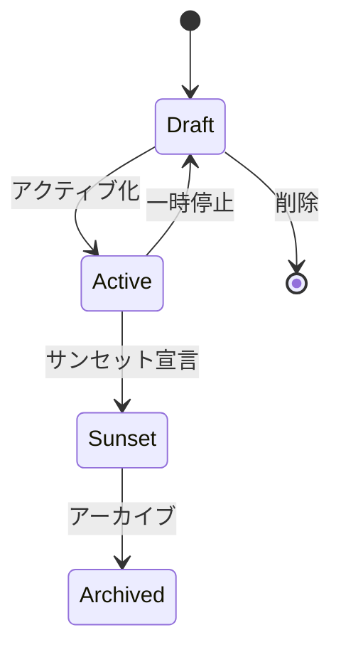

# Use Case: ブランド管理 (Manage Brand)

## 概要

| 項目 | 内容 |
|------|------|
| UC ID | BC3-UC-001 |
| 名称 | ブランド管理 |
| アクター | ブランドマネージャー、マーケティング責任者 |
| トリガー | 新規ブランド立ち上げ、ブランド戦略更新 |
| 関連集約 | Brand, MarketPresence |

---

## ユースケース記述

### 事前条件 (Preconditions)

1. アクターは認証済みで、ブランド管理権限を持つ
2. グローバルブランド作成には上位権限が必要
3. ローカルブランド作成時、親ブランドが存在する

### 事後条件 (Postconditions)

**作成の場合:**
1. 新規Brandエンティティが作成される
2. BrandCreatedイベントが発行される
3. ブランドポートフォリオに追加される

**更新の場合:**
1. ブランドアイデンティティ/ガイドラインが更新される
2. BrandIdentityUpdated/BrandGuidelinesPublishedイベントが発行される
3. 関連キャンペーンに更新通知

### 基本フロー (Main Flow)

1. **開始**: ブランドマネージャーがブランド管理画面にアクセス
2. **ブランドタイプ選択**:
   - Corporate（企業ブランド）
   - Master（マスターブランド）
   - Sub（サブブランド）
   - Product（製品ブランド）
   - Endorsed（エンドースドブランド）
3. **基本情報入力**:
   - ブランド名
   - 展開範囲（Global/Regional/Local）
   - 親ブランド（サブブランドの場合）
   - 展開市場
4. **アイデンティティ定義**:
   - ミッション
   - ビジョン
   - 価値観
   - パーソナリティ
   - ポジショニング
   - タグライン
   - ブランドストーリー
5. **ビジュアルアイデンティティ設定**:
   - プライマリカラー
   - セカンダリカラー
   - タイポグラフィ
   - ロゴ使用規定
6. **ボイス&トーン定義**:
   - ボイス属性
   - コンテキスト別トーン
   - Do's and Don'ts
7. **アセット登録**:
   - ロゴファイル（各フォーマット）
   - イメージ素材
   - テンプレート
8. **確認・保存**: 入力内容を確認して保存
9. **完了**: ブランドが登録されポートフォリオに反映

### 代替フロー (Alternative Flows)

**A1: グローバルブランドからローカルブランドを派生**
- ステップ2で「Sub」または「Endorsed」を選択
- 親ブランドのアイデンティティをベースに継承
- ローカライズ項目のみカスタマイズ

**A2: 既存ブランドの市場展開**
- ブランド詳細画面から「市場展開」を選択
- 展開先市場を選択
- ローカライズ情報（現地名称、タグライン）を入力
- MarketPresenceが作成される

**A3: ブランドガイドライン更新**
- 既存ブランドのガイドラインを選択
- 変更項目を編集
- 変更理由とバージョン番号を入力
- 承認フローを経て公開

### 例外フロー (Exception Flows)

**E1: 重複ブランドコード**
- 同一ブランドコードが存在する場合
- エラーメッセージ表示
- 別のコード提案

**E2: 親ブランドが無効**
- 親ブランドがArchived状態の場合
- エラー：「親ブランドがアクティブではありません」
- アクティブな親ブランドの選択を促す

**E3: 必須アイデンティティ未定義**
- アクティブ化時にアイデンティティが未完成
- 警告：「ブランドアイデンティティを完成させてください」
- 不足項目をハイライト表示

---

## ビジネスルール

| BR ID | ルール | 検証タイミング |
|-------|--------|----------------|
| BR-301 | brandCodeはシステム内で一意 | 作成時 |
| BR-302 | ローカルブランドは親ブランド必須 | 作成時 |
| BR-303 | グローバルブランドは親ブランド不可 | 作成時 |
| BR-304 | アクティブ化にはアイデンティティ完成必須 | ステータス変更時 |
| BR-305 | ガイドライン変更は承認制 | 更新時 |
| BR-306 | サンセットブランドは新規キャンペーン不可 | キャンペーン作成時 |

---

## ブランドステータスワークフロー



---

## データ要件

### 入力データ

```yaml
CreateBrandInput:
  name: string (required, 1-100文字)
  brandType: enum [Corporate, Master, Sub, Product, Endorsed] (required)
  scope: enum [Global, Regional, Local] (required)
  parentBrandId: uuid (required for Sub/Local)
  markets: array<MarketId> (optional)
  identity: BrandIdentityInput (optional)
  guidelines: BrandGuidelinesInput (optional)

BrandIdentityInput:
  mission: string (optional, max 500文字)
  vision: string (optional, max 500文字)
  values: array<string> (optional, max 10個)
  personality: BrandPersonalityInput (optional)
  positioning: string (optional, max 500文字)
  tagline: string (optional, max 100文字)
  storyNarrative: string (optional, max 2000文字)

BrandGuidelinesInput:
  visualIdentity: VisualIdentityInput (optional)
  voiceTone: VoiceToneInput (optional)
  usageRules: array<UsageRuleInput> (optional)
```

### 出力データ

```yaml
BrandOutput:
  brandId: uuid
  brandCode: string
  name: string
  brandType: BrandType
  scope: BrandScope
  identity: BrandIdentity
  guidelines: BrandGuidelines
  assets: array<BrandAsset>
  parentBrand: BrandSummary (optional)
  childBrands: array<BrandSummary>
  markets: array<MarketSummary>
  status: BrandStatus
  healthScore: Score
  createdAt: datetime
  updatedAt: datetime
```

---

## 非機能要件

| 項目 | 要件 |
|------|------|
| 応答時間 | ブランド作成: 2秒以内 |
| アセット容量 | 1ブランドあたり最大1GB |
| 同時編集 | 楽観的ロックで競合検出 |
| バージョン | ガイドライン変更履歴を完全保持 |
| 検索 | ブランド名・コードで全文検索対応 |

---

## 関連API

- POST `/brands` - ブランド作成
- GET `/brands/{brandId}` - ブランド詳細取得
- PUT `/brands/{brandId}` - ブランド更新
- PUT `/brands/{brandId}/identity` - アイデンティティ更新
- PUT `/brands/{brandId}/guidelines` - ガイドライン更新
- POST `/brands/{brandId}/assets` - アセット追加
- POST `/brands/{brandId}/markets` - 市場展開
- PATCH `/brands/{brandId}/status` - ステータス変更

---

## 関連ドメインイベント

| イベント | 発行タイミング | 購読者 |
|----------|----------------|--------|
| BrandCreated | ブランド作成時 | キャンペーン計画、ポートフォリオダッシュボード |
| BrandIdentityUpdated | アイデンティティ更新時 | 関連キャンペーン、ガイドライン配布 |
| BrandGuidelinesPublished | ガイドライン公開時 | アセット管理、クリエイティブチーム |
| BrandExpandedToMarket | 市場展開時 | 市場分析、ローカルチーム |

---

**作成日**: 2025-11-28
**VS/BC**: VS3/BC3 Brand Portfolio
