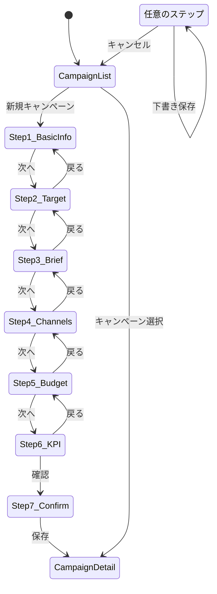

# Page Definition: キャンペーン企画画面

## 概要

| 項目 | 内容 |
|------|------|
| ページID | BC3-PG-002 |
| 名称 | キャンペーン企画 |
| URL | /brand-portfolio/campaigns/new |
| 関連UC | BC3-UC-002 |

---

## 画面構成（キャンペーン一覧）

```
┌─────────────────────────────────────────────────────────────────────┐
│ [ヘッダー] キャンペーン管理                       [+ 新規キャンペーン]│
├─────────────────────────────────────────────────────────────────────┤
│                                                                     │
│  ビュー: [カレンダー] [リスト] [カンバン]                          │
│  フィルター: [ブランド ▼] [ステータス ▼] [期間 ▼] [🔍 検索...]   │
│                                                                     │
│  ┌─────────────────────────────────────────────────────────────┐   │
│  │ 2024年11月                               [◀ 前月] [次月 ▶] │   │
│  │                                                               │   │
│  │  日   月   火   水   木   金   土                            │   │
│  │ ─────────────────────────────────────────────────────────   │   │
│  │      ┌─────────────────────────────────────────┐            │   │
│  │  27  │ [スーパードライ冬季] ████████████████████│ 30       │   │
│  │      └─────────────────────────────────────────┘            │   │
│  │              ┌─────────────────────────┐                    │   │
│  │   3  │      │ [新製品発売] ██████████│      │   9        │   │
│  │              └─────────────────────────┘                    │   │
│  │       ┌─────────────────────────────────────────────┐       │   │
│  │  10   │ [年末プロモーション] ████████████████████████│ 16   │   │
│  │       └─────────────────────────────────────────────┘       │   │
│  │                                                               │   │
│  └─────────────────────────────────────────────────────────────┘   │
│                                                                     │
│  ┌─────────────────────────────────────────────────────────────┐   │
│  │ 今月のキャンペーン                                           │   │
│  │                                                               │   │
│  │ アクティブ: 3件  企画中: 5件  承認待ち: 2件                 │   │
│  │ 総予算: ¥450M   消化率: 62%                                 │   │
│  └─────────────────────────────────────────────────────────────┘   │
│                                                                     │
└─────────────────────────────────────────────────────────────────────┘
```

---

## 画面構成（キャンペーン企画フォーム）

```
┌─────────────────────────────────────────────────────────────────────┐
│ [ヘッダー] 新規キャンペーン企画              [下書き保存] [キャンセル]│
├─────────────────────────────────────────────────────────────────────┤
│ ステップ: [1.基本情報]━[2.ターゲット]━[3.ブリーフ]━               │
│           [4.チャネル]━[5.予算]━[6.KPI]━[7.確認]                  │
├─────────────────────────────────────────────────────────────────────┤
│                                                                     │
│  ┌─ [ステップ1: 基本情報] ─────────────────────────────────────┐   │
│  │                                                               │   │
│  │ 対象ブランド *     [スーパードライ ▼]                       │   │
│  │                    ⓘ ブランドガイドラインを適用              │   │
│  │                                                               │   │
│  │ ─────────────────────────────────────────────────────────    │   │
│  │                                                               │   │
│  │ キャンペーン名 *   [________________________________]        │   │
│  │                                                               │   │
│  │ キャンペーン目的 * [Awareness ▼]                             │   │
│  │   ○ Awareness    ブランド認知向上                           │   │
│  │   ○ Consideration 検討・興味喚起                             │   │
│  │   ○ Conversion   購買・行動促進                              │   │
│  │   ○ Loyalty      顧客維持・ロイヤルティ向上                  │   │
│  │   ○ Advocacy     推奨・口コミ促進                            │   │
│  │                                                               │   │
│  │ 目的の詳細       [________________________________]          │   │
│  │                  [________________________________]          │   │
│  │                                                               │   │
│  │ ─────────────────────────────────────────────────────────    │   │
│  │ キャンペーン期間                                             │   │
│  │                                                               │   │
│  │ 企画開始日 *      [2024/11/01 📅]                            │   │
│  │ クリエイティブ締切 [2024/11/15 📅]                            │   │
│  │ ローンチ日 *      [2024/12/01 📅]                            │   │
│  │ 終了日 *          [2024/12/31 📅]                            │   │
│  │                                                               │   │
│  └─────────────────────────────────────────────────────────────┘   │
│                                                                     │
│                                              [戻る] [次へ: ターゲット]│
└─────────────────────────────────────────────────────────────────────┘
```

---

## ステップ別画面構成

### ステップ2: ターゲットオーディエンス

```
┌─────────────────────────────────────────────────────────────────────┐
│ ターゲットオーディエンス定義                                        │
├─────────────────────────────────────────────────────────────────────┤
│                                                                     │
│  ┌─ デモグラフィック ─────────────────────────────────────────┐    │
│  │                                                             │    │
│  │ 年齢層            [25] 〜 [45] 歳                          │    │
│  │                                                             │    │
│  │ 性別              ☑ 男性  ☑ 女性  ☐ その他               │    │
│  │                                                             │    │
│  │ 世帯収入          [中〜高所得層 ▼]                         │    │
│  │                                                             │    │
│  │ 居住地域          [+ 地域を追加]                           │    │
│  │                   [関東] [近畿] [×]                        │    │
│  │                                                             │    │
│  └─────────────────────────────────────────────────────────────┘    │
│                                                                     │
│  ┌─ サイコグラフィック ───────────────────────────────────────┐    │
│  │                                                             │    │
│  │ ライフスタイル    [+ 追加]                                 │    │
│  │                   [仕事重視] [アクティブ] [×]              │    │
│  │                                                             │    │
│  │ 価値観            [+ 追加]                                 │    │
│  │                   [品質志向] [本物志向] [×]                │    │
│  │                                                             │    │
│  │ 興味関心          [+ 追加]                                 │    │
│  │                   [スポーツ観戦] [グルメ] [×]              │    │
│  │                                                             │    │
│  └─────────────────────────────────────────────────────────────┘    │
│                                                                     │
│  ┌─ 既存セグメント選択 ───────────────────────────────────────┐    │
│  │                                                             │    │
│  │ ☐ プレミアムビール愛好家 (23万人)                         │    │
│  │ ☑ アクティブビジネスマン (45万人)                         │    │
│  │ ☐ 週末リラックス層 (38万人)                               │    │
│  │ ☐ 新規トライアル層 (12万人)                               │    │
│  │                                                             │    │
│  │ 推定リーチ: 45万人                                         │    │
│  └─────────────────────────────────────────────────────────────┘    │
│                                                                     │
└─────────────────────────────────────────────────────────────────────┘
```

### ステップ3: キャンペーンブリーフ

```
┌─────────────────────────────────────────────────────────────────────┐
│ キャンペーンブリーフ                           [AI支援で下書き生成]  │
├─────────────────────────────────────────────────────────────────────┤
│                                                                     │
│  ┌─ 背景・課題 ───────────────────────────────────────────────┐    │
│  │ [________________________________________________________] │    │
│  │ [________________________________________________________] │    │
│  │ [________________________________________________________] │    │
│  │ プレースホルダー: 市場環境、競合動向、ブランドの現状など    │    │
│  └─────────────────────────────────────────────────────────────┘    │
│                                                                     │
│  ┌─ 機会 ─────────────────────────────────────────────────────┐    │
│  │ [________________________________________________________] │    │
│  │ [________________________________________________________] │    │
│  │ プレースホルダー: このキャンペーンで捉える機会は何か        │    │
│  └─────────────────────────────────────────────────────────────┘    │
│                                                                     │
│  ┌─ キーメッセージ ───────────────────────────────────────────┐    │
│  │ [________________________________________________________] │    │
│  │ プレースホルダー: 伝えたい核となるメッセージ（1文）        │    │
│  └─────────────────────────────────────────────────────────────┘    │
│                                                                     │
│  ┌─ クリエイティブ方向性 ─────────────────────────────────────┐    │
│  │ [________________________________________________________] │    │
│  │ [________________________________________________________] │    │
│  │ [________________________________________________________] │    │
│  │ プレースホルダー: トーン、ビジュアル方向性、表現スタイル    │    │
│  └─────────────────────────────────────────────────────────────┘    │
│                                                                     │
│  ┌─ 必須要素 / 制約事項 ──────────────────────────────────────┐    │
│  │                                                             │    │
│  │ 必須要素 (Mandatories)      制約事項 (Restrictions)        │    │
│  │ [+ 追加]                    [+ 追加]                       │    │
│  │ • ブランドロゴ表示          • 20歳未満訴求禁止             │    │
│  │ • タグライン使用            • 競合比較表現禁止             │    │
│  │ • 法定表示                  • 飲酒運転連想禁止             │    │
│  │                                                             │    │
│  └─────────────────────────────────────────────────────────────┘    │
│                                                                     │
└─────────────────────────────────────────────────────────────────────┘
```

### ステップ4: チャネル計画

```
┌─────────────────────────────────────────────────────────────────────┐
│ マーケティングチャネル                         [チャネル最適化提案]  │
├─────────────────────────────────────────────────────────────────────┤
│                                                                     │
│  目的「Awareness」に推奨されるチャネル: TV, OOH, Digital Display   │
│                                                                     │
│  ┌─────────────────────────────────────────────────────────────┐   │
│  │ チャネル選択                                                 │   │
│  │                                                               │   │
│  │ ☑ TV               📺 マスリーチ、ブランド構築              │   │
│  │ ☐ Radio            📻 ローカルリーチ                        │   │
│  │ ☐ Print            📰 専門媒体、ターゲットリーチ            │   │
│  │ ☑ OOH              🏙️ 都市部認知、視認性                    │   │
│  │ ☑ Digital          💻 ターゲティング、効果測定              │   │
│  │ ☑ Social           📱 エンゲージメント、UGC                 │   │
│  │ ☐ Influencer       👤 信頼性、リーチ拡大                    │   │
│  │ ☐ Event            🎪 体験、直接接点                        │   │
│  │ ☐ Sponsorship      🏆 ブランド連想                          │   │
│  │ ☐ Retail           🏪 購買直結                              │   │
│  └─────────────────────────────────────────────────────────────┘   │
│                                                                     │
│  ┌─ チャネル別戦略 ───────────────────────────────────────────┐    │
│  │                                                             │    │
│  │ ▼ TV (展開)                                                │    │
│  │   フォーマット: 15秒/30秒スポット                          │    │
│  │   放映期間: 12/1〜12/31                                    │    │
│  │   ターゲット枠: ゴールデン、スポーツ中継                   │    │
│  │   戦略メモ: [____________________________________]         │    │
│  │                                                             │    │
│  │ ▶ OOH (折りたたみ)                                        │    │
│  │ ▶ Digital (折りたたみ)                                    │    │
│  │ ▶ Social (折りたたみ)                                     │    │
│  │                                                             │    │
│  └─────────────────────────────────────────────────────────────┘    │
│                                                                     │
└─────────────────────────────────────────────────────────────────────┘
```

### ステップ5: 予算設定

```
┌─────────────────────────────────────────────────────────────────────┐
│ 予算計画                                                            │
├─────────────────────────────────────────────────────────────────────┤
│                                                                     │
│  ┌─ 総予算 ───────────────────────────────────────────────────┐    │
│  │                                                             │    │
│  │ 総予算 *         ¥ [150,000,000]  通貨: [JPY ▼]           │    │
│  │ 予備費           ¥ [15,000,000] (10%)                      │    │
│  │ ─────────────────────────────────────────────────          │    │
│  │ 実施予算         ¥ 135,000,000                              │    │
│  │                                                             │    │
│  └─────────────────────────────────────────────────────────────┘    │
│                                                                     │
│  ┌─ チャネル別配分 ───────────────────────────────────────────┐    │
│  │                                                             │    │
│  │ チャネル      配分額          割合     ゲージ              │    │
│  │ ─────────────────────────────────────────────────          │    │
│  │ TV           ¥ [60,000,000]   44%  [████████████░░░░░░░░] │    │
│  │ OOH          ¥ [30,000,000]   22%  [██████░░░░░░░░░░░░░░] │    │
│  │ Digital      ¥ [30,000,000]   22%  [██████░░░░░░░░░░░░░░] │    │
│  │ Social       ¥ [15,000,000]   11%  [███░░░░░░░░░░░░░░░░░] │    │
│  │ ─────────────────────────────────────────────────          │    │
│  │ 合計          ¥ 135,000,000   100%                         │    │
│  │                                                             │    │
│  │ ⚠ 配分合計が実施予算を超えています (+¥5,000,000)          │    │
│  │                                                             │    │
│  └─────────────────────────────────────────────────────────────┘    │
│                                                                     │
│  ┌─ 予算推奨 (AI) ────────────────────────────────────────────┐    │
│  │                                                             │    │
│  │ 目的「Awareness」とターゲットに基づく推奨配分:             │    │
│  │ • TV: 45% (マスリーチ確保)                                 │    │
│  │ • Digital: 25% (ターゲティング精度)                        │    │
│  │ • OOH: 20% (都市部カバレッジ)                              │    │
│  │ • Social: 10% (エンゲージメント)                           │    │
│  │                                                             │    │
│  │                                        [推奨を適用]         │    │
│  └─────────────────────────────────────────────────────────────┘    │
│                                                                     │
└─────────────────────────────────────────────────────────────────────┘
```

### ステップ6: KPI設定

```
┌─────────────────────────────────────────────────────────────────────┐
│ KPI設定                                                             │
├─────────────────────────────────────────────────────────────────────┤
│                                                                     │
│  目的「Awareness」に推奨されるKPI: Reach, Impressions, Brand Lift  │
│                                                                     │
│  ┌─────────────────────────────────────────────────────────────┐   │
│  │ KPI一覧                                        [+ KPI追加]  │   │
│  │                                                               │   │
│  │ ┌─────────┬────────┬─────────┬───────────────────────────┐ │   │
│  │ │ 指標    │ 目標値 │ 単位    │ 測定方法                  │ │   │
│  │ ├─────────┼────────┼─────────┼───────────────────────────┤ │   │
│  │ │ Reach   │ [5,000]│ 万人    │ TV視聴率+Digital測定     │ │   │
│  │ │ Impress │ [1.2]  │ 億回    │ 各媒体レポート集計        │ │   │
│  │ │ BrandL  │ [+5]   │ pt      │ ブランドリフト調査        │ │   │
│  │ │ CTR     │ [0.8]  │ %       │ Digital広告プラットフォーム│ │   │
│  │ └─────────┴────────┴─────────┴───────────────────────────┘ │   │
│  │                                                               │   │
│  └─────────────────────────────────────────────────────────────┘   │
│                                                                     │
│  ┌─ 予測パフォーマンス ───────────────────────────────────────┐    │
│  │                                                             │    │
│  │ 予算とチャネル構成から予測:                                │    │
│  │                                                             │    │
│  │ Reach:      4,800万人 (目標達成確率: 85%)                  │    │
│  │ Impressions: 1.1億回 (目標達成確率: 78%)                   │    │
│  │ Brand Lift: +4.2pt (目標達成確率: 72%)                     │    │
│  │                                                             │    │
│  │ 総合成功確率: 78%                                          │    │
│  │                                                             │    │
│  └─────────────────────────────────────────────────────────────┘    │
│                                                                     │
└─────────────────────────────────────────────────────────────────────┘
```

---

## UI要素定義

### 基本情報

| 要素ID | 種類 | ラベル | 必須 | バリデーション |
|--------|------|--------|------|----------------|
| brandSelect | SearchSelect | 対象ブランド | Yes | Active状態のブランド |
| campaignName | TextInput | キャンペーン名 | Yes | 1-200文字 |
| objectiveType | RadioGroup | キャンペーン目的 | Yes | 選択必須 |
| objectiveDescription | TextArea | 目的の詳細 | No | 0-1000文字 |
| planningStart | DatePicker | 企画開始日 | Yes | 今日以降 |
| creativeDeadline | DatePicker | クリエイティブ締切 | No | 企画開始日以降 |
| launchDate | DatePicker | ローンチ日 | Yes | 締切日以降 |
| endDate | DatePicker | 終了日 | Yes | ローンチ日以降 |

### ターゲットオーディエンス

| 要素ID | 種類 | ラベル | 必須 |
|--------|------|--------|------|
| ageRange | RangeSlider | 年齢層 | No |
| genderSelect | CheckboxGroup | 性別 | No |
| incomeLevel | Select | 世帯収入 | No |
| locationSelect | MultiSelect | 居住地域 | No |
| lifestyles | TagInput | ライフスタイル | No |
| values | TagInput | 価値観 | No |
| interests | TagInput | 興味関心 | No |
| segmentSelect | CheckboxList | 既存セグメント | No |

### ブリーフ

| 要素ID | 種類 | ラベル | 必須 | バリデーション |
|--------|------|--------|------|----------------|
| background | RichTextEditor | 背景・課題 | No | 0-2000文字 |
| opportunity | TextArea | 機会 | No | 0-1000文字 |
| keyMessage | TextInput | キーメッセージ | No | 0-500文字 |
| creativeDirection | RichTextEditor | クリエイティブ方向性 | No | 0-2000文字 |
| mandatories | ListEditor | 必須要素 | No | - |
| restrictions | ListEditor | 制約事項 | No | - |
| aiGenerateButton | SecondaryButton | AI支援で下書き生成 | - | - |

### 予算

| 要素ID | 種類 | ラベル | 必須 | バリデーション |
|--------|------|--------|------|----------------|
| totalBudget | CurrencyInput | 総予算 | No | 0以上 |
| contingency | CurrencyInput | 予備費 | No | 総予算以内 |
| currencySelect | Select | 通貨 | Yes | - |
| channelAllocations | AllocationTable | チャネル別配分 | No | 合計≤実施予算 |
| applyRecommendation | SecondaryButton | 推奨を適用 | - | - |

### KPI

| 要素ID | 種類 | ラベル | 必須 |
|--------|------|--------|------|
| kpiTable | EditableTable | KPI一覧 | No |
| metricSelect | Select | 指標 | Yes |
| targetValue | NumberInput | 目標値 | Yes |
| unitInput | TextInput | 単位 | Yes |
| measurementMethod | TextInput | 測定方法 | No |
| performanceForecast | Panel | 予測パフォーマンス | - |

---

## 画面遷移



---

## イベント定義

| イベント | トリガー | アクション |
|----------|----------|------------|
| onBrandSelect | ブランド選択 | ガイドライン読み込み、推奨チャネル表示 |
| onObjectiveChange | 目的変更 | 推奨KPI・チャネル更新 |
| onStepChange | ステップ移動 | 入力検証、自動保存 |
| onAutoSave | 5分経過 | 現在の入力を下書き保存 |
| onAIGenerate | AI支援クリック | ブリーフ下書き生成 |
| onOptimizeChannel | チャネル最適化クリック | 配分推奨計算 |
| onBudgetChange | 予算変更 | 配分バリデーション |
| onSaveDraft | 下書き保存クリック | API呼び出し |
| onSubmit | 確認で保存 | キャンペーン作成、一覧へ遷移 |

---

## API連携

### キャンペーン作成

```typescript
// POST /campaigns
const createCampaign = async (input: CreateCampaignInput) => {
  const response = await fetch('/api/v1/campaigns', {
    method: 'POST',
    headers: {
      'Content-Type': 'application/json',
      'Authorization': `Bearer ${token}`
    },
    body: JSON.stringify(input)
  });

  if (response.status === 201) {
    showSuccessToast('キャンペーンを作成しました');
    return response.json();
  }
  throw new ApiError(await response.json());
};
```

### AI支援ブリーフ生成

```typescript
// POST /campaigns/generate-brief
const generateBrief = async (brandId: string, objective: CampaignObjective, audience: TargetAudience) => {
  const response = await fetch('/api/v1/campaigns/generate-brief', {
    method: 'POST',
    headers: {
      'Content-Type': 'application/json',
      'Authorization': `Bearer ${token}`
    },
    body: JSON.stringify({ brandId, objective, audience })
  });

  return response.json();
  // Returns: { suggestedBrief, channelRecommendations, budgetEstimate }
};
```

### チャネルミックス最適化

```typescript
// POST /campaigns/optimize-channels
const optimizeChannels = async (campaignId: string, budget: Budget, objective: CampaignObjective) => {
  const response = await fetch('/api/v1/campaigns/optimize-channels', {
    method: 'POST',
    headers: {
      'Content-Type': 'application/json',
      'Authorization': `Bearer ${token}`
    },
    body: JSON.stringify({ campaignId, budget, objective })
  });

  return response.json();
  // Returns: { optimizedAllocation, expectedReach, expectedROI }
};
```

---

## エラー表示

| エラーコード | メッセージ | 表示方法 |
|--------------|------------|----------|
| BRAND_NOT_ACTIVE | このブランドではキャンペーンを作成できません | モーダル |
| INVALID_TIMELINE | タイムラインの整合性を確認してください | フィールドエラー |
| BUDGET_EXCEEDED | 配分合計が予算を超えています | アラートバナー |
| KPI_REQUIRED | 最低1つのKPIを設定してください | 承認申請時トースト |
| AUTO_SAVE_FAILED | 自動保存に失敗しました | トースト |

---

**作成日**: 2025-11-28
**VS/BC**: VS3/BC3 Brand Portfolio
