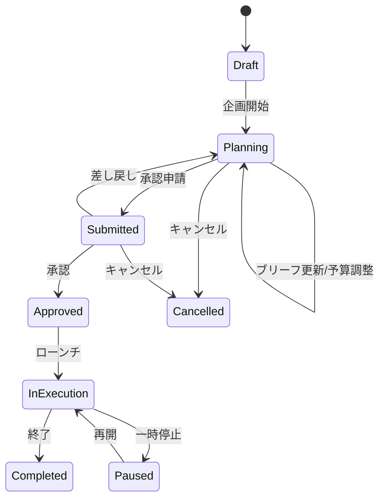

# Use Case: キャンペーン企画 (Plan Campaign)

## 概要

| 項目 | 内容 |
|------|------|
| UC ID | BC3-UC-002 |
| 名称 | キャンペーン企画 |
| アクター | マーケティングプランナー、ブランドマネージャー |
| トリガー | 新製品発売、季節キャンペーン、ブランド施策 |
| 関連集約 | Campaign, Brand |

---

## ユースケース記述

### 事前条件 (Preconditions)

1. アクターは認証済みで、キャンペーン作成権限を持つ
2. 対象ブランドがActive状態
3. 予算計画期間内である

### 事後条件 (Postconditions)

1. 新規Campaignエンティティが作成される
2. CampaignCreatedイベントが発行される
3. 関連チームに通知される
4. 承認ワークフローが開始可能になる

### 基本フロー (Main Flow)

1. **開始**: プランナーがキャンペーン企画画面にアクセス
2. **ブランド選択**:
   - 対象ブランドを選択
   - ブランドガイドラインを参照表示
3. **基本情報入力**:
   - キャンペーン名
   - キャンペーン目的（Awareness/Consideration/Conversion/Loyalty/Advocacy）
   - 期間設定（企画開始〜キャンペーン終了）
4. **ターゲットオーディエンス定義**:
   - デモグラフィック（年齢、性別、収入、地域）
   - サイコグラフィック（ライフスタイル、価値観、興味関心）
   - 行動特性
   - セグメント選択
5. **ブリーフ作成**:
   - 背景・課題
   - 機会
   - キーメッセージ
   - クリエイティブ方向性
   - 必須要素・制約事項
6. **チャネル計画**:
   - マーケティングチャネル選択（TV/Digital/Social/OOH等）
   - チャネル別戦略
7. **予算設定**:
   - 総予算
   - チャネル別配分
   - 予備費
8. **KPI設定**:
   - 目標指標（Reach/Impressions/CTR/Conversion/ROI等）
   - 目標値
   - 測定方法
9. **タイムライン設定**:
   - マイルストーン定義
   - クリエイティブ締切
   - ローンチ日
10. **確認・保存**: 入力内容を確認して下書き保存
11. **完了**: キャンペーン企画が作成される

### 代替フロー (Alternative Flows)

**A1: 既存キャンペーンからコピー作成**
- ステップ1で「既存からコピー」を選択
- 過去キャンペーンを選択
- 基本情報をコピーして新規作成
- 必要箇所を編集

**A2: ブリーフ自動生成支援**
- ステップ5でAI支援を選択
- ブランド情報と目的から下書きブリーフを生成
- プランナーが編集・確定

**A3: チャネルミックス最適化**
- ステップ6,7でチャネル最適化を選択
- 予算と目的からチャネル配分を推奨
- プランナーが調整

### 例外フロー (Exception Flows)

**E1: ブランドが非アクティブ**
- 選択ブランドがSunset/Archivedの場合
- エラー：「このブランドではキャンペーンを作成できません」
- アクティブブランドの選択を促す

**E2: 予算超過**
- 配分合計が総予算を超える場合
- 警告表示
- 配分調整を促す

**E3: 期間不整合**
- ローンチ日がクリエイティブ締切より前の場合
- エラー：「タイムラインの整合性を確認してください」
- 修正を促す

---

## ビジネスルール

| BR ID | ルール | 検証タイミング |
|-------|--------|----------------|
| BR-311 | 対象ブランドはActive状態必須 | 作成時 |
| BR-312 | ローンチ日は企画開始日より後 | 保存時 |
| BR-313 | クリエイティブ締切はローンチ日より前 | 保存時 |
| BR-314 | チャネル配分合計は総予算以内 | 保存時 |
| BR-315 | 最低1つのKPIが必須 | 承認申請時 |
| BR-316 | 承認済みキャンペーンは基本情報変更不可 | 更新時 |

---

## キャンペーンステータスワークフロー



---

## データ要件

### 入力データ

```yaml
CreateCampaignInput:
  brandId: uuid (required)
  name: string (required, 1-200文字)
  objective: CampaignObjectiveInput (required)
  timeline: CampaignTimelineInput (required)
  targetAudience: TargetAudienceInput (optional)
  brief: CampaignBriefInput (optional)
  budget: BudgetInput (optional)
  channels: array<ChannelPlanInput> (optional)
  kpis: array<KPIInput> (optional)

CampaignObjectiveInput:
  type: enum [Awareness, Consideration, Conversion, Loyalty, Advocacy]
  description: string (required)
  targets: array<ObjectiveTargetInput> (optional)

TargetAudienceInput:
  demographics:
    ageRange: { min: number, max: number }
    gender: array<Gender>
    income: IncomeLevel
    location: array<GeoTarget>
  psychographics:
    lifestyles: array<string>
    values: array<string>
    interests: array<string>
  behaviors: array<string>
  segments: array<SegmentId>

CampaignBriefInput:
  background: string (max 2000文字)
  challenge: string (max 1000文字)
  opportunity: string (max 1000文字)
  keyMessage: string (max 500文字)
  creativeDirection: string (max 2000文字)
  mandatories: array<string>
  restrictions: array<string>

BudgetInput:
  totalAmount: Money
  allocation: map<Channel, Money>
  contingency: Money
  currency: CurrencyCode

KPIInput:
  metric: enum [Reach, Impressions, Engagement, CTR, Conversion, ROI, BrandLift, NPS]
  target: number
  unit: string
  measurementMethod: string
```

### 出力データ

```yaml
CampaignOutput:
  campaignId: uuid
  campaignCode: string
  brandId: uuid
  brandName: string
  name: string
  objective: CampaignObjective
  targetAudience: TargetAudience
  brief: CampaignBrief
  budget: Budget
  timeline: CampaignTimeline
  channels: array<MarketingChannel>
  creatives: array<Creative>
  kpis: array<CampaignKPI>
  status: CampaignStatus
  createdBy: UserId
  createdAt: datetime
  updatedAt: datetime
```

---

## 非機能要件

| 項目 | 要件 |
|------|------|
| 応答時間 | キャンペーン作成: 2秒以内 |
| 自動保存 | 入力中5分ごとに自動保存 |
| 同時編集 | 同一キャンペーンは1人のみ編集可 |
| 履歴 | 編集履歴を完全保持 |
| コピー | 過去キャンペーンからの複製対応 |

---

## 関連API

- POST `/campaigns` - キャンペーン作成
- GET `/campaigns/{campaignId}` - キャンペーン詳細取得
- PUT `/campaigns/{campaignId}` - キャンペーン更新
- PUT `/campaigns/{campaignId}/brief` - ブリーフ更新
- PUT `/campaigns/{campaignId}/budget` - 予算更新
- PUT `/campaigns/{campaignId}/timeline` - タイムライン更新
- POST `/campaigns/{campaignId}/channels` - チャネル追加
- PUT `/campaigns/{campaignId}/kpis` - KPI設定
- POST `/campaigns/{campaignId}/submit` - 承認申請
- POST `/campaigns/copy/{sourceCampaignId}` - キャンペーンコピー

---

## 関連ドメインイベント

| イベント | 発行タイミング | 購読者 |
|----------|----------------|--------|
| CampaignCreated | キャンペーン作成時 | ブランドチーム、承認者 |
| CampaignBriefUpdated | ブリーフ更新時 | クリエイティブチーム |
| CampaignSubmitted | 承認申請時 | 承認者、マネージャー |

---

## キャンペーン目的と推奨チャネル

| 目的 | 推奨チャネル | KPI例 |
|------|--------------|-------|
| Awareness | TV, OOH, Digital Display | Reach, Impressions, Brand Lift |
| Consideration | Digital, Social, Influencer | Engagement, CTR, Site Visit |
| Conversion | Digital, Retail, Event | Conversion Rate, ROAS, Sales |
| Loyalty | CRM, Social, Event | NPS, Repeat Purchase, LTV |
| Advocacy | Social, Influencer, UGC | Share, UGC Volume, Referral |

---

**作成日**: 2025-11-28
**VS/BC**: VS3/BC3 Brand Portfolio
