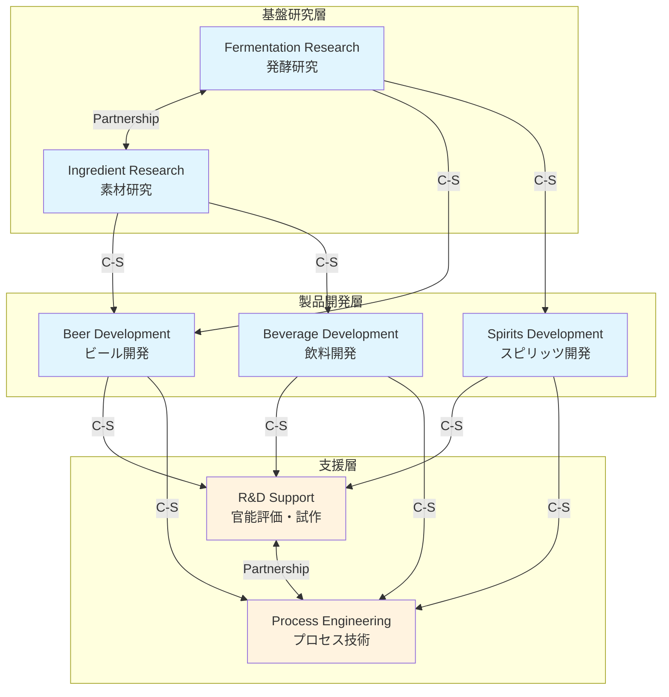

# Context Map

**プロジェクト:** asashi (Asahi Group Holdings)
**作成日:** 2025-11-27
**ステータス:** 初版
**対象スコープ:** VS2 製品開発・イノベーション

---

## エグゼクティブサマリー

VS2の7つのサービス間の関係性と統合パターンを定義しました。

**主要な関係パターン:**
- **Customer-Supplier**: 6関係（主に研究→開発の流れ）
- **Partnership**: 2関係（密接な協力関係）
- **Shared Kernel**: 1関係（共通データモデル）

**データフローの方向:**
```
基盤研究（Upstream）→ 製品開発（Downstream）→ 製造移管
```

---

## Context Map 概要図

```
┌─────────────────────────────────────────────────────────────────────────────┐
│                          VS2 製品開発・イノベーション                          │
├─────────────────────────────────────────────────────────────────────────────┤
│                                                                             │
│  ┌─────────────────────┐       ┌─────────────────────┐                     │
│  │ Fermentation        │       │ Ingredient          │                     │
│  │ Research Service    │◄─────►│ Research Service    │                     │
│  │ [Core]              │  P    │ [Core]              │                     │
│  └──────────┬──────────┘       └──────────┬──────────┘                     │
│             │                             │                                 │
│             │ C-S                         │ C-S                             │
│             ▼                             ▼                                 │
│  ┌─────────────────────────────────────────────────────────────┐           │
│  │                    開発サービス群                            │           │
│  │  ┌─────────────┐  ┌─────────────┐  ┌─────────────┐         │           │
│  │  │ Beer        │  │ Spirits     │  │ Beverage    │         │           │
│  │  │ Development │  │ Development │  │ Development │         │           │
│  │  │ [Core]      │  │ [Core]      │  │ [Core]      │         │           │
│  │  └──────┬──────┘  └──────┬──────┘  └──────┬──────┘         │           │
│  └─────────┼────────────────┼────────────────┼─────────────────┘           │
│            │                │                │                              │
│            │ C-S            │ C-S            │ C-S                          │
│            ▼                ▼                ▼                              │
│  ┌─────────────────────────────────────────────────────────────┐           │
│  │                    支援サービス群                            │           │
│  │  ┌─────────────────────┐       ┌─────────────────────┐     │           │
│  │  │ R&D Support         │◄─────►│ Process Engineering │     │           │
│  │  │ Service             │   P   │ Service             │     │           │
│  │  │ [Supporting]        │       │ [Supporting]        │     │           │
│  │  └─────────────────────┘       └─────────────────────┘     │           │
│  └─────────────────────────────────────────────────────────────┘           │
│                                                                             │
│  凡例: C-S = Customer-Supplier, P = Partnership                            │
│        ◄─────► = 双方向, ───────► = 単方向                                 │
└─────────────────────────────────────────────────────────────────────────────┘
```

---

## サービス間関係の詳細

### 1. Fermentation Research → Beer Development

```yaml
関係性:
  パターン: Customer-Supplier
  Upstream: Fermentation Research Service
  Downstream: Beer Development Service

契約内容:
  提供するもの:
    - 酵母株情報 (YeastStrain)
    - 発酵レシピ (FermentationRecipe)
    - 発酵技術知見

  API契約:
    - GET /api/v1/fermentation-research/yeast-strains
    - GET /api/v1/fermentation-research/recipes

  イベント:
    - YeastStrainRegistered → Beer Development がサブスクライブ
    - FermentationRecipeCreated → Beer Development がサブスクライブ

理由:
  ビール開発は発酵研究の成果（酵母株、発酵技術）に依存する。
  発酵研究は独立して進行し、成果を下流に提供する。

Anti-Corruption Layer:
  Beer Development側で YeastStrainAdapter を実装
  発酵研究の内部モデルを開発用モデルに変換
```

### 2. Fermentation Research → Spirits Development

```yaml
関係性:
  パターン: Customer-Supplier
  Upstream: Fermentation Research Service
  Downstream: Spirits Development Service

契約内容:
  提供するもの:
    - 蒸留用酵母株
    - 発酵条件データ

  API契約:
    - GET /api/v1/fermentation-research/yeast-strains?type=distillation

  イベント:
    - YeastStrainImproved → Spirits Development がサブスクライブ

理由:
  ウイスキー等の蒸留酒も発酵工程を含むため、酵母技術に依存する。
```

### 3. Fermentation Research ↔ Ingredient Research

```yaml
関係性:
  パターン: Partnership
  関係タイプ: 双方向協力

協力内容:
  Fermentation → Ingredient:
    - 酵母の栄養要求性情報
    - 発酵に適した素材要件

  Ingredient → Fermentation:
    - 新素材の発酵適性評価依頼
    - 素材特性データ

共同オペレーション:
  - 素材×酵母の組み合わせ研究
  - 共同実験プロジェクト

理由:
  両研究領域は密接に連携し、相互にインプットを提供し合う。
  どちらが上流とも言えない対等な関係。

統合パターン:
  - 定期的な同期ミーティング
  - 共有イベントバス経由の通知
  - 共同プロジェクト管理システム
```

### 4. Ingredient Research → Beer Development

```yaml
関係性:
  パターン: Customer-Supplier
  Upstream: Ingredient Research Service
  Downstream: Beer Development Service

契約内容:
  提供するもの:
    - 麦芽・ホップ等の素材情報
    - 配合レシピ推奨
    - サプライヤー情報

  API契約:
    - GET /api/v1/ingredient-research/ingredients?category=beer
    - GET /api/v1/ingredient-research/formulations

理由:
  ビール開発は原材料情報に依存する。
```

### 5. Ingredient Research → Beverage Development

```yaml
関係性:
  パターン: Customer-Supplier
  Upstream: Ingredient Research Service
  Downstream: Beverage Development Service

契約内容:
  提供するもの:
    - 飲料素材情報
    - 機能性成分データ
    - 機能性エビデンス

  API契約:
    - GET /api/v1/ingredient-research/ingredients?category=beverage
    - GET /api/v1/ingredient-research/functional-compounds

理由:
  飲料開発、特に機能性飲料は素材研究・機能性研究の成果に強く依存する。
```

### 6. 開発サービス群 → R&D Support Service

```yaml
関係性:
  パターン: Customer-Supplier
  Upstream: Beer/Spirits/Beverage Development Services
  Downstream: R&D Support Service

契約内容:
  開発サービス → R&D Support:
    - 官能評価依頼 (SensoryEvaluationRequest)
    - 試作依頼 (PrototypeRequest)

  R&D Support → 開発サービス:
    - 評価結果 (SensoryEvaluationResult)
    - 試作品情報 (PrototypeBatch)

API契約:
  # 開発サービスが呼び出す
  - POST /api/v1/rnd-support/sensory-evaluations
  - POST /api/v1/rnd-support/prototype-requests

  # R&D Supportがイベント発行
  - SensoryEvaluationCompleted
  - PrototypeBatchCompleted

理由:
  全開発サービスが共通の評価・試作機能を利用する。
  R&D Supportは開発要件に応じてサービスを提供。

備考:
  開発サービス群は依頼を出す側だがDownstreamとして扱う。
  R&D Supportは「サービス提供者」としてUpstream。
  （一般的なビジネスサービスパターン）
```

### 7. R&D Support ↔ Process Engineering

```yaml
関係性:
  パターン: Partnership
  関係タイプ: 双方向協力

協力内容:
  R&D Support → Process Engineering:
    - 試作品の製造条件データ
    - スケールアップ時の課題共有

  Process Engineering → R&D Support:
    - 製造プロセス制約
    - 設備能力情報

理由:
  試作から製造スケールアップへの橋渡しで密接に連携。
```

### 8. 開発サービス群 → Process Engineering

```yaml
関係性:
  パターン: Customer-Supplier
  Upstream: Beer/Spirits/Beverage Development Services
  Downstream: Process Engineering Service

契約内容:
  開発サービス → Process Engineering:
    - 技術移管依頼 (TechnologyTransferRequest)
    - 製品規格書

  Process Engineering → 開発サービス:
    - 製造プロセス設計
    - 移管完了通知

API契約:
  - POST /api/v1/process-engineering/technology-transfers

  イベント:
    - TechnologyTransferValidated → 開発サービスがサブスクライブ

理由:
  製品開発完了後、製造への技術移管を依頼する。
```

---

## Shared Kernel（共有カーネル）

### 共通ドメインモデル

以下のValueObjectsは複数サービスで共通利用:

```yaml
SharedKernel:
  名前: RnD-Common
  所有: 共同（変更時は関係者合意必要）

  共有モデル:
    # 製品識別子
    ProductId:
      type: UUID
      format: "PRD-{category}-{sequence}"

    # プロジェクト識別子
    ProjectId:
      type: UUID
      format: "PJ-{year}-{sequence}"

    # 品質スコア
    QualityScore:
      type: object
      properties:
        overall: number (0-100)
        taste: number (0-100)
        aroma: number (0-100)
        appearance: number (0-100)

    # 規制カテゴリ
    RegulatoryCategory:
      enum: [BEER, HAPPOSHU, NEW_GENRE, SPIRITS, BEVERAGE, FUNCTIONAL_FOOD]

    # 開発ステージ
    DevelopmentStage:
      enum: [CONCEPT, PROTOTYPE, EVALUATION, SPECIFICATION, TRANSFER, PRODUCTION]

  管理方法:
    - 専用GitHubリポジトリ: asashi-rnd-common
    - バージョニング: SemVer
    - 変更プロセス: RFC + 関係者レビュー
```

---

## 外部コンテキストとの関係

### VS2 → 他VS連携（参考）

```yaml
VS1 (市場インサイト) → VS2:
  パターン: Customer-Supplier
  提供: 消費者インサイト、市場トレンド
  受領: 全開発サービス

VS2 → VS3 (ブランディング):
  パターン: Customer-Supplier
  提供: 製品情報、技術特徴
  受領: Brand Management Service

VS2 → VS4 (サプライチェーン):
  パターン: Customer-Supplier
  提供: 製品規格、製造要件
  受領: Manufacturing Service, Supply Chain Service

VS2 ↔ VS5 (品質保証):
  パターン: Partnership
  提供: 品質基準、検査項目
  受領: 品質データ、クレーム情報

VS6 (データプラットフォーム) → VS2:
  パターン: Open Host Service
  提供: データ分析基盤、BI機能
  受領: 全サービス
```

---

## Context Map視覚化（Mermaid）



---

## 統合の考慮事項

### 循環依存の回避

現在の設計では循環依存は存在しない:
- 研究層 → 開発層 → 支援層 の単方向フロー
- Partnership関係は双方向だが、データ依存の循環はない

### イベント駆動による疎結合

以下の関係はイベント駆動で疎結合化:
- 研究成果の通知（YeastStrainRegistered等）
- 評価完了の通知（SensoryEvaluationCompleted等）
- 技術移管完了の通知（TechnologyTransferValidated）

### データ自律性の維持

各サービスは自身のデータストアを所有:
- 他サービスのデータは参照のみ（APIまたはイベント経由）
- 必要に応じてローカルキャッシュを保持
- マスターデータの所有権は明確に分離

---

## 変更管理

### 契約変更プロセス

```yaml
変更種別:
  Breaking Change:
    - 全関係者への事前通知（2週間前）
    - マイグレーション計画の合意
    - バージョニングによる共存期間

  Non-Breaking Change:
    - 関係者への通知（1週間前）
    - 後方互換性の確保
```

### バージョニング戦略

```yaml
API Versioning:
  方式: URL Path Versioning
  例: /api/v1/..., /api/v2/...

Event Versioning:
  方式: Event Type Suffix
  例: YeastStrainRegistered.v1, YeastStrainRegistered.v2
```

---

**作成者:** Claude (Parasol V4 Lite)
**最終更新:** 2025-11-27
