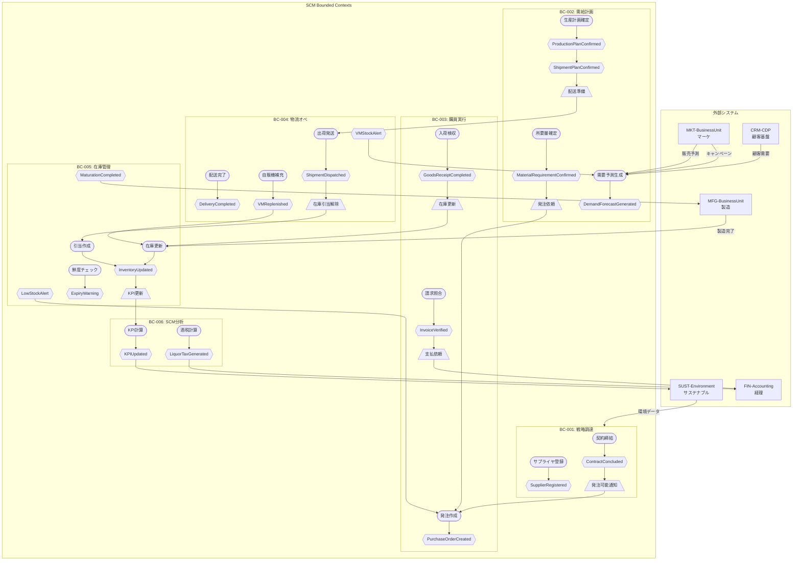

# サントリー SCM イベント駆動アーキテクチャ設計

**作成日**: 2025-12-12
**プロジェクト**: サントリーグループ SCM
**Phase**: 4 - Architecture Design (Event Architecture)

---

## 1. イベントカタログ

### 1.1 BC-SCM-001: Strategic Procurement（戦略調達）

```yaml
events:
  # 発行イベント（Publishes）
  - name: ContractConcluded
    producer: BC-SCM-001-Strategic-Procurement
    consumers:
      - BC-SCM-003-Purchase-Execution
      - BC-SCM-006-SCM-Analytics
      - FIN-Accounting
    description: サプライヤとの契約が締結された
    payload:
      - field: contractId
        type: string
        required: true
      - field: supplierId
        type: string
        required: true
      - field: categoryCode
        type: string
        required: true
      - field: effectiveDate
        type: date
        required: true
      - field: expirationDate
        type: date
        required: true
      - field: contractTerms
        type: object
        required: true
    trigger: 契約書の電子署名完了時

  - name: SupplierRegistered
    producer: BC-SCM-001-Strategic-Procurement
    consumers:
      - BC-SCM-003-Purchase-Execution
      - BC-SCM-006-SCM-Analytics
      - SUST-Environment
    description: 新規サプライヤが登録・認定された
    payload:
      - field: supplierId
        type: string
        required: true
      - field: supplierName
        type: string
        required: true
      - field: categoryCode
        type: string
        required: true
      - field: certificationLevel
        type: string
        required: true
      - field: riskScore
        type: number
        required: false
    trigger: サプライヤ審査承認時

  - name: SupplierEvaluationCompleted
    producer: BC-SCM-001-Strategic-Procurement
    consumers:
      - BC-SCM-006-SCM-Analytics
      - SUST-Governance
    description: サプライヤ評価が完了した
    payload:
      - field: supplierId
        type: string
        required: true
      - field: evaluationPeriod
        type: string
        required: true
      - field: qualityScore
        type: number
        required: true
      - field: deliveryScore
        type: number
        required: true
      - field: costScore
        type: number
        required: true
      - field: esgScore
        type: number
        required: true
      - field: overallRank
        type: string
        required: true
    trigger: 四半期評価完了時

  - name: SupplierRiskDetected
    producer: BC-SCM-001-Strategic-Procurement
    consumers:
      - BC-SCM-002-Demand-Planning
      - BC-SCM-003-Purchase-Execution
      - BC-SCM-006-SCM-Analytics
    description: サプライヤリスクが検出された
    payload:
      - field: supplierId
        type: string
        required: true
      - field: riskType
        type: string
        required: true
      - field: severity
        type: string
        required: true
      - field: affectedCategories
        type: array
        required: true
      - field: recommendedActions
        type: array
        required: false
    trigger: リスクモニタリングによる検出時

  - name: SustainableSourceCertified
    producer: BC-SCM-001-Strategic-Procurement
    consumers:
      - SUST-Environment
      - BRAND-Quality
    description: サステナブル調達先として認証された（水源地・農園等）
    payload:
      - field: sourceId
        type: string
        required: true
      - field: sourceName
        type: string
        required: true
      - field: sourceType
        type: string
        required: true
      - field: certificationBody
        type: string
        required: true
      - field: certificationDate
        type: date
        required: true
    trigger: 天然水の森認定、サステナブル農園認定時

  # 購読イベント（Subscribes）
  subscribes:
    - name: EnvironmentalDataReceived
      source: SUST-Environment
      description: 水源地環境データを受信
      action: サプライヤ環境評価に反映

    - name: QualityStandardUpdated
      source: BRAND-Quality
      description: 品質基準が更新された
      action: サプライヤ品質要件に反映

    - name: PurchaseOrderCreated
      source: BC-SCM-003-Purchase-Execution
      description: 発注が作成された
      action: 契約利用実績を更新

    - name: GoodsReceiptCompleted
      source: BC-SCM-003-Purchase-Execution
      description: 入荷検収が完了した
      action: サプライヤ納期・品質実績を更新

    - name: InvoiceVerified
      source: BC-SCM-003-Purchase-Execution
      description: 請求書照合が完了した
      action: サプライヤ支払実績を更新
```

### 1.2 BC-SCM-002: Demand Planning（需給計画）

```yaml
events:
  # 発行イベント（Publishes）
  - name: DemandForecastGenerated
    producer: BC-SCM-002-Demand-Planning
    consumers:
      - BC-SCM-003-Purchase-Execution
      - BC-SCM-005-Inventory-Control
      - MFG-BusinessUnit
    description: 需要予測が生成された
    payload:
      - field: forecastId
        type: string
        required: true
      - field: businessUnit
        type: string
        required: true
      - field: itemId
        type: string
        required: true
      - field: forecastPeriod
        type: string
        required: true
      - field: forecastQuantity
        type: number
        required: true
      - field: confidenceLevel
        type: number
        required: true
      - field: forecastType
        type: string
        required: true
    trigger: 予測モデル実行完了時（週次/月次）

  - name: MaterialRequirementConfirmed
    producer: BC-SCM-002-Demand-Planning
    consumers:
      - BC-SCM-003-Purchase-Execution
    description: 所要量が確定し発注依頼が発生した
    payload:
      - field: requirementId
        type: string
        required: true
      - field: itemId
        type: string
        required: true
      - field: requiredQuantity
        type: number
        required: true
      - field: requiredDate
        type: date
        required: true
      - field: plantId
        type: string
        required: true
      - field: priority
        type: string
        required: true
    trigger: MRP実行・所要量計算完了時

  - name: ProductionPlanConfirmed
    producer: BC-SCM-002-Demand-Planning
    consumers:
      - MFG-BusinessUnit
      - BC-SCM-004-Logistics
      - BC-SCM-005-Inventory-Control
    description: 生産計画が確定した
    payload:
      - field: planId
        type: string
        required: true
      - field: plantId
        type: string
        required: true
      - field: itemId
        type: string
        required: true
      - field: planQuantity
        type: number
        required: true
      - field: startDate
        type: date
        required: true
      - field: endDate
        type: date
        required: true
    trigger: S&OP会議承認時

  - name: ShipmentPlanConfirmed
    producer: BC-SCM-002-Demand-Planning
    consumers:
      - BC-SCM-004-Logistics
    description: 出荷計画が確定した
    payload:
      - field: shipmentPlanId
        type: string
        required: true
      - field: sourceWarehouseId
        type: string
        required: true
      - field: destinationId
        type: string
        required: true
      - field: itemId
        type: string
        required: true
      - field: plannedQuantity
        type: number
        required: true
      - field: plannedDate
        type: date
        required: true
    trigger: 配送計画策定完了時

  - name: SupplyConstraintDetected
    producer: BC-SCM-002-Demand-Planning
    consumers:
      - MKT-BusinessUnit
      - BC-SCM-001-Strategic-Procurement
    description: 供給制約が検出された
    payload:
      - field: constraintId
        type: string
        required: true
      - field: constraintType
        type: string
        required: true
      - field: affectedItems
        type: array
        required: true
      - field: impactPeriod
        type: string
        required: true
      - field: shortfallQuantity
        type: number
        required: true
    trigger: 需給バランスチェックで制約検出時

  - name: MaturationPlanUpdated
    producer: BC-SCM-002-Demand-Planning
    consumers:
      - MFG-BusinessUnit
      - BC-SCM-005-Inventory-Control
    description: ウイスキー熟成計画が更新された（サントリー固有）
    payload:
      - field: maturationPlanId
        type: string
        required: true
      - field: barrelType
        type: string
        required: true
      - field: distilleryId
        type: string
        required: true
      - field: targetAge
        type: number
        required: true
      - field: estimatedCompletionDate
        type: date
        required: true
    trigger: 熟成計画レビュー時

  # 購読イベント（Subscribes）
  subscribes:
    - name: SalesForecastReceived
      source: MKT-BusinessUnit
      description: 販売予測を受信
      action: 需要予測モデル入力に反映

    - name: CampaignPlanned
      source: MKT-BusinessUnit
      description: キャンペーン計画を受信
      action: 需要予測の上乗せ要素として反映

    - name: ProductionCompleted
      source: MFG-BusinessUnit
      description: 製造完了通知を受信
      action: 生産実績を計画と照合

    - name: InventoryLevelUpdated
      source: BC-SCM-005-Inventory-Control
      description: 在庫水準が更新された
      action: 在庫計画パラメータを再計算

    - name: CustomerDemandDataReceived
      source: CRM-CDP
      description: 顧客需要データを受信
      action: 需要予測モデル入力に反映

    - name: SupplierRiskDetected
      source: BC-SCM-001-Strategic-Procurement
      description: サプライヤリスクを受信
      action: 供給計画にリスク対応を反映

    - name: WeatherForecastReceived
      source: External-Weather-API
      description: 気象予報データを受信（サントリー固有）
      action: 夏季飲料需要予測に反映
```

### 1.3 BC-SCM-003: Purchase Execution（購買実行）

```yaml
events:
  # 発行イベント（Publishes）
  - name: PurchaseOrderCreated
    producer: BC-SCM-003-Purchase-Execution
    consumers:
      - BC-SCM-001-Strategic-Procurement
      - BC-SCM-004-Logistics
      - FIN-Accounting
    description: 発注書が作成された
    payload:
      - field: purchaseOrderId
        type: string
        required: true
      - field: supplierId
        type: string
        required: true
      - field: contractId
        type: string
        required: false
      - field: orderItems
        type: array
        required: true
      - field: totalAmount
        type: number
        required: true
      - field: currency
        type: string
        required: true
      - field: requestedDeliveryDate
        type: date
        required: true
    trigger: 発注承認完了時

  - name: PurchaseOrderConfirmed
    producer: BC-SCM-003-Purchase-Execution
    consumers:
      - BC-SCM-004-Logistics
      - BC-SCM-005-Inventory-Control
    description: サプライヤが発注を確認した
    payload:
      - field: purchaseOrderId
        type: string
        required: true
      - field: confirmedDeliveryDate
        type: date
        required: true
      - field: confirmedQuantities
        type: array
        required: true
    trigger: サプライヤからの発注確認受領時

  - name: GoodsReceiptCompleted
    producer: BC-SCM-003-Purchase-Execution
    consumers:
      - BC-SCM-001-Strategic-Procurement
      - BC-SCM-005-Inventory-Control
      - FIN-Accounting
    description: 入荷検収が完了した
    payload:
      - field: goodsReceiptId
        type: string
        required: true
      - field: purchaseOrderId
        type: string
        required: true
      - field: receivedQuantity
        type: number
        required: true
      - field: inspectionResult
        type: string
        required: true
      - field: lotNumbers
        type: array
        required: true
      - field: warehouseId
        type: string
        required: true
    trigger: 入荷検品完了時

  - name: DeliveryDelayDetected
    producer: BC-SCM-003-Purchase-Execution
    consumers:
      - BC-SCM-001-Strategic-Procurement
      - BC-SCM-002-Demand-Planning
      - BC-SCM-006-SCM-Analytics
    description: 納期遅延が検出された
    payload:
      - field: purchaseOrderId
        type: string
        required: true
      - field: supplierId
        type: string
        required: true
      - field: originalDeliveryDate
        type: date
        required: true
      - field: revisedDeliveryDate
        type: date
        required: true
      - field: delayReason
        type: string
        required: true
      - field: impactedItems
        type: array
        required: true
    trigger: 納期確認で遅延判明時

  - name: InvoiceVerified
    producer: BC-SCM-003-Purchase-Execution
    consumers:
      - BC-SCM-001-Strategic-Procurement
      - FIN-Accounting
    description: 請求書照合が完了した
    payload:
      - field: invoiceId
        type: string
        required: true
      - field: purchaseOrderId
        type: string
        required: true
      - field: goodsReceiptId
        type: string
        required: true
      - field: invoiceAmount
        type: number
        required: true
      - field: varianceAmount
        type: number
        required: false
      - field: paymentDueDate
        type: date
        required: true
    trigger: 三点照合完了時

  - name: QualityRejectionRaised
    producer: BC-SCM-003-Purchase-Execution
    consumers:
      - BC-SCM-001-Strategic-Procurement
      - BC-SCM-006-SCM-Analytics
      - BRAND-Quality
    description: 入荷品の品質不良が検出された
    payload:
      - field: rejectionId
        type: string
        required: true
      - field: purchaseOrderId
        type: string
        required: true
      - field: supplierId
        type: string
        required: true
      - field: itemId
        type: string
        required: true
      - field: rejectedQuantity
        type: number
        required: true
      - field: defectType
        type: string
        required: true
      - field: disposition
        type: string
        required: true
    trigger: 入荷検査で不良判定時

  # 購読イベント（Subscribes）
  subscribes:
    - name: ContractConcluded
      source: BC-SCM-001-Strategic-Procurement
      description: 契約締結通知を受信
      action: 発注可能サプライヤ・単価を更新

    - name: MaterialRequirementConfirmed
      source: BC-SCM-002-Demand-Planning
      description: 所要量確定（発注依頼）を受信
      action: 発注処理を開始

    - name: SupplierRegistered
      source: BC-SCM-001-Strategic-Procurement
      description: サプライヤ登録通知を受信
      action: サプライヤマスタを更新

    - name: PaymentProcessed
      source: FIN-Accounting
      description: 支払処理完了通知を受信
      action: 発注ステータスを更新
```

### 1.4 BC-SCM-004: Logistics Operations（物流オペレーション）

```yaml
events:
  # 発行イベント（Publishes）
  - name: GoodsInboundCompleted
    producer: BC-SCM-004-Logistics
    consumers:
      - BC-SCM-005-Inventory-Control
      - BC-SCM-003-Purchase-Execution
    description: 倉庫への入庫処理が完了した
    payload:
      - field: inboundId
        type: string
        required: true
      - field: warehouseId
        type: string
        required: true
      - field: locationId
        type: string
        required: true
      - field: itemId
        type: string
        required: true
      - field: quantity
        type: number
        required: true
      - field: lotNumber
        type: string
        required: true
    trigger: 入庫作業完了時

  - name: ShipmentDispatched
    producer: BC-SCM-004-Logistics
    consumers:
      - BC-SCM-005-Inventory-Control
      - BC-SCM-006-SCM-Analytics
    description: 出荷が発送された
    payload:
      - field: shipmentId
        type: string
        required: true
      - field: sourceWarehouseId
        type: string
        required: true
      - field: destinationId
        type: string
        required: true
      - field: shipmentItems
        type: array
        required: true
      - field: dispatchedAt
        type: datetime
        required: true
      - field: estimatedArrival
        type: datetime
        required: true
      - field: carrierId
        type: string
        required: true
    trigger: 出荷トラック出発時

  - name: DeliveryCompleted
    producer: BC-SCM-004-Logistics
    consumers:
      - BC-SCM-005-Inventory-Control
      - BC-SCM-006-SCM-Analytics
      - MKT-BusinessUnit
    description: 配送が完了した
    payload:
      - field: deliveryId
        type: string
        required: true
      - field: shipmentId
        type: string
        required: true
      - field: destinationId
        type: string
        required: true
      - field: deliveredAt
        type: datetime
        required: true
      - field: receiverSignature
        type: string
        required: false
      - field: deliveryStatus
        type: string
        required: true
    trigger: 納品完了確認時

  - name: RouteCompleted
    producer: BC-SCM-004-Logistics
    consumers:
      - BC-SCM-006-SCM-Analytics
    description: 配送ルートが完了した
    payload:
      - field: routeId
        type: string
        required: true
      - field: vehicleId
        type: string
        required: true
      - field: driverId
        type: string
        required: true
      - field: completedStops
        type: number
        required: true
      - field: totalDistance
        type: number
        required: true
      - field: completedAt
        type: datetime
        required: true
    trigger: ルート最終配送完了時

  - name: VendingMachineReplenished
    producer: BC-SCM-004-Logistics
    consumers:
      - BC-SCM-005-Inventory-Control
      - BC-SCM-006-SCM-Analytics
    description: 自販機への補充が完了した（サントリー固有）
    payload:
      - field: replenishmentId
        type: string
        required: true
      - field: vendingMachineId
        type: string
        required: true
      - field: routeId
        type: string
        required: true
      - field: replenishedItems
        type: array
        required: true
      - field: collectedCash
        type: number
        required: false
      - field: replenishedAt
        type: datetime
        required: true
    trigger: 自販機補充作業完了時

  - name: VendingMachineStockAlert
    producer: BC-SCM-004-Logistics
    consumers:
      - BC-SCM-002-Demand-Planning
      - BC-SCM-006-SCM-Analytics
    description: 自販機在庫アラートを発信（AIコラミング連携・サントリー固有）
    payload:
      - field: alertId
        type: string
        required: true
      - field: vendingMachineId
        type: string
        required: true
      - field: alertType
        type: string
        required: true
      - field: lowStockItems
        type: array
        required: true
      - field: predictedStockout
        type: datetime
        required: false
      - field: recommendedAction
        type: string
        required: true
    trigger: IoTセンサー/AIコラミング予測による検知時

  - name: WarehouseCapacityAlert
    producer: BC-SCM-004-Logistics
    consumers:
      - BC-SCM-002-Demand-Planning
      - BC-SCM-006-SCM-Analytics
    description: 倉庫キャパシティアラートが発生した
    payload:
      - field: warehouseId
        type: string
        required: true
      - field: alertType
        type: string
        required: true
      - field: currentUtilization
        type: number
        required: true
      - field: threshold
        type: number
        required: true
    trigger: キャパシティ監視による閾値超過時

  # 購読イベント（Subscribes）
  subscribes:
    - name: ShipmentPlanConfirmed
      source: BC-SCM-002-Demand-Planning
      description: 出荷計画を受信
      action: 配送準備を開始

    - name: PurchaseOrderConfirmed
      source: BC-SCM-003-Purchase-Execution
      description: 発注確認（入荷予定）を受信
      action: 入荷予定を登録、倉庫スペース確保

    - name: ProductionCompleted
      source: MFG-BusinessUnit
      description: 製造完了通知を受信
      action: 出荷準備を開始

    - name: PromotionMaterialShipmentRequested
      source: MKT-BusinessUnit
      description: 販促物配送依頼を受信
      action: 販促物配送を手配
```

### 1.5 BC-SCM-005: Inventory Control（在庫管理）

```yaml
events:
  # 発行イベント（Publishes）
  - name: InventoryUpdated
    producer: BC-SCM-005-Inventory-Control
    consumers:
      - BC-SCM-002-Demand-Planning
      - BC-SCM-006-SCM-Analytics
    description: 在庫数量が更新された
    payload:
      - field: inventoryTransactionId
        type: string
        required: true
      - field: warehouseId
        type: string
        required: true
      - field: itemId
        type: string
        required: true
      - field: previousQuantity
        type: number
        required: true
      - field: currentQuantity
        type: number
        required: true
      - field: transactionType
        type: string
        required: true
      - field: lotNumber
        type: string
        required: false
    trigger: 入出庫処理完了時

  - name: InventoryLevelUpdated
    producer: BC-SCM-005-Inventory-Control
    consumers:
      - BC-SCM-002-Demand-Planning
      - BC-SCM-003-Purchase-Execution
    description: 在庫水準が更新された（KPI用）
    payload:
      - field: itemId
        type: string
        required: true
      - field: warehouseId
        type: string
        required: true
      - field: onHandQuantity
        type: number
        required: true
      - field: allocatedQuantity
        type: number
        required: true
      - field: availableQuantity
        type: number
        required: true
      - field: daysOfSupply
        type: number
        required: true
    trigger: 在庫水準計算完了時（日次）

  - name: StockAllocationCreated
    producer: BC-SCM-005-Inventory-Control
    consumers:
      - BC-SCM-004-Logistics
    description: 在庫引当が作成された
    payload:
      - field: allocationId
        type: string
        required: true
      - field: itemId
        type: string
        required: true
      - field: warehouseId
        type: string
        required: true
      - field: allocatedQuantity
        type: number
        required: true
      - field: lotNumber
        type: string
        required: false
      - field: reservedFor
        type: string
        required: true
    trigger: 出荷オーダー引当時

  - name: StockAllocationReleased
    producer: BC-SCM-005-Inventory-Control
    consumers:
      - BC-SCM-004-Logistics
      - BC-SCM-006-SCM-Analytics
    description: 在庫引当が解除された
    payload:
      - field: allocationId
        type: string
        required: true
      - field: releaseReason
        type: string
        required: true
    trigger: 出荷完了または引当キャンセル時

  - name: LowStockAlert
    producer: BC-SCM-005-Inventory-Control
    consumers:
      - BC-SCM-002-Demand-Planning
      - BC-SCM-003-Purchase-Execution
    description: 在庫不足アラートが発生した
    payload:
      - field: alertId
        type: string
        required: true
      - field: itemId
        type: string
        required: true
      - field: warehouseId
        type: string
        required: true
      - field: currentQuantity
        type: number
        required: true
      - field: safetyStockLevel
        type: number
        required: true
      - field: reorderPoint
        type: number
        required: true
      - field: recommendedOrderQuantity
        type: number
        required: true
    trigger: 在庫が発注点を下回った時

  - name: ExcessStockAlert
    producer: BC-SCM-005-Inventory-Control
    consumers:
      - BC-SCM-002-Demand-Planning
      - BC-SCM-006-SCM-Analytics
    description: 過剰在庫アラートが発生した
    payload:
      - field: alertId
        type: string
        required: true
      - field: itemId
        type: string
        required: true
      - field: warehouseId
        type: string
        required: true
      - field: currentQuantity
        type: number
        required: true
      - field: maxStockLevel
        type: number
        required: true
      - field: excessQuantity
        type: number
        required: true
    trigger: 在庫が上限を超過した時

  - name: ExpiryWarningRaised
    producer: BC-SCM-005-Inventory-Control
    consumers:
      - BC-SCM-004-Logistics
      - BC-SCM-006-SCM-Analytics
    description: 賞味期限警告が発生した
    payload:
      - field: warningId
        type: string
        required: true
      - field: itemId
        type: string
        required: true
      - field: warehouseId
        type: string
        required: true
      - field: lotNumber
        type: string
        required: true
      - field: expiryDate
        type: date
        required: true
      - field: remainingDays
        type: number
        required: true
      - field: quantity
        type: number
        required: true
    trigger: 賞味期限が閾値日数を切った時

  - name: MaturationCompleted
    producer: BC-SCM-005-Inventory-Control
    consumers:
      - MFG-BusinessUnit
      - BC-SCM-002-Demand-Planning
    description: 熟成完了通知（ウイスキー・サントリー固有）
    payload:
      - field: maturationId
        type: string
        required: true
      - field: barrelId
        type: string
        required: true
      - field: productType
        type: string
        required: true
      - field: maturationYears
        type: number
        required: true
      - field: warehouseId
        type: string
        required: true
      - field: qualityGrade
        type: string
        required: true
    trigger: 熟成年数到達・品質検査完了時

  # 購読イベント（Subscribes）
  subscribes:
    - name: GoodsInboundCompleted
      source: BC-SCM-004-Logistics
      description: 入庫完了通知を受信
      action: 在庫数量を増加

    - name: ShipmentDispatched
      source: BC-SCM-004-Logistics
      description: 出荷発送通知を受信
      action: 在庫引当を解除、在庫数量を減少

    - name: VendingMachineReplenished
      source: BC-SCM-004-Logistics
      description: 自販機補充完了通知を受信
      action: 倉庫在庫を減少、自販機在庫を更新

    - name: ProductionCompleted
      source: MFG-BusinessUnit
      description: 製造完了通知を受信
      action: 完成品在庫を増加

    - name: QualityRejectionRaised
      source: BC-SCM-003-Purchase-Execution
      description: 品質不良通知を受信
      action: 在庫ステータスを保留/不良に更新
```

### 1.6 BC-SCM-006: SCM Analytics（SCM分析）

```yaml
events:
  # 発行イベント（Publishes）
  - name: KPIUpdated
    producer: BC-SCM-006-SCM-Analytics
    consumers:
      - SUST-Governance
      - IT-Application
    description: SCM KPIが更新された
    payload:
      - field: kpiId
        type: string
        required: true
      - field: kpiName
        type: string
        required: true
      - field: period
        type: string
        required: true
      - field: value
        type: number
        required: true
      - field: target
        type: number
        required: true
      - field: variance
        type: number
        required: true
      - field: trend
        type: string
        required: true
    trigger: KPI計算完了時（日次/週次/月次）

  - name: AnalysisReportGenerated
    producer: BC-SCM-006-SCM-Analytics
    consumers:
      - IT-Application
    description: 分析レポートが生成された
    payload:
      - field: reportId
        type: string
        required: true
      - field: reportType
        type: string
        required: true
      - field: period
        type: string
        required: true
      - field: generatedAt
        type: datetime
        required: true
      - field: reportUrl
        type: string
        required: true
    trigger: 定期レポート生成完了時

  - name: SupplyChainRiskAlertRaised
    producer: BC-SCM-006-SCM-Analytics
    consumers:
      - BC-SCM-001-Strategic-Procurement
      - BC-SCM-002-Demand-Planning
      - SUST-Governance
    description: サプライチェーンリスクアラートが発生した
    payload:
      - field: riskAlertId
        type: string
        required: true
      - field: riskCategory
        type: string
        required: true
      - field: riskScore
        type: number
        required: true
      - field: affectedAreas
        type: array
        required: true
      - field: potentialImpact
        type: string
        required: true
      - field: recommendedActions
        type: array
        required: true
    trigger: リスク分析による異常検知時

  - name: SustainabilityDataPublished
    producer: BC-SCM-006-SCM-Analytics
    consumers:
      - SUST-Environment
      - SUST-Governance
    description: サプライチェーンサステナビリティデータが公開された
    payload:
      - field: datasetId
        type: string
        required: true
      - field: period
        type: string
        required: true
      - field: scope3Emissions
        type: number
        required: true
      - field: waterUsage
        type: number
        required: true
      - field: wasteReduction
        type: number
        required: true
      - field: sustainableSourcingRate
        type: number
        required: true
    trigger: 環境データ集計完了時（月次/四半期）

  - name: LiquorTaxDataGenerated
    producer: BC-SCM-006-SCM-Analytics
    consumers:
      - FIN-Accounting
      - COMP-Regulation
    description: 酒税申告データが生成された（サントリー固有）
    payload:
      - field: taxReportId
        type: string
        required: true
      - field: reportPeriod
        type: string
        required: true
      - field: taxCategory
        type: string
        required: true
      - field: productionVolume
        type: number
        required: true
      - field: shipmentVolume
        type: number
        required: true
      - field: taxAmount
        type: number
        required: true
    trigger: 月次酒税計算完了時

  # 購読イベント（Subscribes）
  subscribes:
    - name: InventoryUpdated
      source: BC-SCM-005-Inventory-Control
      description: 在庫更新データを受信
      action: 在庫KPIを更新

    - name: ContractConcluded
      source: BC-SCM-001-Strategic-Procurement
      description: 契約データを受信
      action: 調達KPIを更新

    - name: SupplierEvaluationCompleted
      source: BC-SCM-001-Strategic-Procurement
      description: サプライヤ評価データを受信
      action: サプライヤパフォーマンスKPIを更新

    - name: DeliveryCompleted
      source: BC-SCM-004-Logistics
      description: 配送完了データを受信
      action: 物流KPIを更新

    - name: ShipmentDispatched
      source: BC-SCM-004-Logistics
      description: 出荷データを受信
      action: OTIF計算に反映

    - name: DemandForecastGenerated
      source: BC-SCM-002-Demand-Planning
      description: 予測データを受信
      action: 予測精度KPIを更新

    - name: GoodsReceiptCompleted
      source: BC-SCM-003-Purchase-Execution
      description: 入荷データを受信
      action: 調達リードタイムKPIを更新

    - name: WaterSourceDataReceived
      source: SUST-Environment
      description: 水源地環境データを受信（サントリー固有）
      action: サステナビリティKPIに反映
```

---

## 2. 外部システム連携イベント

### 2.1 外部システムからの受信イベント

```yaml
external_inbound_events:
  - name: ProductionPlanReceived
    source: MFG-BusinessUnit
    target: BC-SCM-002-Demand-Planning
    description: 製造からの生産計画を受信
    payload:
      - field: planId
        type: string
      - field: plantId
        type: string
      - field: itemId
        type: string
      - field: plannedQuantity
        type: number
      - field: plannedDate
        type: date

  - name: ProductionCompleted
    source: MFG-BusinessUnit
    target:
      - BC-SCM-002-Demand-Planning
      - BC-SCM-004-Logistics
      - BC-SCM-005-Inventory-Control
    description: 製造完了通知を受信
    payload:
      - field: productionOrderId
        type: string
      - field: itemId
        type: string
      - field: producedQuantity
        type: number
      - field: lotNumber
        type: string
      - field: completedAt
        type: datetime

  - name: SalesForecastReceived
    source: MKT-BusinessUnit
    target: BC-SCM-002-Demand-Planning
    description: マーケティングからの販売予測を受信
    payload:
      - field: forecastId
        type: string
      - field: itemId
        type: string
      - field: channel
        type: string
      - field: forecastQuantity
        type: number
      - field: forecastPeriod
        type: string

  - name: CampaignPlanned
    source: MKT-BusinessUnit
    target: BC-SCM-002-Demand-Planning
    description: キャンペーン計画通知を受信
    payload:
      - field: campaignId
        type: string
      - field: campaignName
        type: string
      - field: targetItems
        type: array
      - field: expectedLift
        type: number
      - field: startDate
        type: date
      - field: endDate
        type: date

  - name: PaymentProcessed
    source: FIN-Accounting
    target: BC-SCM-003-Purchase-Execution
    description: 支払処理完了通知を受信
    payload:
      - field: paymentId
        type: string
      - field: invoiceId
        type: string
      - field: paymentAmount
        type: number
      - field: paymentDate
        type: date

  - name: CustomerDemandDataReceived
    source: CRM-CDP
    target: BC-SCM-002-Demand-Planning
    description: 顧客需要データを受信
    payload:
      - field: datasetId
        type: string
      - field: segmentId
        type: string
      - field: demandIndicators
        type: object
      - field: collectedAt
        type: datetime

  - name: EnvironmentalDataReceived
    source: SUST-Environment
    target:
      - BC-SCM-001-Strategic-Procurement
      - BC-SCM-006-SCM-Analytics
    description: 水源地環境データを受信（サントリー固有）
    payload:
      - field: sourceId
        type: string
      - field: waterQuality
        type: object
      - field: forestCoverage
        type: number
      - field: measuredAt
        type: datetime
```

### 2.2 外部システムへの発行イベント

```yaml
external_outbound_events:
  - name: PaymentRequested
    source: BC-SCM-003-Purchase-Execution
    target: FIN-Accounting
    description: 支払依頼を送信
    payload:
      - field: paymentRequestId
        type: string
      - field: supplierId
        type: string
      - field: invoiceId
        type: string
      - field: amount
        type: number
      - field: dueDate
        type: date

  - name: CostPosted
    source: BC-SCM-003-Purchase-Execution
    target: FIN-Accounting
    description: 原価計上を送信
    payload:
      - field: postingId
        type: string
      - field: costCenter
        type: string
      - field: accountCode
        type: string
      - field: amount
        type: number
      - field: postingDate
        type: date

  - name: SupplyChainESGData
    source: BC-SCM-006-SCM-Analytics
    target: SUST-Governance
    description: サプライチェーンESGデータを送信
    payload:
      - field: reportId
        type: string
      - field: period
        type: string
      - field: scope3Emissions
        type: number
      - field: supplierESGScores
        type: array
      - field: sustainableSourcingRate
        type: number

  - name: LiquorTaxReport
    source: BC-SCM-006-SCM-Analytics
    target: COMP-Regulation
    description: 酒税申告データを送信（サントリー固有）
    payload:
      - field: reportId
        type: string
      - field: taxPeriod
        type: string
      - field: productionData
        type: array
      - field: shipmentData
        type: array
      - field: inventoryData
        type: array
```

---

## 3. メッセージスキーマ（AsyncAPI 2.6）

```yaml
asyncapi: '2.6.0'
info:
  title: Suntory SCM Event API
  version: '1.0.0'
  description: |
    サントリーグループ SCM（サプライチェーン管理）のイベント駆動アーキテクチャ定義。
    6つのBounded Context間およびび外部システムとの非同期連携を定義。

servers:
  production:
    url: kafka.scm.suntory.internal:9092
    protocol: kafka
    description: 本番Kafkaクラスタ
  staging:
    url: kafka.scm-stg.suntory.internal:9092
    protocol: kafka
    description: ステージングKafkaクラスタ

defaultContentType: application/json

channels:
  # 調達関連チャネル
  scm.procurement.contract.concluded:
    description: 契約締結イベント
    subscribe:
      operationId: onContractConcluded
      message:
        $ref: '#/components/messages/ContractConcluded'
    publish:
      operationId: publishContractConcluded
      message:
        $ref: '#/components/messages/ContractConcluded'

  scm.procurement.supplier.registered:
    description: サプライヤ登録イベント
    subscribe:
      operationId: onSupplierRegistered
      message:
        $ref: '#/components/messages/SupplierRegistered'
    publish:
      operationId: publishSupplierRegistered
      message:
        $ref: '#/components/messages/SupplierRegistered'

  scm.procurement.supplier.risk-detected:
    description: サプライヤリスク検出イベント
    subscribe:
      operationId: onSupplierRiskDetected
      message:
        $ref: '#/components/messages/SupplierRiskDetected'
    publish:
      operationId: publishSupplierRiskDetected
      message:
        $ref: '#/components/messages/SupplierRiskDetected'

  # 需給計画関連チャネル
  scm.planning.demand-forecast.generated:
    description: 需要予測生成イベント
    subscribe:
      operationId: onDemandForecastGenerated
      message:
        $ref: '#/components/messages/DemandForecastGenerated'
    publish:
      operationId: publishDemandForecastGenerated
      message:
        $ref: '#/components/messages/DemandForecastGenerated'

  scm.planning.material-requirement.confirmed:
    description: 所要量確定イベント
    subscribe:
      operationId: onMaterialRequirementConfirmed
      message:
        $ref: '#/components/messages/MaterialRequirementConfirmed'
    publish:
      operationId: publishMaterialRequirementConfirmed
      message:
        $ref: '#/components/messages/MaterialRequirementConfirmed'

  scm.planning.production-plan.confirmed:
    description: 生産計画確定イベント
    subscribe:
      operationId: onProductionPlanConfirmed
      message:
        $ref: '#/components/messages/ProductionPlanConfirmed'
    publish:
      operationId: publishProductionPlanConfirmed
      message:
        $ref: '#/components/messages/ProductionPlanConfirmed'

  scm.planning.shipment-plan.confirmed:
    description: 出荷計画確定イベント
    subscribe:
      operationId: onShipmentPlanConfirmed
      message:
        $ref: '#/components/messages/ShipmentPlanConfirmed'
    publish:
      operationId: publishShipmentPlanConfirmed
      message:
        $ref: '#/components/messages/ShipmentPlanConfirmed'

  # 購買実行関連チャネル
  scm.purchase.order.created:
    description: 発注書作成イベント
    subscribe:
      operationId: onPurchaseOrderCreated
      message:
        $ref: '#/components/messages/PurchaseOrderCreated'
    publish:
      operationId: publishPurchaseOrderCreated
      message:
        $ref: '#/components/messages/PurchaseOrderCreated'

  scm.purchase.goods-receipt.completed:
    description: 入荷検収完了イベント
    subscribe:
      operationId: onGoodsReceiptCompleted
      message:
        $ref: '#/components/messages/GoodsReceiptCompleted'
    publish:
      operationId: publishGoodsReceiptCompleted
      message:
        $ref: '#/components/messages/GoodsReceiptCompleted'

  scm.purchase.invoice.verified:
    description: 請求書照合完了イベント
    subscribe:
      operationId: onInvoiceVerified
      message:
        $ref: '#/components/messages/InvoiceVerified'
    publish:
      operationId: publishInvoiceVerified
      message:
        $ref: '#/components/messages/InvoiceVerified'

  # 物流関連チャネル
  scm.logistics.shipment.dispatched:
    description: 出荷発送イベント
    subscribe:
      operationId: onShipmentDispatched
      message:
        $ref: '#/components/messages/ShipmentDispatched'
    publish:
      operationId: publishShipmentDispatched
      message:
        $ref: '#/components/messages/ShipmentDispatched'

  scm.logistics.delivery.completed:
    description: 配送完了イベント
    subscribe:
      operationId: onDeliveryCompleted
      message:
        $ref: '#/components/messages/DeliveryCompleted'
    publish:
      operationId: publishDeliveryCompleted
      message:
        $ref: '#/components/messages/DeliveryCompleted'

  scm.logistics.vending-machine.replenished:
    description: 自販機補充完了イベント（サントリー固有）
    subscribe:
      operationId: onVendingMachineReplenished
      message:
        $ref: '#/components/messages/VendingMachineReplenished'
    publish:
      operationId: publishVendingMachineReplenished
      message:
        $ref: '#/components/messages/VendingMachineReplenished'

  scm.logistics.vending-machine.stock-alert:
    description: 自販機在庫アラートイベント（AIコラミング連携）
    subscribe:
      operationId: onVendingMachineStockAlert
      message:
        $ref: '#/components/messages/VendingMachineStockAlert'
    publish:
      operationId: publishVendingMachineStockAlert
      message:
        $ref: '#/components/messages/VendingMachineStockAlert'

  # 在庫関連チャネル
  scm.inventory.updated:
    description: 在庫更新イベント
    subscribe:
      operationId: onInventoryUpdated
      message:
        $ref: '#/components/messages/InventoryUpdated'
    publish:
      operationId: publishInventoryUpdated
      message:
        $ref: '#/components/messages/InventoryUpdated'

  scm.inventory.low-stock.alert:
    description: 在庫不足アラートイベント
    subscribe:
      operationId: onLowStockAlert
      message:
        $ref: '#/components/messages/LowStockAlert'
    publish:
      operationId: publishLowStockAlert
      message:
        $ref: '#/components/messages/LowStockAlert'

  scm.inventory.expiry.warning:
    description: 賞味期限警告イベント
    subscribe:
      operationId: onExpiryWarningRaised
      message:
        $ref: '#/components/messages/ExpiryWarningRaised'
    publish:
      operationId: publishExpiryWarningRaised
      message:
        $ref: '#/components/messages/ExpiryWarningRaised'

  scm.inventory.maturation.completed:
    description: 熟成完了イベント（ウイスキー・サントリー固有）
    subscribe:
      operationId: onMaturationCompleted
      message:
        $ref: '#/components/messages/MaturationCompleted'
    publish:
      operationId: publishMaturationCompleted
      message:
        $ref: '#/components/messages/MaturationCompleted'

  # 分析関連チャネル
  scm.analytics.kpi.updated:
    description: KPI更新イベント
    subscribe:
      operationId: onKPIUpdated
      message:
        $ref: '#/components/messages/KPIUpdated'
    publish:
      operationId: publishKPIUpdated
      message:
        $ref: '#/components/messages/KPIUpdated'

  scm.analytics.liquor-tax.generated:
    description: 酒税申告データ生成イベント（サントリー固有）
    subscribe:
      operationId: onLiquorTaxDataGenerated
      message:
        $ref: '#/components/messages/LiquorTaxDataGenerated'
    publish:
      operationId: publishLiquorTaxDataGenerated
      message:
        $ref: '#/components/messages/LiquorTaxDataGenerated'

components:
  messages:
    ContractConcluded:
      name: ContractConcluded
      title: 契約締結イベント
      contentType: application/json
      payload:
        $ref: '#/components/schemas/ContractConcludedPayload'
      headers:
        $ref: '#/components/schemas/CloudEventHeaders'

    SupplierRegistered:
      name: SupplierRegistered
      title: サプライヤ登録イベント
      contentType: application/json
      payload:
        $ref: '#/components/schemas/SupplierRegisteredPayload'
      headers:
        $ref: '#/components/schemas/CloudEventHeaders'

    SupplierRiskDetected:
      name: SupplierRiskDetected
      title: サプライヤリスク検出イベント
      contentType: application/json
      payload:
        $ref: '#/components/schemas/SupplierRiskDetectedPayload'
      headers:
        $ref: '#/components/schemas/CloudEventHeaders'

    DemandForecastGenerated:
      name: DemandForecastGenerated
      title: 需要予測生成イベント
      contentType: application/json
      payload:
        $ref: '#/components/schemas/DemandForecastGeneratedPayload'
      headers:
        $ref: '#/components/schemas/CloudEventHeaders'

    MaterialRequirementConfirmed:
      name: MaterialRequirementConfirmed
      title: 所要量確定イベント
      contentType: application/json
      payload:
        $ref: '#/components/schemas/MaterialRequirementConfirmedPayload'
      headers:
        $ref: '#/components/schemas/CloudEventHeaders'

    ProductionPlanConfirmed:
      name: ProductionPlanConfirmed
      title: 生産計画確定イベント
      contentType: application/json
      payload:
        $ref: '#/components/schemas/ProductionPlanConfirmedPayload'
      headers:
        $ref: '#/components/schemas/CloudEventHeaders'

    ShipmentPlanConfirmed:
      name: ShipmentPlanConfirmed
      title: 出荷計画確定イベント
      contentType: application/json
      payload:
        $ref: '#/components/schemas/ShipmentPlanConfirmedPayload'
      headers:
        $ref: '#/components/schemas/CloudEventHeaders'

    PurchaseOrderCreated:
      name: PurchaseOrderCreated
      title: 発注書作成イベント
      contentType: application/json
      payload:
        $ref: '#/components/schemas/PurchaseOrderCreatedPayload'
      headers:
        $ref: '#/components/schemas/CloudEventHeaders'

    GoodsReceiptCompleted:
      name: GoodsReceiptCompleted
      title: 入荷検収完了イベント
      contentType: application/json
      payload:
        $ref: '#/components/schemas/GoodsReceiptCompletedPayload'
      headers:
        $ref: '#/components/schemas/CloudEventHeaders'

    InvoiceVerified:
      name: InvoiceVerified
      title: 請求書照合完了イベント
      contentType: application/json
      payload:
        $ref: '#/components/schemas/InvoiceVerifiedPayload'
      headers:
        $ref: '#/components/schemas/CloudEventHeaders'

    ShipmentDispatched:
      name: ShipmentDispatched
      title: 出荷発送イベント
      contentType: application/json
      payload:
        $ref: '#/components/schemas/ShipmentDispatchedPayload'
      headers:
        $ref: '#/components/schemas/CloudEventHeaders'

    DeliveryCompleted:
      name: DeliveryCompleted
      title: 配送完了イベント
      contentType: application/json
      payload:
        $ref: '#/components/schemas/DeliveryCompletedPayload'
      headers:
        $ref: '#/components/schemas/CloudEventHeaders'

    VendingMachineReplenished:
      name: VendingMachineReplenished
      title: 自販機補充完了イベント
      contentType: application/json
      payload:
        $ref: '#/components/schemas/VendingMachineReplenishedPayload'
      headers:
        $ref: '#/components/schemas/CloudEventHeaders'

    VendingMachineStockAlert:
      name: VendingMachineStockAlert
      title: 自販機在庫アラートイベント
      contentType: application/json
      payload:
        $ref: '#/components/schemas/VendingMachineStockAlertPayload'
      headers:
        $ref: '#/components/schemas/CloudEventHeaders'

    InventoryUpdated:
      name: InventoryUpdated
      title: 在庫更新イベント
      contentType: application/json
      payload:
        $ref: '#/components/schemas/InventoryUpdatedPayload'
      headers:
        $ref: '#/components/schemas/CloudEventHeaders'

    LowStockAlert:
      name: LowStockAlert
      title: 在庫不足アラートイベント
      contentType: application/json
      payload:
        $ref: '#/components/schemas/LowStockAlertPayload'
      headers:
        $ref: '#/components/schemas/CloudEventHeaders'

    ExpiryWarningRaised:
      name: ExpiryWarningRaised
      title: 賞味期限警告イベント
      contentType: application/json
      payload:
        $ref: '#/components/schemas/ExpiryWarningRaisedPayload'
      headers:
        $ref: '#/components/schemas/CloudEventHeaders'

    MaturationCompleted:
      name: MaturationCompleted
      title: 熟成完了イベント
      contentType: application/json
      payload:
        $ref: '#/components/schemas/MaturationCompletedPayload'
      headers:
        $ref: '#/components/schemas/CloudEventHeaders'

    KPIUpdated:
      name: KPIUpdated
      title: KPI更新イベント
      contentType: application/json
      payload:
        $ref: '#/components/schemas/KPIUpdatedPayload'
      headers:
        $ref: '#/components/schemas/CloudEventHeaders'

    LiquorTaxDataGenerated:
      name: LiquorTaxDataGenerated
      title: 酒税申告データ生成イベント
      contentType: application/json
      payload:
        $ref: '#/components/schemas/LiquorTaxDataGeneratedPayload'
      headers:
        $ref: '#/components/schemas/CloudEventHeaders'

  schemas:
    CloudEventHeaders:
      type: object
      required:
        - specversion
        - type
        - source
        - id
        - time
      properties:
        specversion:
          type: string
          description: CloudEvents仕様バージョン
          const: '1.0'
        type:
          type: string
          description: イベントタイプ
        source:
          type: string
          description: イベント発生源
        id:
          type: string
          format: uuid
          description: イベントID
        time:
          type: string
          format: date-time
          description: イベント発生日時
        datacontenttype:
          type: string
          default: application/json
        correlationid:
          type: string
          description: 相関ID（トレーシング用）

    ContractConcludedPayload:
      type: object
      required:
        - contractId
        - supplierId
        - categoryCode
        - effectiveDate
        - expirationDate
        - contractTerms
      properties:
        contractId:
          type: string
          description: 契約ID
        supplierId:
          type: string
          description: サプライヤID
        categoryCode:
          type: string
          description: 調達カテゴリコード
        effectiveDate:
          type: string
          format: date
          description: 契約開始日
        expirationDate:
          type: string
          format: date
          description: 契約終了日
        contractTerms:
          type: object
          description: 契約条件
          properties:
            priceTerms:
              type: array
              items:
                type: object
                properties:
                  itemId:
                    type: string
                  unitPrice:
                    type: number
                  currency:
                    type: string
            paymentTerms:
              type: string
            deliveryTerms:
              type: string

    SupplierRegisteredPayload:
      type: object
      required:
        - supplierId
        - supplierName
        - categoryCode
        - certificationLevel
      properties:
        supplierId:
          type: string
        supplierName:
          type: string
        categoryCode:
          type: string
        certificationLevel:
          type: string
          enum: [STRATEGIC, PREFERRED, APPROVED, CONDITIONAL]
        riskScore:
          type: number
          minimum: 0
          maximum: 100

    SupplierRiskDetectedPayload:
      type: object
      required:
        - supplierId
        - riskType
        - severity
        - affectedCategories
      properties:
        supplierId:
          type: string
        riskType:
          type: string
          enum: [FINANCIAL, OPERATIONAL, COMPLIANCE, GEOPOLITICAL, ENVIRONMENTAL]
        severity:
          type: string
          enum: [CRITICAL, HIGH, MEDIUM, LOW]
        affectedCategories:
          type: array
          items:
            type: string
        recommendedActions:
          type: array
          items:
            type: string

    DemandForecastGeneratedPayload:
      type: object
      required:
        - forecastId
        - businessUnit
        - itemId
        - forecastPeriod
        - forecastQuantity
        - confidenceLevel
        - forecastType
      properties:
        forecastId:
          type: string
        businessUnit:
          type: string
          enum: [BEVERAGE, SPIRITS, BEER, WINE, HEALTH]
        itemId:
          type: string
        forecastPeriod:
          type: string
          description: 予測期間（例: 2025-W01, 2025-01）
        forecastQuantity:
          type: number
        confidenceLevel:
          type: number
          minimum: 0
          maximum: 1
        forecastType:
          type: string
          enum: [STATISTICAL, CONSENSUS, CAMPAIGN_ADJUSTED]

    MaterialRequirementConfirmedPayload:
      type: object
      required:
        - requirementId
        - itemId
        - requiredQuantity
        - requiredDate
        - plantId
        - priority
      properties:
        requirementId:
          type: string
        itemId:
          type: string
        requiredQuantity:
          type: number
        requiredDate:
          type: string
          format: date
        plantId:
          type: string
        priority:
          type: string
          enum: [URGENT, HIGH, NORMAL, LOW]

    ProductionPlanConfirmedPayload:
      type: object
      required:
        - planId
        - plantId
        - itemId
        - planQuantity
        - startDate
        - endDate
      properties:
        planId:
          type: string
        plantId:
          type: string
        itemId:
          type: string
        planQuantity:
          type: number
        startDate:
          type: string
          format: date
        endDate:
          type: string
          format: date

    ShipmentPlanConfirmedPayload:
      type: object
      required:
        - shipmentPlanId
        - sourceWarehouseId
        - destinationId
        - itemId
        - plannedQuantity
        - plannedDate
      properties:
        shipmentPlanId:
          type: string
        sourceWarehouseId:
          type: string
        destinationId:
          type: string
        itemId:
          type: string
        plannedQuantity:
          type: number
        plannedDate:
          type: string
          format: date

    PurchaseOrderCreatedPayload:
      type: object
      required:
        - purchaseOrderId
        - supplierId
        - orderItems
        - totalAmount
        - currency
        - requestedDeliveryDate
      properties:
        purchaseOrderId:
          type: string
        supplierId:
          type: string
        contractId:
          type: string
        orderItems:
          type: array
          items:
            type: object
            properties:
              itemId:
                type: string
              quantity:
                type: number
              unitPrice:
                type: number
        totalAmount:
          type: number
        currency:
          type: string
        requestedDeliveryDate:
          type: string
          format: date

    GoodsReceiptCompletedPayload:
      type: object
      required:
        - goodsReceiptId
        - purchaseOrderId
        - receivedQuantity
        - inspectionResult
        - lotNumbers
        - warehouseId
      properties:
        goodsReceiptId:
          type: string
        purchaseOrderId:
          type: string
        receivedQuantity:
          type: number
        inspectionResult:
          type: string
          enum: [ACCEPTED, REJECTED, PARTIAL_ACCEPT]
        lotNumbers:
          type: array
          items:
            type: string
        warehouseId:
          type: string

    InvoiceVerifiedPayload:
      type: object
      required:
        - invoiceId
        - purchaseOrderId
        - goodsReceiptId
        - invoiceAmount
        - paymentDueDate
      properties:
        invoiceId:
          type: string
        purchaseOrderId:
          type: string
        goodsReceiptId:
          type: string
        invoiceAmount:
          type: number
        varianceAmount:
          type: number
        paymentDueDate:
          type: string
          format: date

    ShipmentDispatchedPayload:
      type: object
      required:
        - shipmentId
        - sourceWarehouseId
        - destinationId
        - shipmentItems
        - dispatchedAt
        - estimatedArrival
        - carrierId
      properties:
        shipmentId:
          type: string
        sourceWarehouseId:
          type: string
        destinationId:
          type: string
        shipmentItems:
          type: array
          items:
            type: object
            properties:
              itemId:
                type: string
              quantity:
                type: number
              lotNumber:
                type: string
        dispatchedAt:
          type: string
          format: date-time
        estimatedArrival:
          type: string
          format: date-time
        carrierId:
          type: string

    DeliveryCompletedPayload:
      type: object
      required:
        - deliveryId
        - shipmentId
        - destinationId
        - deliveredAt
        - deliveryStatus
      properties:
        deliveryId:
          type: string
        shipmentId:
          type: string
        destinationId:
          type: string
        deliveredAt:
          type: string
          format: date-time
        receiverSignature:
          type: string
        deliveryStatus:
          type: string
          enum: [COMPLETED, PARTIAL, REFUSED]

    VendingMachineReplenishedPayload:
      type: object
      required:
        - replenishmentId
        - vendingMachineId
        - routeId
        - replenishedItems
        - replenishedAt
      properties:
        replenishmentId:
          type: string
        vendingMachineId:
          type: string
        routeId:
          type: string
        replenishedItems:
          type: array
          items:
            type: object
            properties:
              itemId:
                type: string
              quantity:
                type: number
              slot:
                type: string
        collectedCash:
          type: number
        replenishedAt:
          type: string
          format: date-time

    VendingMachineStockAlertPayload:
      type: object
      required:
        - alertId
        - vendingMachineId
        - alertType
        - lowStockItems
        - recommendedAction
      properties:
        alertId:
          type: string
        vendingMachineId:
          type: string
        alertType:
          type: string
          enum: [LOW_STOCK, STOCKOUT_PREDICTION, SALES_ANOMALY]
        lowStockItems:
          type: array
          items:
            type: object
            properties:
              itemId:
                type: string
              currentStock:
                type: number
              threshold:
                type: number
        predictedStockout:
          type: string
          format: date-time
        recommendedAction:
          type: string

    InventoryUpdatedPayload:
      type: object
      required:
        - inventoryTransactionId
        - warehouseId
        - itemId
        - previousQuantity
        - currentQuantity
        - transactionType
      properties:
        inventoryTransactionId:
          type: string
        warehouseId:
          type: string
        itemId:
          type: string
        previousQuantity:
          type: number
        currentQuantity:
          type: number
        transactionType:
          type: string
          enum: [RECEIPT, SHIPMENT, ADJUSTMENT, TRANSFER, SCRAP]
        lotNumber:
          type: string

    LowStockAlertPayload:
      type: object
      required:
        - alertId
        - itemId
        - warehouseId
        - currentQuantity
        - safetyStockLevel
        - reorderPoint
        - recommendedOrderQuantity
      properties:
        alertId:
          type: string
        itemId:
          type: string
        warehouseId:
          type: string
        currentQuantity:
          type: number
        safetyStockLevel:
          type: number
        reorderPoint:
          type: number
        recommendedOrderQuantity:
          type: number

    ExpiryWarningRaisedPayload:
      type: object
      required:
        - warningId
        - itemId
        - warehouseId
        - lotNumber
        - expiryDate
        - remainingDays
        - quantity
      properties:
        warningId:
          type: string
        itemId:
          type: string
        warehouseId:
          type: string
        lotNumber:
          type: string
        expiryDate:
          type: string
          format: date
        remainingDays:
          type: integer
        quantity:
          type: number

    MaturationCompletedPayload:
      type: object
      required:
        - maturationId
        - barrelId
        - productType
        - maturationYears
        - warehouseId
        - qualityGrade
      properties:
        maturationId:
          type: string
        barrelId:
          type: string
        productType:
          type: string
          enum: [WHISKY, BRANDY, WINE]
        maturationYears:
          type: integer
        warehouseId:
          type: string
        qualityGrade:
          type: string
          enum: [PREMIUM, STANDARD, BLEND]

    KPIUpdatedPayload:
      type: object
      required:
        - kpiId
        - kpiName
        - period
        - value
        - target
        - variance
        - trend
      properties:
        kpiId:
          type: string
        kpiName:
          type: string
        period:
          type: string
        value:
          type: number
        target:
          type: number
        variance:
          type: number
        trend:
          type: string
          enum: [IMPROVING, STABLE, DECLINING]

    LiquorTaxDataGeneratedPayload:
      type: object
      required:
        - taxReportId
        - reportPeriod
        - taxCategory
        - productionVolume
        - shipmentVolume
        - taxAmount
      properties:
        taxReportId:
          type: string
        reportPeriod:
          type: string
        taxCategory:
          type: string
          enum: [SPIRITS, BEER, WINE, LIQUEUR]
        productionVolume:
          type: number
        shipmentVolume:
          type: number
        taxAmount:
          type: number
```

---

## 4. イベントストーミング結果

### 4.1 主要イベントフロー図



### 4.2 調達→購買 イベントフロー


### 4.3 需給計画→物流 イベントフロー


### 4.4 物流→在庫 イベントフロー（自販機補充）


### 4.5 在庫→分析 イベントフロー


---

## 5. イベント購読マトリクス

```
発行BC →          BC-001   BC-002   BC-003   BC-004   BC-005   BC-006
購読BC ↓          調達     需給計画  購買実行  物流     在庫     分析
─────────────────────────────────────────────────────────────────────
BC-001 調達        -        -        ●        -        -        -
BC-002 需給計画    ●        -        -        ●        ●        -
BC-003 購買実行    ●        ●        -        ●        ●        -
BC-004 物流        -        ●        ●        -        ●        -
BC-005 在庫        -        ●        ●        ●        -        -
BC-006 分析        ●        ●        ●        ●        ●        -
─────────────────────────────────────────────────────────────────────
MFG-BusinessUnit   -        ●        -        ●        ●        -
MKT-BusinessUnit   -        -        -        ●        -        -
FIN-Accounting     ●        -        ●        -        -        ●
CRM-CDP            -        -        -        -        -        -
SUST-Environment   ●        -        -        -        -        ●

● = イベント購読あり
```

---

## 6. 設計上の考慮事項

### 6.1 イベント順序保証

| パターン | 対象イベント | 保証方法 |
|----------|-------------|----------|
| 同一エンティティ | PO作成→確認→入荷 | Kafkaパーティションキー（purchaseOrderId） |
| 同一品目在庫 | 入出庫イベント | Kafkaパーティションキー（itemId+warehouseId） |
| サプライヤ評価 | 評価完了イベント | Kafkaパーティションキー（supplierId） |

### 6.2 イベントバージョニング

```yaml
versioning_strategy:
  approach: semantic_versioning
  format: "suntory.scm.{domain}.v{major}.{event_type}"
  example: "suntory.scm.procurement.v1.ContractConcluded"

  backward_compatibility:
    - 新フィールド追加: optionalのみ許可
    - フィールド削除: 1バージョン間deprecated期間
    - 型変更: 新バージョン作成

  migration:
    - 旧バージョン: 6ヶ月間並行運用
    - コンシューマー: 新旧両方を購読
```

### 6.3 デッドレターキュー

```yaml
dlq_configuration:
  naming: "{original_topic}.dlq"
  retention: 30日
  alert_threshold: 10件/時間

  retry_policy:
    max_retries: 3
    backoff: exponential
    initial_delay: 1秒
    max_delay: 60秒

  monitoring:
    - DLQメッセージ数
    - エラー種別分布
    - 再処理成功率
```

---

**イベントアーキテクチャ定義完了**: 2025-12-12
**次ステップ**: 実装ガイドライン策定
