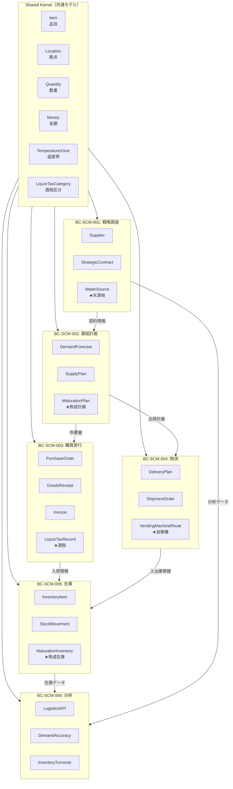
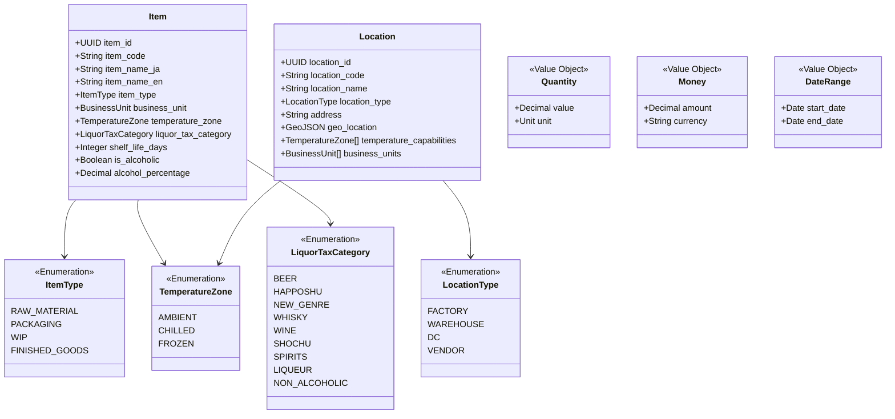
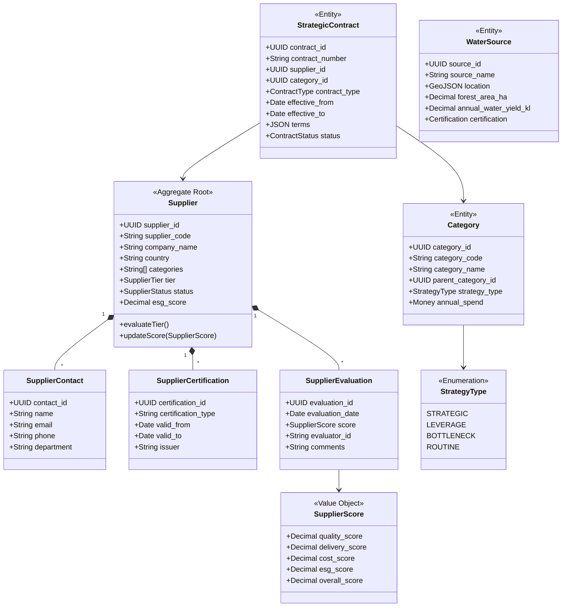
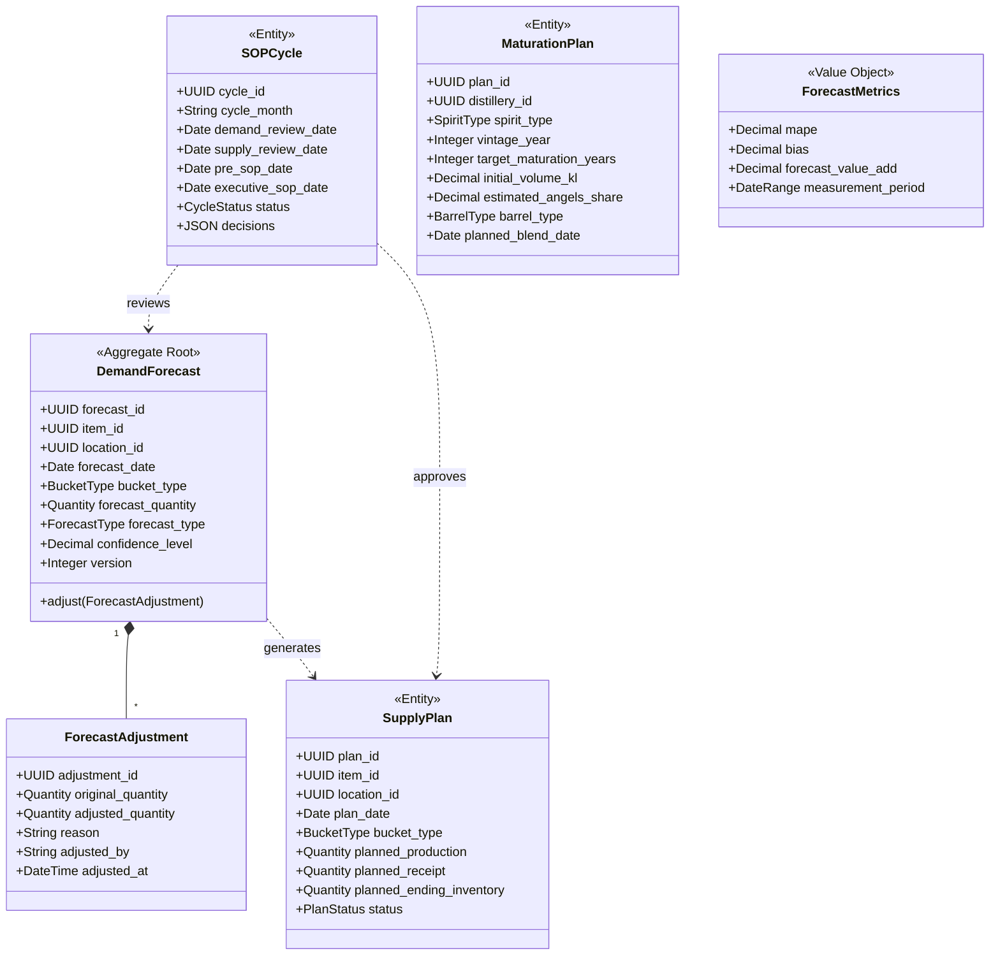
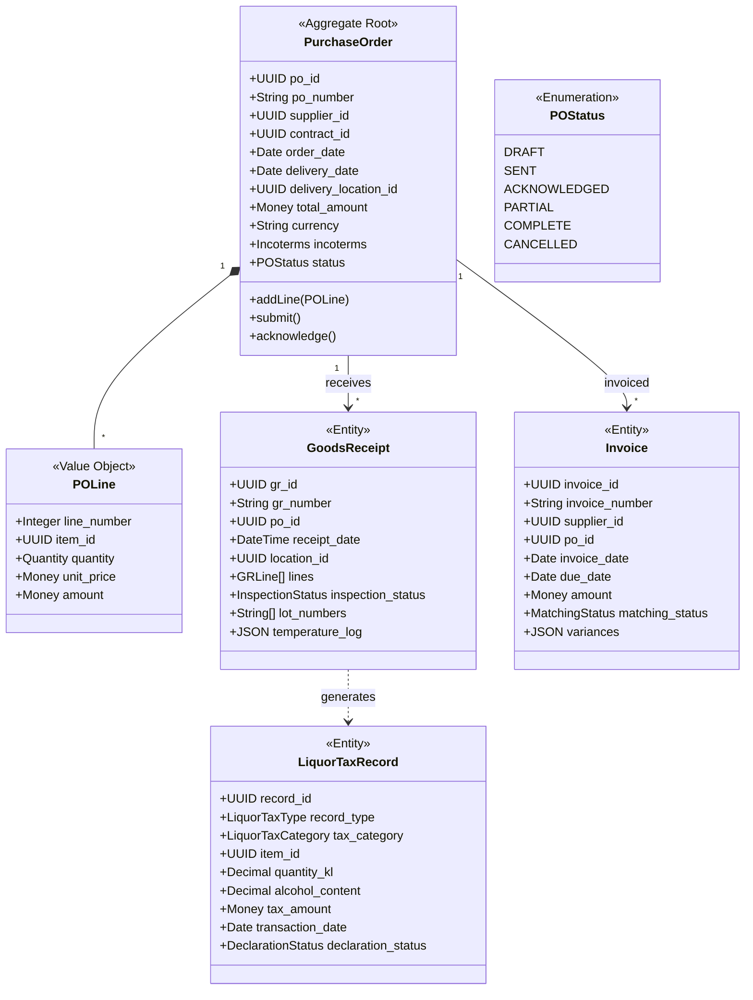
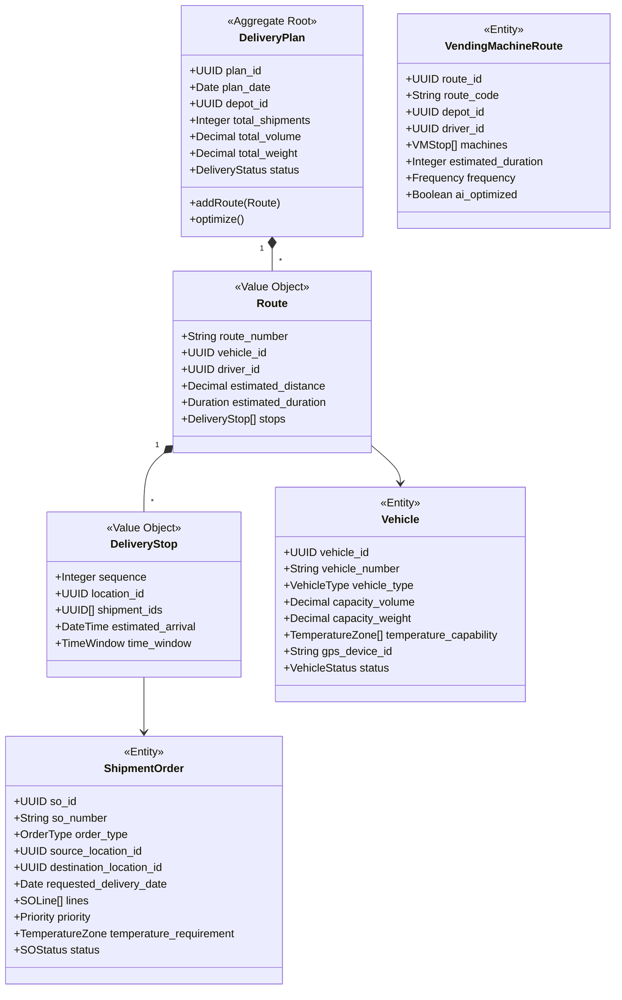
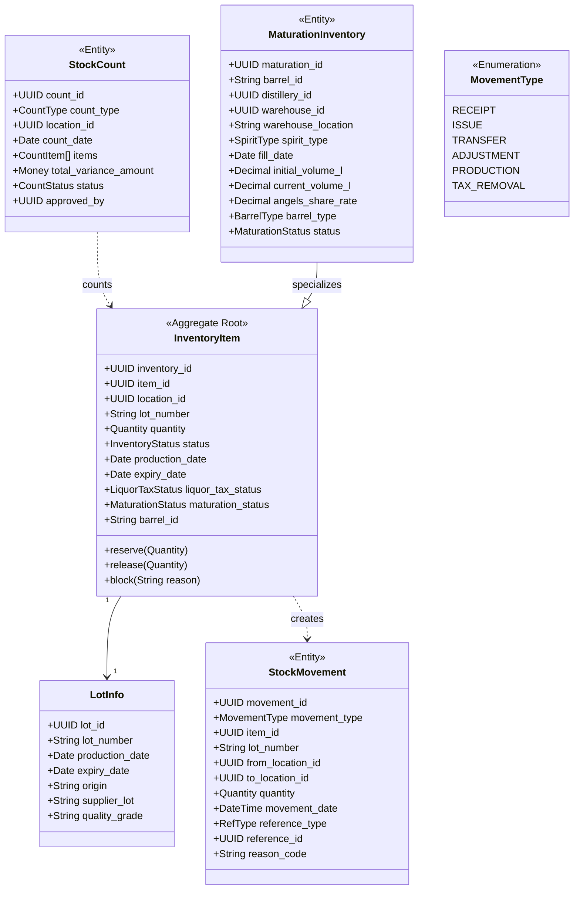
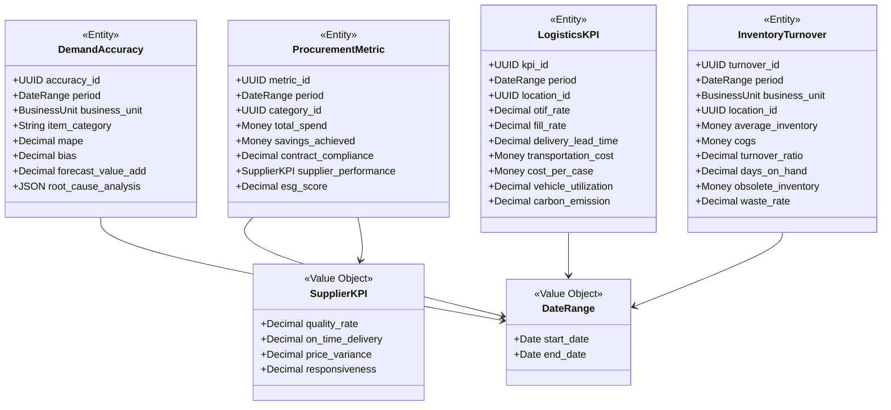

# サントリー SCM ドメインモデル

**作成日**: 2025-12-12
**プロジェクト**: サントリーグループ SCM
**対象**: SCM (Supply Chain Management) ドメイン

---

## 1. ドメインモデル概要図

```
┌─────────────────────────────────────────────────────────────────────────────────┐
│                        サントリー SCM ドメインモデル                              │
├─────────────────────────────────────────────────────────────────────────────────┤
│                                                                                 │
│   ┌─────────────────────────────────────────────────────────────────────────┐  │
│   │                         【Shared Kernel】                                │  │
│   │                          全BC共通モデル                                   │  │
│   │                                                                          │  │
│   │    ┌──────────┐    ┌──────────┐    ┌──────────┐    ┌──────────┐        │  │
│   │    │  Item    │    │ Location │    │ Quantity │    │  Money   │        │  │
│   │    │  (品目)  │    │  (拠点)  │    │  (数量)  │    │  (金額)  │        │  │
│   │    └──────────┘    └──────────┘    └──────────┘    └──────────┘        │  │
│   │                                                                          │  │
│   │    ┌───────────────┐    ┌───────────────┐    ┌───────────────┐         │  │
│   │    │ TemperatureZone│    │LiquorTaxCategory│   │   DateRange   │         │  │
│   │    │   (温度帯)     │    │  (酒税区分)    │    │    (期間)    │         │  │
│   │    └───────────────┘    └───────────────┘    └───────────────┘         │  │
│   └─────────────────────────────────────────────────────────────────────────┘  │
│                                      │                                         │
│         ┌────────────────────────────┼────────────────────────────┐           │
│         │                            │                            │           │
│         ▼                            ▼                            ▼           │
│   ┌───────────┐              ┌───────────┐              ┌───────────┐        │
│   │ BC-SCM-001│              │ BC-SCM-002│              │ BC-SCM-003│        │
│   │ 戦略調達  │──────────────▶│ 需給計画  │──────────────▶│ 購買実行  │        │
│   │           │ 契約情報      │           │ 所要量       │           │        │
│   └───────────┘              └───────────┘              └─────┬─────┘        │
│         │                            │                        │              │
│         │                            │ 出荷計画               │ 入荷情報    │
│         │                            ▼                        ▼              │
│         │                    ┌───────────┐              ┌───────────┐        │
│         │                    │ BC-SCM-004│              │ BC-SCM-005│        │
│         │                    │   物流    │──────────────▶│   在庫    │        │
│         │                    │           │ 入出庫情報    │           │        │
│         │                    └───────────┘              └─────┬─────┘        │
│         │                                                     │              │
│         │                                                     │ 在庫データ  │
│         │                                                     ▼              │
│         │                                               ┌───────────┐        │
│         └───────────────────────────────────────────────▶│ BC-SCM-006│        │
│                        分析データ                         │   分析    │        │
│                                                          └───────────┘        │
│                                                                                 │
└─────────────────────────────────────────────────────────────────────────────────┘
```

---

## 1.1 ドメインモデル概要図（Mermaid）

以下の図はGitHub、VSCode、Obsidianなどで自動レンダリングされます。



---

## 2. Shared Kernel（共通ドメインモデル）

### 2.1 Shared Kernel クラス図（Mermaid）



### 2.2 共通エンティティ

#### Item（品目）

```
┌─────────────────────────────────────────────────────────────┐
│ <<Entity>> Item（品目）                                      │
├─────────────────────────────────────────────────────────────┤
│ 【説明】                                                     │
│ 調達・製造・販売の対象となる物品の総称                        │
│ 原材料、半製品、完成品を含む                                  │
├─────────────────────────────────────────────────────────────┤
│ 【属性】                                                     │
│ + item_id: UUID               # 品目ID（主キー）             │
│ + item_code: String           # 品目コード（社内統一）       │
│ + item_name_ja: String        # 品目名（日本語）             │
│ + item_name_en: String        # 品目名（英語）               │
│ + item_type: ItemType         # 品目種別                     │
│ + business_unit: BusinessUnit # 事業部                       │
│ + temperature_zone: TempZone  # 温度帯                       │
│ + liquor_tax_category: LTC    # 酒税区分（該当時）           │
│ + shelf_life_days: Integer    # 賞味期限日数                 │
│ + is_alcoholic: Boolean       # アルコール製品フラグ         │
│ + alcohol_percentage: Decimal # アルコール度数               │
├─────────────────────────────────────────────────────────────┤
│ 【ItemType】                                                 │
│ RAW_MATERIAL  : 原材料（モルト、ホップ、水）                 │
│ PACKAGING     : 包材（PET、缶、ラベル）                      │
│ WIP           : 仕掛品                                       │
│ FINISHED_GOODS: 完成品                                       │
├─────────────────────────────────────────────────────────────┤
│ 【BusinessUnit】                                             │
│ BEVERAGE : 飲料                                              │
│ SPIRITS  : スピリッツ                                        │
│ BEER     : ビール                                            │
│ WINE     : ワイン                                            │
│ HEALTH   : 健康食品                                          │
└─────────────────────────────────────────────────────────────┘
```

#### Location（拠点）

```
┌─────────────────────────────────────────────────────────────┐
│ <<Entity>> Location（拠点）                                  │
├─────────────────────────────────────────────────────────────┤
│ 【説明】                                                     │
│ 在庫を保有・移動させる場所                                    │
│ 工場、倉庫、配送センター、サプライヤ拠点を含む                │
├─────────────────────────────────────────────────────────────┤
│ 【属性】                                                     │
│ + location_id: UUID                # 拠点ID（主キー）        │
│ + location_code: String            # 拠点コード              │
│ + location_name: String            # 拠点名                  │
│ + location_type: LocationType      # 拠点種別                │
│ + address: String                  # 住所                    │
│ + geo_location: GeoJSON            # 緯度経度                │
│ + temperature_capabilities: TZ[]   # 対応可能温度帯          │
│ + business_units: BU[]             # 取扱事業部              │
├─────────────────────────────────────────────────────────────┤
│ 【LocationType】                                             │
│ FACTORY   : 工場（武蔵野ブルワリー、山崎蒸溜所）             │
│ WAREHOUSE : 倉庫（物流センター）                             │
│ DC        : 配送センター                                     │
│ VENDOR    : サプライヤ拠点                                   │
└─────────────────────────────────────────────────────────────┘
```

### 2.2 共通値オブジェクト

```
┌─────────────────────────────────────────────────────────────┐
│ <<Value Object>> Quantity（数量）                            │
├─────────────────────────────────────────────────────────────┤
│ + value: Decimal   # 数値                                    │
│ + unit: Unit       # 単位（PIECE/CASE/PALLET/KG/L/KL）       │
└─────────────────────────────────────────────────────────────┘

┌─────────────────────────────────────────────────────────────┐
│ <<Value Object>> Money（金額）                               │
├─────────────────────────────────────────────────────────────┤
│ + amount: Decimal  # 金額                                    │
│ + currency: String # 通貨コード（ISO 4217: JPY, USD, EUR）   │
└─────────────────────────────────────────────────────────────┘

┌─────────────────────────────────────────────────────────────┐
│ <<Value Object>> DateRange（期間）                           │
├─────────────────────────────────────────────────────────────┤
│ + start_date: Date # 開始日                                  │
│ + end_date: Date   # 終了日                                  │
└─────────────────────────────────────────────────────────────┘

┌─────────────────────────────────────────────────────────────┐
│ <<Enum>> TemperatureZone（温度帯）                           │
├─────────────────────────────────────────────────────────────┤
│ AMBIENT : 常温（15-25℃）                                    │
│ CHILLED : 冷蔵（2-8℃）                                      │
│ FROZEN  : 冷凍（-18℃以下）                                  │
└─────────────────────────────────────────────────────────────┘

┌─────────────────────────────────────────────────────────────┐
│ <<Enum>> LiquorTaxCategory（酒税区分）★サントリー固有       │
├─────────────────────────────────────────────────────────────┤
│ BEER         : ビール（麦芽比率50%以上）                     │
│ HAPPOSHU     : 発泡酒（麦芽比率50%未満）                     │
│ NEW_GENRE    : 新ジャンル                                    │
│ WHISKY       : ウイスキー                                    │
│ WINE         : ワイン                                        │
│ SHOCHU       : 焼酎                                          │
│ SPIRITS      : スピリッツ                                    │
│ LIQUEUR      : リキュール                                    │
│ NON_ALCOHOLIC: ノンアルコール                                │
└─────────────────────────────────────────────────────────────┘
```

---

## 3. BC-SCM-001: Strategic Procurement（戦略調達）

### 3.1 クラス図（Mermaid）



### 3.2 ドメインモデル図（ASCII）

```
┌─────────────────────────────────────────────────────────────────────────┐
│                    BC-SCM-001: Strategic Procurement                     │
│                           戦略調達ドメイン                               │
├─────────────────────────────────────────────────────────────────────────┤
│                                                                         │
│    ┌─────────────────────────────────────────────────────────────┐     │
│    │              <<Aggregate>> SupplierAggregate                 │     │
│    │                                                              │     │
│    │    ┌────────────────────┐                                   │     │
│    │    │ <<Root>> Supplier  │                                   │     │
│    │    │    (サプライヤ)    │                                   │     │
│    │    ├────────────────────┤                                   │     │
│    │    │ supplier_id        │                                   │     │
│    │    │ supplier_code      │                                   │     │
│    │    │ company_name       │                                   │     │
│    │    │ country            │                                   │     │
│    │    │ categories[]       │                                   │     │
│    │    │ tier              ◀──┐                                 │     │
│    │    │ status             │  │ティア決定                       │     │
│    │    │ esg_score          │  │                                │     │
│    │    └────────┬───────────┘  │                                │     │
│    │             │              │                                │     │
│    │    ┌────────▼───────────┐  │                                │     │
│    │    │ SupplierContact    │  │                                │     │
│    │    │   (担当者)         │  │                                │     │
│    │    └────────────────────┘  │                                │     │
│    │             │              │                                │     │
│    │    ┌────────▼───────────┐  │                                │     │
│    │    │SupplierCertification│ │                                │     │
│    │    │   (認証情報)       │  │                                │     │
│    │    └────────────────────┘  │                                │     │
│    │             │              │                                │     │
│    │    ┌────────▼───────────┐  │                                │     │
│    │    │SupplierEvaluation  │──┘                                │     │
│    │    │   (評価履歴)       │                                   │     │
│    │    └────────────────────┘                                   │     │
│    └─────────────────────────────────────────────────────────────┘     │
│                          │                                             │
│                          │ 契約締結                                    │
│                          ▼                                             │
│    ┌─────────────────────────────────────────────────────────────┐     │
│    │              <<Entity>> StrategicContract                   │     │
│    │                    (戦略契約)                                │     │
│    ├─────────────────────────────────────────────────────────────┤     │
│    │ contract_id    : UUID                                       │     │
│    │ contract_number: String                                     │     │
│    │ supplier_id    : UUID (FK → Supplier)                       │     │
│    │ category_id    : UUID (FK → Category)                       │     │
│    │ contract_type  : ContractType                               │     │
│    │ effective_from : Date                                       │     │
│    │ effective_to   : Date                                       │     │
│    │ terms          : JSON（価格、数量、品質基準）               │     │
│    │ status         : ContractStatus                             │     │
│    └─────────────────────────────────────────────────────────────┘     │
│                                                                         │
│    ┌─────────────────────────────────────────────────────────────┐     │
│    │              <<Entity>> Category（カテゴリ）                 │     │
│    ├─────────────────────────────────────────────────────────────┤     │
│    │ category_id      : UUID                                     │     │
│    │ category_code    : String                                   │     │
│    │ category_name    : String                                   │     │
│    │ parent_category_id: UUID                                    │     │
│    │ strategy_type    : StrategyType（Kraljic Matrix）           │     │
│    │ annual_spend     : Money                                    │     │
│    │ supplier_count   : Integer                                  │     │
│    └─────────────────────────────────────────────────────────────┘     │
│                                                                         │
│    ┌───────────────────────────────────┐                               │
│    │ <<Value Object>> SupplierScore    │                               │
│    ├───────────────────────────────────┤                               │
│    │ quality_score  : Decimal (0-100)  │                               │
│    │ delivery_score : Decimal (0-100)  │                               │
│    │ cost_score     : Decimal (0-100)  │                               │
│    │ esg_score      : Decimal (0-100)  │                               │
│    │ overall_score  : Decimal (0-100)  │                               │
│    │ evaluation_date: Date             │                               │
│    └───────────────────────────────────┘                               │
│                                                                         │
│    【StrategyType（Kraljic Matrix）】                                   │
│    ┌────────────────┬────────────────┐                                 │
│    │   STRATEGIC    │   LEVERAGE     │ ← 支出大                        │
│    │  (戦略品目)    │ (レバレッジ)   │                                 │
│    ├────────────────┼────────────────┤                                 │
│    │  BOTTLENECK    │    ROUTINE     │ ← 支出小                        │
│    │ (ボトルネック) │  (ルーティン)  │                                 │
│    └────────────────┴────────────────┘                                 │
│         供給リスク高      供給リスク低                                  │
│                                                                         │
└─────────────────────────────────────────────────────────────────────────┘
```

### 3.2 サントリー固有: 水源地管理

```
┌─────────────────────────────────────────────────────────────┐
│ <<Entity>> WaterSource（水源地）★サントリー固有             │
├─────────────────────────────────────────────────────────────┤
│ 【説明】                                                     │
│ 「天然水の森」プロジェクトで管理する水源地                   │
│ AWS（Alliance for Water Stewardship）認証対応               │
├─────────────────────────────────────────────────────────────┤
│ + source_id: UUID               # 水源地ID                   │
│ + source_name: String           # 水源地名（白州、奥大山等）│
│ + location: GeoJSON             # 位置情報                   │
│ + forest_area_ha: Decimal       # 森林面積（ヘクタール）     │
│ + annual_water_yield_kl: Decimal# 年間涵養量（キロリットル） │
│ + certification: Certification  # 認証情報（AWS等）          │
│ + environmental_data: JSON      # 環境モニタリングデータ     │
└─────────────────────────────────────────────────────────────┘
```

---

## 4. BC-SCM-002: Demand Planning（需給計画）

### 4.1 クラス図（Mermaid）



### 4.2 ドメインモデル図（ASCII）

```
┌─────────────────────────────────────────────────────────────────────────┐
│                     BC-SCM-002: Demand Planning                          │
│                          需給計画ドメイン                                │
├─────────────────────────────────────────────────────────────────────────┤
│                                                                         │
│    ┌─────────────────────────────────────────────────────────────┐     │
│    │           <<Aggregate>> DemandPlanAggregate                  │     │
│    │                                                              │     │
│    │    ┌──────────────────────┐                                 │     │
│    │    │<<Root>> DemandForecast│                                 │     │
│    │    │     (需要予測)        │                                 │     │
│    │    ├──────────────────────┤                                 │     │
│    │    │ forecast_id          │                                 │     │
│    │    │ item_id (FK)         │                                 │     │
│    │    │ location_id (FK)     │                                 │     │
│    │    │ forecast_date        │                                 │     │
│    │    │ bucket_type          │ DAILY/WEEKLY/MONTHLY            │     │
│    │    │ forecast_quantity    │                                 │     │
│    │    │ forecast_type        │ STATISTICAL/JUDGMENTAL/COMBINED │     │
│    │    │ confidence_level     │ 0.0 - 1.0                       │     │
│    │    │ version              │                                 │     │
│    │    └──────────┬───────────┘                                 │     │
│    │               │                                             │     │
│    │    ┌──────────▼───────────┐    ┌────────────────────┐      │     │
│    │    │ ForecastAdjustment   │    │  ForecastComment   │      │     │
│    │    │   (予測調整)         │    │   (コメント)       │      │     │
│    │    └──────────────────────┘    └────────────────────┘      │     │
│    └─────────────────────────────────────────────────────────────┘     │
│                          │                                             │
│                          │ 予測に基づく                                │
│                          ▼                                             │
│    ┌─────────────────────────────────────────────────────────────┐     │
│    │               <<Entity>> SupplyPlan（供給計画）              │     │
│    ├─────────────────────────────────────────────────────────────┤     │
│    │ plan_id              : UUID                                 │     │
│    │ item_id              : UUID (FK → Item)                     │     │
│    │ location_id          : UUID (FK → Location)                 │     │
│    │ plan_date            : Date                                 │     │
│    │ bucket_type          : BucketType                           │     │
│    │ planned_production   : Quantity                             │     │
│    │ planned_receipt      : Quantity                             │     │
│    │ planned_ending_inventory: Quantity                          │     │
│    │ status               : PlanStatus (DRAFT/CONFIRMED/FROZEN)  │     │
│    └─────────────────────────────────────────────────────────────┘     │
│                                                                         │
│    ┌─────────────────────────────────────────────────────────────┐     │
│    │               <<Entity>> SOPCycle（S&OPサイクル）            │     │
│    ├─────────────────────────────────────────────────────────────┤     │
│    │ cycle_id         : UUID                                     │     │
│    │ cycle_month      : String (YYYY-MM)                         │     │
│    │ demand_review_date   : Date                                 │     │
│    │ supply_review_date   : Date                                 │     │
│    │ pre_sop_date         : Date                                 │     │
│    │ executive_sop_date   : Date                                 │     │
│    │ status           : CycleStatus (IN_PROGRESS/COMPLETED)      │     │
│    │ decisions        : JSON（意思決定事項）                     │     │
│    └─────────────────────────────────────────────────────────────┘     │
│                                                                         │
│    ┌────────────────────────────────┐                                  │
│    │<<Value Object>> ForecastMetrics│                                  │
│    ├────────────────────────────────┤                                  │
│    │ mape: Decimal                  │ Mean Absolute % Error            │
│    │ bias: Decimal                  │ 予測偏り（+過大/-過小）          │
│    │ forecast_value_add: Decimal    │ FVA（予測付加価値）              │
│    │ measurement_period: DateRange  │                                  │
│    └────────────────────────────────┘                                  │
│                                                                         │
└─────────────────────────────────────────────────────────────────────────┘
```

### 4.2 サントリー固有: 熟成在庫計画

```
┌─────────────────────────────────────────────────────────────┐
│ <<Entity>> MaturationPlan（熟成計画）★サントリー固有        │
├─────────────────────────────────────────────────────────────┤
│ 【説明】                                                     │
│ ウイスキー等の長期熟成品の10-20年先の在庫計画               │
├─────────────────────────────────────────────────────────────┤
│ + plan_id: UUID                  # 計画ID                    │
│ + distillery_id: UUID            # 蒸溜所ID                  │
│ + spirit_type: SpiritType        # 原酒種別                  │
│ + vintage_year: Integer          # 蒸留年                    │
│ + target_maturation_years: Integer # 目標熟成年数            │
│ + initial_volume_kl: Decimal     # 初期容量（キロリットル）  │
│ + estimated_angels_share: Decimal# 予想エンジェルズシェア    │
│ + barrel_type: BarrelType        # 樽種別                    │
│ + planned_blend_date: Date       # ブレンド予定日            │
│ + status: MaturationStatus       # NEW_MAKE/MATURING/MATURE  │
└─────────────────────────────────────────────────────────────┘
```

---

## 5. BC-SCM-003: Purchase Execution（購買実行）

### 5.1 クラス図（Mermaid）



### 5.2 ドメインモデル図（ASCII）

```
┌─────────────────────────────────────────────────────────────────────────┐
│                     BC-SCM-003: Purchase Execution                       │
│                          購買実行ドメイン                                │
├─────────────────────────────────────────────────────────────────────────┤
│                                                                         │
│    ┌─────────────────────────────────────────────────────────────┐     │
│    │         <<Aggregate>> PurchaseOrderAggregate                 │     │
│    │                                                              │     │
│    │    ┌────────────────────────┐                               │     │
│    │    │<<Root>> PurchaseOrder  │                               │     │
│    │    │      (発注書)          │                               │     │
│    │    ├────────────────────────┤                               │     │
│    │    │ po_id                  │                               │     │
│    │    │ po_number              │                               │     │
│    │    │ supplier_id (FK)       │                               │     │
│    │    │ contract_id (FK)       │                               │     │
│    │    │ order_date             │                               │     │
│    │    │ delivery_date          │                               │     │
│    │    │ delivery_location_id   │                               │     │
│    │    │ total_amount           │                               │     │
│    │    │ currency               │                               │     │
│    │    │ incoterms              │ FOB/CIF/DDP等                │     │
│    │    │ status                 │                               │     │
│    │    └──────────┬─────────────┘                               │     │
│    │               │ 1                                           │     │
│    │               │                                             │     │
│    │               │ *                                           │     │
│    │    ┌──────────▼─────────────┐    ┌────────────────────┐    │     │
│    │    │  <<VO>> POLine         │    │  POStatusHistory   │    │     │
│    │    │   (発注明細)           │    │   (状態履歴)       │    │     │
│    │    ├────────────────────────┤    └────────────────────┘    │     │
│    │    │ line_number            │                               │     │
│    │    │ item_id                │                               │     │
│    │    │ quantity               │                               │     │
│    │    │ unit_price             │                               │     │
│    │    │ amount                 │                               │     │
│    │    └────────────────────────┘                               │     │
│    └─────────────────────────────────────────────────────────────┘     │
│                          │                                             │
│                          │ 入荷検収                                    │
│                          ▼                                             │
│    ┌─────────────────────────────────────────────────────────────┐     │
│    │               <<Entity>> GoodsReceipt（入荷伝票）            │     │
│    ├─────────────────────────────────────────────────────────────┤     │
│    │ gr_id                : UUID                                 │     │
│    │ gr_number            : String                               │     │
│    │ po_id                : UUID (FK → PurchaseOrder)            │     │
│    │ receipt_date         : DateTime                             │     │
│    │ location_id          : UUID (FK → Location)                 │     │
│    │ lines                : GRLine[]                             │     │
│    │ inspection_status    : InspectionStatus                     │     │
│    │ lot_numbers          : String[]                             │     │
│    │ temperature_log      : JSON（温度管理品の場合）             │     │
│    └─────────────────────────────────────────────────────────────┘     │
│                          │                                             │
│                          │ 三点照合                                    │
│                          ▼                                             │
│    ┌─────────────────────────────────────────────────────────────┐     │
│    │               <<Entity>> Invoice（請求書）                   │     │
│    ├─────────────────────────────────────────────────────────────┤     │
│    │ invoice_id           : UUID                                 │     │
│    │ invoice_number       : String                               │     │
│    │ supplier_id          : UUID (FK → Supplier)                 │     │
│    │ po_id                : UUID (FK → PurchaseOrder)            │     │
│    │ invoice_date         : Date                                 │     │
│    │ due_date             : Date                                 │     │
│    │ amount               : Money                                │     │
│    │ matching_status      : MatchingStatus                       │     │
│    │ variances            : JSON（差異情報）                     │     │
│    └─────────────────────────────────────────────────────────────┘     │
│                                                                         │
│    【POStatus】                                                         │
│    DRAFT → SENT → ACKNOWLEDGED → PARTIAL → COMPLETE                   │
│                                  ↓                                      │
│                              CANCELLED                                  │
│                                                                         │
│    【三点照合フロー】                                                   │
│    ┌──────────┐    ┌──────────┐    ┌──────────┐                       │
│    │発注書(PO)│───▶│入荷(GR)  │───▶│請求書(IV)│                       │
│    │数量・金額│    │数量・品質│    │金額      │                       │
│    └──────────┘    └──────────┘    └──────────┘                       │
│         │               │               │                              │
│         └───────────────┴───────────────┘                              │
│                         │                                              │
│                    照合・差異検出                                       │
│                                                                         │
└─────────────────────────────────────────────────────────────────────────┘
```

### 5.2 サントリー固有: 酒税管理

```
┌─────────────────────────────────────────────────────────────┐
│ <<Entity>> LiquorTaxRecord（酒税記録）★サントリー固有       │
├─────────────────────────────────────────────────────────────┤
│ 【説明】                                                     │
│ 酒税法に基づく原料受払・製成・蔵出しの記録                  │
├─────────────────────────────────────────────────────────────┤
│ + record_id: UUID                # 記録ID                    │
│ + record_type: LiquorTaxType     # 種別（製成/蔵出し/戻入） │
│ + tax_category: LiquorTaxCategory# 酒税区分                 │
│ + item_id: UUID                  # 品目ID                    │
│ + quantity_kl: Decimal           # 数量（キロリットル）      │
│ + alcohol_content: Decimal       # アルコール分              │
│ + tax_amount: Money              # 酒税額                    │
│ + transaction_date: Date         # 取引日                    │
│ + bonded_warehouse_id: UUID      # 保税倉庫ID（該当時）      │
│ + declaration_status: Status     # 申告ステータス            │
└─────────────────────────────────────────────────────────────┘

【LiquorTaxType】
・PRODUCTION (製成): 製造場で酒類を製造した時点
・REMOVAL (蔵出し): 製造場から搬出（酒税課税ポイント）
・RETURN (戻入れ): 搬出した酒類を製造場に戻す
```

---

## 6. BC-SCM-004: Logistics Operations（物流オペレーション）

### 6.1 クラス図（Mermaid）



### 6.2 ドメインモデル図（ASCII）

```
┌─────────────────────────────────────────────────────────────────────────┐
│                    BC-SCM-004: Logistics Operations                      │
│                        物流オペレーションドメイン                         │
├─────────────────────────────────────────────────────────────────────────┤
│                                                                         │
│    ┌─────────────────────────────────────────────────────────────┐     │
│    │           <<Aggregate>> DeliveryPlanAggregate                │     │
│    │                                                              │     │
│    │    ┌────────────────────────┐                               │     │
│    │    │<<Root>> DeliveryPlan   │                               │     │
│    │    │    (配送計画)          │                               │     │
│    │    ├────────────────────────┤                               │     │
│    │    │ plan_id                │                               │     │
│    │    │ plan_date              │                               │     │
│    │    │ depot_id (FK)          │                               │     │
│    │    │ total_shipments        │                               │     │
│    │    │ total_volume           │                               │     │
│    │    │ total_weight           │                               │     │
│    │    │ status                 │                               │     │
│    │    └──────────┬─────────────┘                               │     │
│    │               │ 1                                           │     │
│    │               │ *                                           │     │
│    │    ┌──────────▼─────────────┐                               │     │
│    │    │   <<VO>> Route         │                               │     │
│    │    │    (ルート)            │                               │     │
│    │    ├────────────────────────┤                               │     │
│    │    │ route_number           │                               │     │
│    │    │ vehicle_id             │                               │     │
│    │    │ driver_id              │                               │     │
│    │    │ estimated_distance     │                               │     │
│    │    │ estimated_duration     │                               │     │
│    │    └──────────┬─────────────┘                               │     │
│    │               │ 1                                           │     │
│    │               │ *                                           │     │
│    │    ┌──────────▼─────────────┐                               │     │
│    │    │  <<VO>> DeliveryStop   │                               │     │
│    │    │    (配送先)            │                               │     │
│    │    ├────────────────────────┤                               │     │
│    │    │ sequence               │                               │     │
│    │    │ location_id            │                               │     │
│    │    │ shipment_ids[]         │                               │     │
│    │    │ estimated_arrival      │                               │     │
│    │    │ time_window            │                               │     │
│    │    └────────────────────────┘                               │     │
│    └─────────────────────────────────────────────────────────────┘     │
│                                                                         │
│    ┌─────────────────────────────────────────────────────────────┐     │
│    │               <<Entity>> ShipmentOrder（出荷指示）           │     │
│    ├─────────────────────────────────────────────────────────────┤     │
│    │ so_id                    : UUID                             │     │
│    │ so_number                : String                           │     │
│    │ order_type               : OrderType (SALES/TRANSFER/RETURN)│     │
│    │ source_location_id       : UUID (FK → Location)             │     │
│    │ destination_location_id  : UUID (FK → Location)             │     │
│    │ requested_delivery_date  : Date                             │     │
│    │ lines                    : SOLine[]                         │     │
│    │ priority                 : Priority (NORMAL/HIGH/URGENT)    │     │
│    │ temperature_requirement  : TemperatureZone                  │     │
│    │ status                   : SOStatus                         │     │
│    └─────────────────────────────────────────────────────────────┘     │
│                                                                         │
│    ┌─────────────────────────────────────────────────────────────┐     │
│    │               <<Entity>> Vehicle（車両）                     │     │
│    ├─────────────────────────────────────────────────────────────┤     │
│    │ vehicle_id               : UUID                             │     │
│    │ vehicle_number           : String（ナンバープレート）       │     │
│    │ vehicle_type             : VehicleType                      │     │
│    │ capacity_volume          : Decimal                          │     │
│    │ capacity_weight          : Decimal                          │     │
│    │ temperature_capability   : TemperatureZone[]                │     │
│    │ gps_device_id            : String（traevo連携）             │     │
│    │ status                   : VehicleStatus                    │     │
│    └─────────────────────────────────────────────────────────────┘     │
│                                                                         │
│    【SOStatus】                                                         │
│    PENDING → ALLOCATED → PICKED → SHIPPED → DELIVERED                 │
│                                      ↓                                  │
│                                   RETURNED                              │
│                                                                         │
└─────────────────────────────────────────────────────────────────────────┘
```

### 6.2 サントリー固有: 自販機オペレーション

```
┌─────────────────────────────────────────────────────────────┐
│ <<Entity>> VendingMachineRoute（自販機ルート）★飲料固有     │
├─────────────────────────────────────────────────────────────┤
│ 【説明】                                                     │
│ 66万台の自販機への補充ルート管理                             │
│ AIコラミング（需要予測AI）と連携                             │
├─────────────────────────────────────────────────────────────┤
│ + route_id: UUID                 # ルートID                  │
│ + route_code: String             # ルートコード              │
│ + depot_id: UUID                 # 担当拠点ID                │
│ + driver_id: UUID                # 担当ドライバーID          │
│ + machines: VMStop[]             # 訪問自販機リスト          │
│ + estimated_duration: Integer    # 予定所要時間（分）        │
│ + frequency: Frequency           # 訪問頻度                  │
│ + ai_optimized: Boolean          # AI最適化フラグ            │
│ + last_optimization_at: DateTime # 最終最適化日時            │
│ + status: RouteStatus                                        │
└─────────────────────────────────────────────────────────────┘

┌─────────────────────────────────────────────────────────────┐
│ <<Value Object>> VMStop（自販機停車地点）                    │
├─────────────────────────────────────────────────────────────┤
│ + vending_machine_id: String     # 自販機ID                  │
│ + stop_sequence: Integer         # 訪問順序                  │
│ + estimated_arrival: Time        # 予定到着時刻              │
│ + replenishment_items: JSON      # 補充予定品目              │
│ + actual_replenishment: JSON     # 実績補充品目              │
│ + completion_status: StopStatus  # PENDING/COMPLETED/SKIPPED │
│ + completed_at: DateTime                                     │
└─────────────────────────────────────────────────────────────┘
```

---

## 7. BC-SCM-005: Inventory Control（在庫管理）

### 7.1 クラス図（Mermaid）



### 7.2 ドメインモデル図（ASCII）

```
┌─────────────────────────────────────────────────────────────────────────┐
│                     BC-SCM-005: Inventory Control                        │
│                          在庫管理ドメイン                                │
├─────────────────────────────────────────────────────────────────────────┤
│                                                                         │
│    ┌─────────────────────────────────────────────────────────────┐     │
│    │           <<Aggregate>> InventoryAggregate                   │     │
│    │                                                              │     │
│    │    ┌────────────────────────┐                               │     │
│    │    │<<Root>> InventoryItem  │                               │     │
│    │    │    (在庫品目)          │                               │     │
│    │    ├────────────────────────┤                               │     │
│    │    │ inventory_id           │                               │     │
│    │    │ item_id (FK)           │                               │     │
│    │    │ location_id (FK)       │                               │     │
│    │    │ lot_number             │                               │     │
│    │    │ quantity               │                               │     │
│    │    │ quantity_unit          │                               │     │
│    │    │ status                 │ AVAILABLE/RESERVED/BLOCKED    │     │
│    │    │ production_date        │                               │     │
│    │    │ expiry_date            │                               │     │
│    │    │ liquor_tax_status      │ ★酒類固有                    │     │
│    │    │ maturation_status      │ ★酒類固有                    │     │
│    │    │ maturation_start_date  │ ★酒類固有                    │     │
│    │    │ barrel_id              │ ★酒類固有                    │     │
│    │    └──────────┬─────────────┘                               │     │
│    │               │                                             │     │
│    │    ┌──────────▼─────────────┐                               │     │
│    │    │     LotInfo            │                               │     │
│    │    │    (ロット情報)        │                               │     │
│    │    ├────────────────────────┤                               │     │
│    │    │ lot_id                 │                               │     │
│    │    │ lot_number             │                               │     │
│    │    │ production_date        │                               │     │
│    │    │ expiry_date            │                               │     │
│    │    │ origin                 │ 原産地                        │     │
│    │    │ supplier_lot           │ サプライヤロット番号         │     │
│    │    │ quality_grade          │                               │     │
│    │    └────────────────────────┘                               │     │
│    └─────────────────────────────────────────────────────────────┘     │
│                                                                         │
│    ┌─────────────────────────────────────────────────────────────┐     │
│    │               <<Entity>> StockMovement（在庫移動）           │     │
│    ├─────────────────────────────────────────────────────────────┤     │
│    │ movement_id          : UUID                                 │     │
│    │ movement_type        : MovementType                         │     │
│    │ item_id              : UUID (FK → Item)                     │     │
│    │ lot_number           : String                               │     │
│    │ from_location_id     : UUID (FK → Location)                 │     │
│    │ to_location_id       : UUID (FK → Location)                 │     │
│    │ quantity             : Quantity                             │     │
│    │ movement_date        : DateTime                             │     │
│    │ reference_type       : RefType（PO/SO/ADJUSTMENT等）        │     │
│    │ reference_id         : UUID（参照元ID）                     │     │
│    │ reason_code          : String                               │     │
│    └─────────────────────────────────────────────────────────────┘     │
│                                                                         │
│    ┌─────────────────────────────────────────────────────────────┐     │
│    │               <<Entity>> StockCount（棚卸）                  │     │
│    ├─────────────────────────────────────────────────────────────┤     │
│    │ count_id             : UUID                                 │     │
│    │ count_type           : CountType (FULL/CYCLE/SPOT)          │     │
│    │ location_id          : UUID (FK → Location)                 │     │
│    │ count_date           : Date                                 │     │
│    │ items                : CountItem[]                          │     │
│    │ total_variance_amount: Money                                │     │
│    │ status               : CountStatus                          │     │
│    │ approved_by          : UUID                                 │     │
│    │ approved_at          : DateTime                             │     │
│    └─────────────────────────────────────────────────────────────┘     │
│                                                                         │
│    【MovementType】                                                     │
│    ┌─────────────┬─────────────────────────────────┐                  │
│    │ RECEIPT     │ 入庫（購買、製造、返品）        │                  │
│    │ ISSUE       │ 出庫（出荷、製造消費、廃棄）    │                  │
│    │ TRANSFER    │ 移動（拠点間）                  │                  │
│    │ ADJUSTMENT  │ 調整（棚卸差異、破損）          │                  │
│    │ PRODUCTION  │ 製造入庫（★酒類固有: 製成）     │                  │
│    │ TAX_REMOVAL │ 蔵出し（★酒類固有）             │                  │
│    └─────────────┴─────────────────────────────────┘                  │
│                                                                         │
└─────────────────────────────────────────────────────────────────────────┘
```

### 7.2 サントリー固有: 熟成在庫管理

```
┌─────────────────────────────────────────────────────────────┐
│ <<Entity>> MaturationInventory（熟成在庫）★酒類固有         │
├─────────────────────────────────────────────────────────────┤
│ 【説明】                                                     │
│ ウイスキー等の樽熟成中の在庫を管理                          │
│ 10-20年単位の長期トラッキング                               │
├─────────────────────────────────────────────────────────────┤
│ + maturation_id: UUID            # 熟成在庫ID                │
│ + barrel_id: String              # 樽ID                      │
│ + distillery_id: UUID            # 蒸溜所ID                  │
│ + warehouse_id: UUID             # 熟成庫ID                  │
│ + warehouse_location: String     # 庫内位置（段・列）        │
│ + spirit_type: SpiritType        # 原酒種別                  │
│ + fill_date: Date                # 樽詰め日                  │
│ + initial_volume_l: Decimal      # 初期容量（リットル）      │
│ + current_volume_l: Decimal      # 現在容量                  │
│ + angels_share_rate: Decimal     # エンジェルズシェア率      │
│ + barrel_type: BarrelType        # 樽種別（バーボン/シェリー）│
│ + barrel_size: BarrelSize        # 樽サイズ（180L/250L/480L）│
│ + quality_samples: JSON          # 品質サンプル履歴          │
│ + estimated_mature_date: Date    # 熟成完了予定日            │
│ + status: MaturationStatus       # NEW_MAKE/MATURING/MATURE  │
└─────────────────────────────────────────────────────────────┘

【BarrelType】
・BOURBON   : バーボン樽（アメリカンオーク）
・SHERRY    : シェリー樽（スパニッシュオーク）
・MIZUNARA  : ミズナラ樽（日本固有）
・WINE      : ワイン樽
・RUM       : ラム樽
```

---

## 8. BC-SCM-006: SCM Analytics（SCM分析）

### 8.1 クラス図（Mermaid）



### 8.2 ドメインモデル図（ASCII）

```
┌─────────────────────────────────────────────────────────────────────────┐
│                      BC-SCM-006: SCM Analytics                           │
│                          SCM分析ドメイン                                 │
├─────────────────────────────────────────────────────────────────────────┤
│                                                                         │
│    ┌─────────────────────────────────────────────────────────────┐     │
│    │               <<Entity>> ProcurementMetric（調達指標）       │     │
│    ├─────────────────────────────────────────────────────────────┤     │
│    │ metric_id            : UUID                                 │     │
│    │ period               : DateRange                            │     │
│    │ category_id          : UUID                                 │     │
│    │ total_spend          : Money                                │     │
│    │ savings_achieved     : Money                                │     │
│    │ contract_compliance  : Decimal (%)                          │     │
│    │ supplier_performance : SupplierKPI                          │     │
│    │ esg_score            : Decimal                              │     │
│    └─────────────────────────────────────────────────────────────┘     │
│                                                                         │
│    ┌─────────────────────────────────────────────────────────────┐     │
│    │               <<Entity>> DemandAccuracy（予測精度）          │     │
│    ├─────────────────────────────────────────────────────────────┤     │
│    │ accuracy_id          : UUID                                 │     │
│    │ period               : DateRange                            │     │
│    │ business_unit        : BusinessUnit                         │     │
│    │ item_category        : String                               │     │
│    │ mape                 : Decimal                              │     │
│    │ bias                 : Decimal                              │     │
│    │ forecast_value_add   : Decimal                              │     │
│    │ root_cause_analysis  : JSON                                 │     │
│    └─────────────────────────────────────────────────────────────┘     │
│                                                                         │
│    ┌─────────────────────────────────────────────────────────────┐     │
│    │               <<Entity>> LogisticsKPI（物流KPI）             │     │
│    ├─────────────────────────────────────────────────────────────┤     │
│    │ kpi_id               : UUID                                 │     │
│    │ period               : DateRange                            │     │
│    │ location_id          : UUID                                 │     │
│    │ otif_rate            : Decimal (%)   # On-Time In-Full      │     │
│    │ fill_rate            : Decimal (%)                          │     │
│    │ delivery_lead_time   : Decimal (days)                       │     │
│    │ transportation_cost  : Money                                │     │
│    │ cost_per_case        : Money                                │     │
│    │ vehicle_utilization  : Decimal (%)                          │     │
│    │ carbon_emission      : Decimal (kg CO2)                     │     │
│    └─────────────────────────────────────────────────────────────┘     │
│                                                                         │
│    ┌─────────────────────────────────────────────────────────────┐     │
│    │               <<Entity>> InventoryTurnover（在庫回転）       │     │
│    ├─────────────────────────────────────────────────────────────┤     │
│    │ turnover_id          : UUID                                 │     │
│    │ period               : DateRange                            │     │
│    │ business_unit        : BusinessUnit                         │     │
│    │ location_id          : UUID                                 │     │
│    │ average_inventory    : Money                                │     │
│    │ cogs                 : Money   # Cost of Goods Sold         │     │
│    │ turnover_ratio       : Decimal                              │     │
│    │ days_on_hand         : Decimal                              │     │
│    │ obsolete_inventory   : Money                                │     │
│    │ waste_rate           : Decimal (%)                          │     │
│    └─────────────────────────────────────────────────────────────┘     │
│                                                                         │
│    【主要KPI一覧】                                                      │
│    ┌─────────────────────────────────────────────────────────────┐     │
│    │ KPI名              │ 計算式                   │ 目標値     │     │
│    ├─────────────────────────────────────────────────────────────┤     │
│    │ OTIF              │ 完全納品数/総出荷数      │ ≥95%      │     │
│    │ 在庫回転率        │ COGS/平均在庫            │ ≥12回/年  │     │
│    │ 予測精度(MAPE)    │ |実績-予測|/実績 平均    │ ≤15%      │     │
│    │ サプライヤ納期遵守│ 期日内納品/総発注        │ ≥98%      │     │
│    │ 廃棄率            │ 廃棄金額/在庫金額        │ ≤0.5%     │     │
│    │ CO2排出量        │ 輸送距離×排出係数       │ 前年比-5%  │     │
│    └─────────────────────────────────────────────────────────────┘     │
│                                                                         │
└─────────────────────────────────────────────────────────────────────────┘
```

---

## 9. ドメインイベント一覧

### 9.1 BC別主要イベント

| BC | イベント名 | トリガー | 主な購読者 |
|----|-----------|---------|-----------|
| **BC-001** | ContractConcluded | 契約締結完了 | BC-003, BC-006 |
| | SupplierRiskDetected | リスク検出 | BC-002, BC-003 |
| | SustainableSourceCertified | 認証取得 | SUST |
| **BC-002** | DemandForecastGenerated | 予測生成 | BC-003, BC-005 |
| | ProductionPlanApproved | 生産計画承認 | MFG, BC-003 |
| | SupplyConstraintDetected | 供給制約検出 | BC-003 |
| **BC-003** | PurchaseOrderCreated | 発注作成 | BC-001, Supplier |
| | GoodsReceiptCompleted | 入荷検収完了 | BC-005 |
| | InvoiceVerified | 請求照合完了 | FIN |
| **BC-004** | ShipmentDispatched | 出荷完了 | BC-005, Customer |
| | DeliveryCompleted | 配送完了 | BC-005, BC-006 |
| | VendingMachineStockAlert | 自販機在庫低下 | BC-002 |
| **BC-005** | InventoryUpdated | 在庫更新 | BC-006 |
| | FreshnessAlertRaised | 鮮度アラート | BC-002, BC-004 |
| | MaturationCompleted | 熟成完了 | BC-002, MFG |
| | LiquorTaxDataGenerated | 酒税データ生成 | FIN |
| **BC-006** | KPICalculated | KPI計算完了 | Dashboard |
| | AnomalyDetected | 異常検知 | All BCs |

---

## 10. 用語集（Glossary）

| 日本語 | English | 定義 |
|--------|---------|------|
| 品目 | Item | 調達・製造・販売の対象となる物品 |
| SKU | Stock Keeping Unit | 在庫管理の最小単位 |
| 拠点 | Location | 在庫を保有・移動させる場所 |
| リードタイム | Lead Time | 発注から納品までの期間 |
| ロット | Lot | 同一条件で製造・調達された品目の集合 |
| 温度帯 | Temperature Zone | 品質保持に必要な温度区分 |
| 酒税区分 | Liquor Tax Category | 酒税法に基づく酒類分類 |
| 蔵出し | Taxable Removal | 酒類の製造場からの搬出（課税ポイント） |
| 熟成 | Maturation | ウイスキー等の樽での長期貯蔵 |
| エンジェルズシェア | Angel's Share | 熟成中に蒸発するアルコール |
| S&OP | Sales & Operations Planning | 販売・生産計画調整プロセス |
| MAPE | Mean Absolute Percentage Error | 予測精度指標 |
| OTIF | On-Time In-Full | 完全納品率 |
| 三点照合 | Three-Way Matching | PO・GR・請求書の照合 |
| AIコラミング | AI Colaming | 自販機需要予測AI |
| traevo | traevo | 車両追跡プラットフォーム |

---

## 参照ファイル

| ファイル | 説明 |
|---------|------|
| `ubiquitous-language.yaml` | ユビキタス言語定義（詳細版） |
| `event-architecture.md` | イベントアーキテクチャ |
| `scm-cl3-decomposition-report.md` | CL3分解レポート |
| `scm-software-design-report.md` | ソフトウェア設計レポート |
