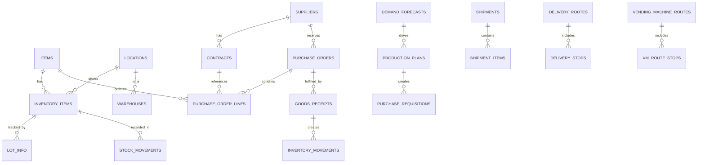

# サントリー SCM ソフトウェア設計レポート

**作成日**: 2025-12-12
**プロジェクト**: サントリーグループ SCM
**Phase**: 5 - Software Design
**対象**: SCM (Supply Chain Management) ドメイン

---

## エグゼクティブサマリー

本レポートは、サントリーグループSCMドメインのソフトウェア設計を包括的にまとめたものである。Parasol V5フレームワークに基づき、CL3分解で定義された6つのBounded Contextに対して、ドメイン言語、API仕様、データベーススキーマ、イベント駆動アーキテクチャを設計した。

### 設計サマリー

| 設計成果物 | 成果 |
|-----------|------|
| **ユビキタス言語** | 8共通用語 + BC別50+用語定義 |
| **API仕様** | 51エンドポイント（6BC + 連携層） |
| **データベース** | 6スキーマ、35+テーブル |
| **イベント** | 36イベント定義（発行/購読） |

### フュージョン層対応

| 層 | API数 | DB配置 | イベント |
|----|-------|--------|---------|
| **共通層** | 22 | scm_shared | 12 |
| **事業固有層** | 24 | scm_{bu} | 18 |
| **連携層** | 5 | scm_integration | 6 |

---

## 1. ドメイン言語設計

### 1.1 Shared Kernel（共通用語）

全BCで共有される基本用語：

| 日本語 | English | 定義 |
|--------|---------|------|
| 品目 | Item | 調達・製造・販売の対象となる物品の総称 |
| SKU | StockKeepingUnit | 在庫管理の最小単位 |
| 拠点 | Location | 在庫を保有・移動させる場所 |
| リードタイム | LeadTime | 発注から納品までに要する期間 |
| ロット | Lot | 同一条件で製造・調達された品目の集合 |
| 温度帯 | TemperatureZone | 品質保持に必要な保管・輸送温度区分 |
| 酒税区分 | LiquorTaxCategory | 酒税法に基づく酒類の分類 |
| 蔵出し | TaxableRemoval | 酒類を製造場から搬出すること |

### 1.2 BC別ユビキタス言語

#### BC-SCM-001: Strategic Procurement（戦略調達）
- **サプライヤ** (Supplier): 原材料・包材・サービスを供給する取引先
- **カテゴリマネジメント** (CategoryManagement): 調達品目をカテゴリ単位で戦略管理
- **スペンド分析** (SpendAnalysis): 調達支出の分析・可視化
- **戦略契約** (StrategicContract): 長期パートナーシップに基づく契約
- **水源地管理** (WatershedManagement): 天然水の森プロジェクト関連

#### BC-SCM-002: Demand Planning（需給計画）
- **需要予測** (DemandForecast): 将来の販売数量を予測
- **S&OP** (SalesOperationsPlanning): 販売・生産計画調整プロセス
- **予測精度** (ForecastAccuracy): 予測と実績の乖離指標（MAPE）
- **熟成在庫計画** (MaturationInventoryPlan): ウイスキー長期熟成計画

#### BC-SCM-003: Purchase Execution（購買実行）
- **発注書** (PurchaseOrder): サプライヤへの正式発注文書
- **三点照合** (ThreeWayMatching): PO・入荷・請求の照合
- **入荷検収** (GoodsReceipt): 納品物の数量・品質確認
- **酒税管理** (LiquorTaxManagement): 酒類の製成・蔵出し管理

#### BC-SCM-004: Logistics Operations（物流オペレーション）
- **出荷指示** (ShipmentOrder): 倉庫への出荷依頼
- **配送計画** (DeliveryPlan): ルート・車両の計画
- **自販機オペレーション** (VendingMachineOperation): 66万台の補充管理
- **コールドチェーン** (ColdChain): 温度管理輸送

#### BC-SCM-005: Inventory Control（在庫管理）
- **在庫残高** (InventoryBalance): 拠点・SKU別の在庫数量
- **棚卸** (PhysicalInventory): 実地棚卸による在庫確認
- **賞味期限管理** (ShelfLifeManagement): FIFO・期限アラート
- **熟成管理** (MaturationManagement): 樽ウイスキーの熟成追跡

#### BC-SCM-006: SCM Analytics（SCM分析）
- **OTIF** (OnTimeInFull): 納期遵守率KPI
- **在庫回転率** (InventoryTurnover): 在庫効率指標
- **サステナビリティ指標** (SustainabilityMetrics): ESG関連KPI

---

## 2. API仕様設計

### 2.1 API概要

```
Base URL: https://api.suntory.com/scm/v1
認証: OAuth 2.0 (Bearer Token)
形式: REST + JSON
バージョニング: URL Path (/v1, /v2)
```

### 2.2 BC別エンドポイント

#### BC-SCM-001: Strategic Procurement (8 endpoints)

| Method | Endpoint | 説明 | フュージョン層 |
|--------|----------|------|--------------|
| GET | /suppliers | サプライヤ一覧取得 | 共通層 |
| POST | /suppliers | サプライヤ登録 | 共通層 |
| GET | /suppliers/{id} | サプライヤ詳細 | 共通層 |
| PUT | /suppliers/{id}/evaluation | サプライヤ評価更新 | 共通層 |
| GET | /suppliers/{id}/risks | リスク情報取得 | 共通層 |
| GET | /contracts | 契約一覧 | 共通層 |
| POST | /contracts | 契約登録 | 共通層 |
| GET | /category-strategies | カテゴリ戦略一覧 | 共通層 |

#### BC-SCM-002: Demand Planning (9 endpoints)

| Method | Endpoint | 説明 | フュージョン層 |
|--------|----------|------|--------------|
| GET | /forecasts | 需要予測一覧 | 事業固有層 |
| POST | /forecasts | 需要予測作成 | 事業固有層 |
| GET | /forecasts/{id}/accuracy | 予測精度評価 | 事業固有層 |
| GET | /production-plans | 生産計画一覧 | 事業固有層 |
| POST | /production-plans | 生産計画作成 | 事業固有層 |
| GET | /inventory-plans | 在庫計画一覧 | 連携層 |
| POST | /inventory-plans | 在庫計画作成 | 連携層 |
| GET | /sop-meetings | S&OP会議一覧 | 連携層 |
| POST | /sop-meetings | S&OP会議登録 | 連携層 |

#### BC-SCM-003: Purchase Execution (9 endpoints)

| Method | Endpoint | 説明 | フュージョン層 |
|--------|----------|------|--------------|
| GET | /purchase-orders | 発注一覧 | 事業固有層 |
| POST | /purchase-orders | 発注作成 | 事業固有層 |
| PUT | /purchase-orders/{id}/approve | 発注承認 | 事業固有層 |
| PUT | /purchase-orders/{id}/change | 発注変更 | 事業固有層 |
| GET | /delivery-schedules | 納期一覧 | 事業固有層 |
| POST | /goods-receipts | 入荷検収登録 | 事業固有層 |
| GET | /goods-receipts/{id} | 入荷詳細 | 事業固有層 |
| POST | /invoice-matching | 請求照合実行 | 事業固有層 |
| GET | /invoice-matching/{id} | 照合結果 | 事業固有層 |

#### BC-SCM-004: Logistics Operations (11 endpoints)

| Method | Endpoint | 説明 | フュージョン層 |
|--------|----------|------|--------------|
| POST | /warehouses/{id}/inbound | 入庫処理 | 共通層 |
| POST | /warehouses/{id}/outbound | 出庫処理 | 共通層 |
| POST | /warehouses/{id}/stock-count | 棚卸登録 | 共通層 |
| GET | /delivery-routes | 配送ルート一覧 | 事業固有層 |
| POST | /delivery-routes/optimize | ルート最適化 | 事業固有層 |
| GET | /vending-machine-routes | 自販機ルート | 飲料固有 |
| POST | /vending-machine-routes | ルート作成 | 飲料固有 |
| PUT | /vending-machine-routes/{id}/complete | 補充完了 | 飲料固有 |
| GET | /vehicles | 車両一覧 | 共通層 |
| POST | /shipments | 出荷作成 | 共通層 |
| GET | /shipments/{id}/tracking | 追跡情報 | 共通層 |

#### BC-SCM-005: Inventory Control (7 endpoints)

| Method | Endpoint | 説明 | フュージョン層 |
|--------|----------|------|--------------|
| GET | /inventory | 在庫照会 | 共通層 |
| GET | /inventory/history | 在庫履歴 | 共通層 |
| POST | /inventory/movements | 在庫移動 | 共通層 |
| GET | /inventory/freshness-alerts | 鮮度アラート | 事業固有層 |
| GET | /lots/{lotId}/trace | ロット追跡 | 共通層 |
| POST | /lots/{lotId}/recall | リコール実行 | 共通層 |
| GET | /maturation-inventory | 熟成在庫（酒類固有） | 酒類固有 |

#### BC-SCM-006: SCM Analytics (5 endpoints)

| Method | Endpoint | 説明 | フュージョン層 |
|--------|----------|------|--------------|
| GET | /analytics/procurement | 調達分析 | 共通層 |
| GET | /analytics/demand | 需給分析 | 共通層 |
| GET | /analytics/logistics-kpi | 物流KPI | 共通層 |
| GET | /analytics/inventory | 在庫分析 | 共通層 |
| GET | /analytics/supplier-performance | サプライヤ分析 | 共通層 |

#### 連携層API (2 endpoints)

| Method | Endpoint | 説明 |
|--------|----------|------|
| POST | /coordination/demand-adjustment | 事業間需要調整 |
| POST | /coordination/capacity-allocation | 生産能力配分 |

---

## 3. データベーススキーマ設計

### 3.1 スキーマ構成

```
┌─────────────────────────────────────────────────────────┐
│                    PostgreSQL Cluster                    │
├─────────────────────────────────────────────────────────┤
│                                                         │
│  ┌─────────────┐  ┌─────────────┐  ┌─────────────┐    │
│  │ scm_shared  │  │ scm_procure │  │ scm_demand  │    │
│  │ (共通層)    │  │ (戦略調達)  │  │ (需給計画)  │    │
│  └─────────────┘  └─────────────┘  └─────────────┘    │
│                                                         │
│  ┌─────────────┐  ┌─────────────┐  ┌─────────────┐    │
│  │ scm_purchase│  │scm_logistics│  │scm_inventory│    │
│  │ (購買実行)  │  │ (物流)      │  │ (在庫管理)  │    │
│  └─────────────┘  └─────────────┘  └─────────────┘    │
│                                                         │
│  ┌─────────────┐                                       │
│  │scm_analytics│                                       │
│  │ (分析)      │                                       │
│  └─────────────┘                                       │
│                                                         │
└─────────────────────────────────────────────────────────┘
```

### 3.2 サントリー固有ENUM定義

```sql
-- 事業部区分
CREATE TYPE business_unit AS ENUM (
    'BEVERAGE',      -- 飲料
    'SPIRITS',       -- スピリッツ
    'BEER',          -- ビール
    'WINE',          -- ワイン
    'HEALTH'         -- 健康食品
);

-- 温度帯
CREATE TYPE temperature_zone AS ENUM (
    'AMBIENT',       -- 常温 (15-25℃)
    'CHILLED',       -- 冷蔵 (2-8℃)
    'FROZEN'         -- 冷凍 (-18℃以下)
);

-- 酒税区分
CREATE TYPE liquor_tax_category AS ENUM (
    'BEER',          -- ビール
    'HAPPOSHU',      -- 発泡酒
    'NEW_GENRE',     -- 新ジャンル
    'WHISKY',        -- ウイスキー
    'WINE',          -- ワイン
    'SHOCHU',        -- 焼酎
    'SPIRITS',       -- スピリッツ
    'LIQUEUR',       -- リキュール
    'NON_ALCOHOLIC'  -- ノンアルコール
);

-- 熟成状態（酒類固有）
CREATE TYPE maturation_status AS ENUM (
    'NEW_MAKE',      -- ニューメイク（蒸留直後）
    'MATURING',      -- 熟成中
    'MATURE',        -- 熟成完了
    'BLENDED'        -- ブレンド済み
);
```

### 3.3 主要テーブル構造

#### scm_shared.items（品目マスタ）

```sql
CREATE TABLE scm_shared.items (
    item_id UUID PRIMARY KEY DEFAULT gen_random_uuid(),
    item_code VARCHAR(20) NOT NULL UNIQUE,
    item_name_ja VARCHAR(200) NOT NULL,
    item_name_en VARCHAR(200),
    item_type item_type NOT NULL,
    business_unit business_unit NOT NULL,
    temperature_zone temperature_zone NOT NULL DEFAULT 'AMBIENT',
    liquor_tax_category liquor_tax_category,
    shelf_life_days INTEGER,
    is_alcoholic BOOLEAN DEFAULT FALSE,
    alcohol_percentage DECIMAL(4,2),

    -- 監査列
    created_at TIMESTAMPTZ DEFAULT NOW(),
    updated_at TIMESTAMPTZ DEFAULT NOW(),
    created_by VARCHAR(100),
    updated_by VARCHAR(100),
    deleted_at TIMESTAMPTZ
);

CREATE INDEX idx_items_business_unit ON scm_shared.items(business_unit);
CREATE INDEX idx_items_liquor_tax ON scm_shared.items(liquor_tax_category);
```

#### scm_inventory.inventory_items（在庫品目）

```sql
CREATE TABLE scm_inventory.inventory_items (
    inventory_id UUID PRIMARY KEY DEFAULT gen_random_uuid(),
    item_id UUID NOT NULL REFERENCES scm_shared.items(item_id),
    location_id UUID NOT NULL REFERENCES scm_shared.locations(location_id),
    lot_number VARCHAR(50) NOT NULL,
    quantity DECIMAL(15,3) NOT NULL,
    quantity_unit VARCHAR(10) NOT NULL,
    status inventory_status NOT NULL DEFAULT 'AVAILABLE',

    -- 鮮度管理
    production_date DATE,
    expiry_date DATE,

    -- 酒類固有
    liquor_tax_status liquor_tax_status,
    bonded_warehouse_id UUID,

    -- 熟成管理（ウイスキー等）
    maturation_status maturation_status,
    maturation_start_date DATE,
    barrel_id VARCHAR(50),

    -- 監査列
    created_at TIMESTAMPTZ DEFAULT NOW(),
    updated_at TIMESTAMPTZ DEFAULT NOW()
);

CREATE INDEX idx_inv_item_location ON scm_inventory.inventory_items(item_id, location_id);
CREATE INDEX idx_inv_expiry ON scm_inventory.inventory_items(expiry_date);
CREATE INDEX idx_inv_maturation ON scm_inventory.inventory_items(maturation_status);
```

#### scm_logistics.vending_machine_routes（自販機ルート - 飲料固有）

```sql
CREATE TABLE scm_logistics.vending_machine_routes (
    route_id UUID PRIMARY KEY DEFAULT gen_random_uuid(),
    route_code VARCHAR(20) NOT NULL,
    route_name VARCHAR(100) NOT NULL,
    assigned_driver_id UUID,
    assigned_vehicle_id UUID REFERENCES scm_logistics.vehicles(vehicle_id),

    -- ルート情報
    start_location_id UUID REFERENCES scm_shared.locations(location_id),
    estimated_duration_minutes INTEGER,
    estimated_distance_km DECIMAL(8,2),

    -- AIコラミング連携
    ai_optimized BOOLEAN DEFAULT FALSE,
    last_optimization_at TIMESTAMPTZ,

    -- 監査列
    created_at TIMESTAMPTZ DEFAULT NOW(),
    updated_at TIMESTAMPTZ DEFAULT NOW()
);

-- 自販機ルート詳細
CREATE TABLE scm_logistics.vending_machine_route_stops (
    stop_id UUID PRIMARY KEY DEFAULT gen_random_uuid(),
    route_id UUID NOT NULL REFERENCES scm_logistics.vending_machine_routes(route_id),
    vending_machine_id VARCHAR(20) NOT NULL,
    stop_sequence INTEGER NOT NULL,
    estimated_arrival_time TIME,

    -- 補充情報
    replenishment_items JSONB,
    actual_replenishment JSONB,
    completion_status stop_status DEFAULT 'PENDING',
    completed_at TIMESTAMPTZ
);
```

### 3.4 ERD（簡略版）



---

## 4. イベント駆動アーキテクチャ

### 4.1 イベントカタログ概要

| BC | 発行イベント | 購読イベント | 主要イベント |
|----|------------|------------|-------------|
| BC-001 戦略調達 | 5 | 5 | ContractConcluded, SupplierRiskDetected |
| BC-002 需給計画 | 6 | 7 | DemandForecastGenerated, ProductionPlanApproved |
| BC-003 購買実行 | 6 | 4 | PurchaseOrderCreated, GoodsReceiptCompleted |
| BC-004 物流オペ | 7 | 4 | ShipmentDispatched, DeliveryCompleted |
| BC-005 在庫管理 | 8 | 5 | InventoryUpdated, FreshnessAlertRaised |
| BC-006 SCM分析 | 4 | 8 | KPICalculated, AnomalyDetected |

### 4.2 サントリー固有イベント

```yaml
# 自販機在庫アラート（AIコラミング連携）
- name: VendingMachineStockAlert
  producer: BC-SCM-004-Logistics
  consumers:
    - BC-SCM-002-Demand-Planning
    - External-AIColaming
  payload:
    - vendingMachineId: string
    - itemId: string
    - currentStock: number
    - predictedStockout: datetime
    - recommendedReplenishment: number
  trigger: IoTセンサーによる在庫低下検出時

# 熟成完了通知（ウイスキー）
- name: MaturationCompleted
  producer: BC-SCM-005-Inventory-Control
  consumers:
    - BC-SCM-002-Demand-Planning
    - MFG-Blending
    - BRAND-Quality
  payload:
    - barrelId: string
    - distilleryCode: string
    - maturationYears: number
    - qualityGrade: string
    - availableVolume: number
  trigger: 熟成年数到達＋品質検査合格時

# 酒税申告データ生成
- name: LiquorTaxDataGenerated
  producer: BC-SCM-005-Inventory-Control
  consumers:
    - FIN-TaxCompliance
    - External-NTA (国税庁)
  payload:
    - reportPeriod: string
    - taxCategory: string
    - productionVolume: number
    - removalVolume: number
    - taxAmount: number
  trigger: 月次締め処理完了時
```

### 4.3 イベントフロー図

```
┌─────────────────────────────────────────────────────────────────────┐
│                        SCM イベントフロー                            │
├─────────────────────────────────────────────────────────────────────┤
│                                                                     │
│  ┌─────────┐    ContractConcluded    ┌─────────┐                   │
│  │ 戦略調達 │ ─────────────────────▶ │ 購買実行 │                   │
│  │ BC-001  │                         │ BC-003  │                   │
│  └─────────┘                         └────┬────┘                   │
│       │                                   │                         │
│       │ SupplierRiskDetected              │ PurchaseOrderCreated    │
│       ▼                                   ▼                         │
│  ┌─────────┐    DemandForecastGenerated  ┌─────────┐               │
│  │ 需給計画 │ ◀────────────────────────  │  在庫   │               │
│  │ BC-002  │                             │ BC-005  │               │
│  └────┬────┘                             └────┬────┘               │
│       │                                       │                     │
│       │ ProductionPlanApproved                │ InventoryUpdated    │
│       ▼                                       ▼                     │
│  ┌─────────┐    ShipmentDispatched       ┌─────────┐               │
│  │  物流   │ ─────────────────────────▶  │  分析   │               │
│  │ BC-004  │                             │ BC-006  │               │
│  └─────────┘                             └─────────┘               │
│                                                                     │
│  【サントリー固有フロー】                                            │
│                                                                     │
│  自販機IoT → VendingMachineStockAlert → AIコラミング → 補充計画    │
│                                                                     │
│  熟成庫センサー → MaturationCompleted → ブレンド計画 → 瓶詰計画     │
│                                                                     │
└─────────────────────────────────────────────────────────────────────┘
```

---

## 5. サービス間連携設計

### 5.1 Context Map

```
┌─────────────────────────────────────────────────────────────────────┐
│                      SCM Context Map                                 │
├─────────────────────────────────────────────────────────────────────┤
│                                                                     │
│   ┌─────────────────────────────────────────────────────────────┐  │
│   │                    【Upstream】                              │  │
│   │                                                              │  │
│   │  ┌──────────────┐         ┌──────────────┐                  │  │
│   │  │ BC-001       │ OHS/PL  │ BC-002       │                  │  │
│   │  │ Strategic    │────────▶│ Demand       │                  │  │
│   │  │ Procurement  │         │ Planning     │                  │  │
│   │  └──────────────┘         └──────┬───────┘                  │  │
│   │         │                        │                          │  │
│   │         │ OHS/PL                 │ OHS/PL                   │  │
│   │         ▼                        ▼                          │  │
│   │  ┌──────────────┐         ┌──────────────┐                  │  │
│   │  │ BC-003       │ OHS/PL  │ BC-004       │                  │  │
│   │  │ Purchase     │────────▶│ Logistics    │                  │  │
│   │  │ Execution    │         │ Operations   │                  │  │
│   │  └──────┬───────┘         └──────┬───────┘                  │  │
│   │         │                        │                          │  │
│   │         │ OHS/PL                 │ OHS/PL                   │  │
│   │         └────────┬───────────────┘                          │  │
│   │                  ▼                                          │  │
│   │           ┌──────────────┐                                  │  │
│   │           │ BC-005       │                                  │  │
│   │           │ Inventory    │                                  │  │
│   │           │ Control      │                                  │  │
│   │           └──────┬───────┘                                  │  │
│   │                  │                                          │  │
│   │                  │ PL (Published Language)                  │  │
│   │                  ▼                                          │  │
│   │           ┌──────────────┐                                  │  │
│   │           │ BC-006       │                                  │  │
│   │           │ SCM Analytics│                                  │  │
│   │           └──────────────┘                                  │  │
│   │                                                              │  │
│   │    【Downstream】                                            │  │
│   │                                                              │  │
│   └─────────────────────────────────────────────────────────────┘  │
│                                                                     │
│   凡例:                                                             │
│   OHS = Open Host Service（公開ホストサービス）                     │
│   PL  = Published Language（公開言語）                              │
│   ACL = Anti-Corruption Layer（腐敗防止層）                         │
│                                                                     │
└─────────────────────────────────────────────────────────────────────┘
```

### 5.2 連携パターン

| From BC | To BC | パターン | 連携方式 | 説明 |
|---------|-------|---------|---------|------|
| BC-001 | BC-003 | OHS/PL | イベント | 契約情報提供 |
| BC-002 | BC-003 | OHS/PL | イベント | 所要量依頼 |
| BC-002 | BC-004 | OHS/PL | イベント | 出荷計画 |
| BC-003 | BC-005 | OHS/PL | イベント | 入荷情報 |
| BC-004 | BC-005 | OHS/PL | イベント | 入出庫情報 |
| BC-005 | BC-006 | PL | イベント | 在庫変動データ |
| 全BC | BC-006 | PL | イベント | KPI計算用データ |

### 5.3 外部システム連携

```
┌─────────────────────────────────────────────────────────────────────┐
│                    外部システム連携                                  │
├─────────────────────────────────────────────────────────────────────┤
│                                                                     │
│  ┌─────────────┐                      ┌─────────────┐              │
│  │ MFG         │◀─ 生産計画/実績 ───▶│ BC-002      │              │
│  │ 製造システム │                      │ 需給計画    │              │
│  └─────────────┘                      └─────────────┘              │
│                                                                     │
│  ┌─────────────┐                      ┌─────────────┐              │
│  │ MKT         │◀─ 販売予測 ────────▶│ BC-002      │              │
│  │ マーケ      │                      │ 需給計画    │              │
│  └─────────────┘                      └─────────────┘              │
│                                                                     │
│  ┌─────────────┐                      ┌─────────────┐              │
│  │ FIN         │◀─ 支払依頼 ────────▶│ BC-003      │              │
│  │ 経理        │                      │ 購買実行    │              │
│  └─────────────┘                      └─────────────┘              │
│                                                                     │
│  ┌─────────────┐                      ┌─────────────┐              │
│  │ AIコラミング │◀─ 自販機データ ───▶│ BC-004      │              │
│  │ (66万台)    │                      │ 物流        │              │
│  └─────────────┘                      └─────────────┘              │
│                                                                     │
│  ┌─────────────┐                      ┌─────────────┐              │
│  │ traevo      │◀─ 車両追跡 ────────▶│ BC-004      │              │
│  │ 輸送PF     │                      │ 物流        │              │
│  └─────────────┘                      └─────────────┘              │
│                                                                     │
│  ┌─────────────┐                      ┌─────────────┐              │
│  │ 日立Lumada  │◀─ トレーサビリティ─▶│ BC-005      │              │
│  │ 60工場300倉庫│                      │ 在庫        │              │
│  └─────────────┘                      └─────────────┘              │
│                                                                     │
└─────────────────────────────────────────────────────────────────────┘
```

---

## 6. フュージョン層別設計まとめ

### 6.1 共通層（Generic Layer）

| 項目 | 内容 |
|------|------|
| **目的** | 全事業部で共有する基盤機能 |
| **DB** | scm_shared スキーマ |
| **API** | 22エンドポイント |
| **主要機能** | サプライヤマスタ、品目マスタ、拠点マスタ、契約管理、在庫可視化、分析基盤 |
| **実施策対応** | traevo（車両追跡）、日立Lumada、天然水の森、Sedex |

### 6.2 事業固有層（Business-Specific Layer）

| 事業部 | 固有機能 | 固有イベント |
|--------|---------|-------------|
| **飲料** | 自販機ルート管理、AIコラミング連携、日配鮮度管理 | VendingMachineStockAlert |
| **酒類** | 熟成管理、酒税管理、蔵出し処理 | MaturationCompleted, LiquorTaxDataGenerated |
| **健康食品** | GMP製造連携、定期配送管理 | SubscriptionDeliveryScheduled |

### 6.3 連携層（Integration Layer）

| 機能 | 説明 | API |
|------|------|-----|
| **事業間需要調整** | 繁忙期の事業間リソース融通 | POST /coordination/demand-adjustment |
| **生産能力配分** | 共通工場の生産枠配分 | POST /coordination/capacity-allocation |
| **在庫再配置** | 事業間在庫移動の調整 | POST /coordination/inventory-reallocation |

---

## 7. 次のステップ

### 7.1 Phase 6: 実装への移行

1. **優先度High: 共通層基盤**
   - scm_shared スキーマ構築
   - 品目/拠点マスタAPI実装
   - 認証・認可基盤

2. **優先度High: 在庫可視化**
   - BC-SCM-005 Inventory Control
   - リアルタイム在庫照会API
   - 日立Lumada連携

3. **優先度Medium: 需給計画**
   - BC-SCM-002 Demand Planning
   - 需要予測エンジン連携
   - S&OP会議支援

4. **優先度Medium: 物流オペ**
   - BC-SCM-004 Logistics Operations
   - AIコラミング連携
   - traevo連携

### 7.2 技術スタック推奨

| レイヤー | 技術 | 理由 |
|---------|------|------|
| API Gateway | Kong / AWS API Gateway | 認証・レート制限 |
| Backend | Python (FastAPI) / Go | 高速・型安全 |
| Database | PostgreSQL | JSONB、パーティショニング |
| Event Bus | Apache Kafka | 高スループット、耐障害性 |
| Cache | Redis | 在庫キャッシュ |
| Search | Elasticsearch | ロット追跡検索 |

---

## 参照ファイル

| ファイル | 説明 |
|---------|------|
| `5-software/bounded-contexts/scm/domain-language/ubiquitous-language.yaml` | ユビキタス言語定義 |
| `4-architecture/event-architecture.md` | イベントアーキテクチャ |
| `analysis/scm-cl3-decomposition-report.md` | CL3分解レポート |

---

**作成**: Parasol V5 Phase 5 Software Design
**レビュー**: 要
**次Phase**: Phase 6 - Implementation
