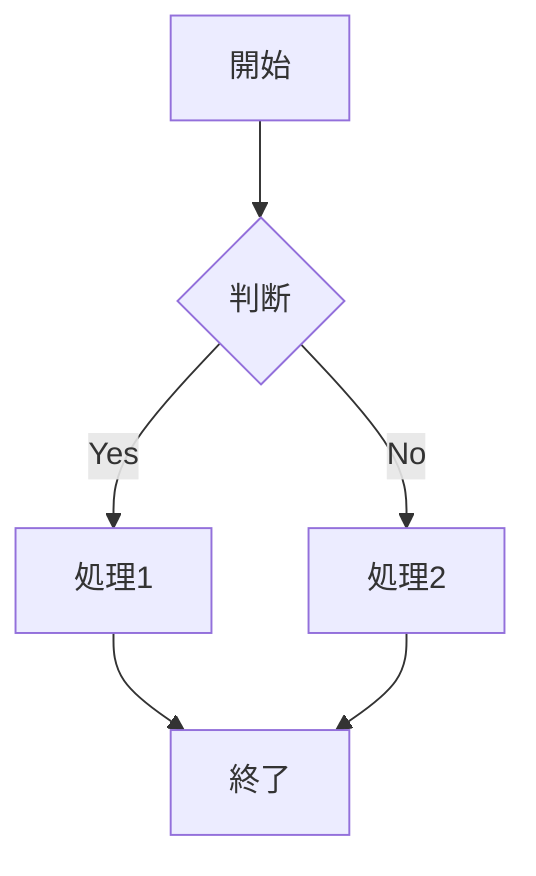

# Markdown機能テスト文書

このドキュメントは、書籍生成システムのMarkdown処理能力をテストするためのものです。

## 1. 基本的なテキスト装飾

**太字のテキスト** と *イタリック体のテキスト* と ***太字イタリック*** の組み合わせ。

`インラインコード` の表示もテストします。

## 2. リスト機能

### 順序なしリスト
- 項目1
- 項目2
  - ネストされた項目2.1
  - ネストされた項目2.2
    - 深くネストされた項目2.2.1
- 項目3

### 順序付きリスト
1. 最初の項目
2. 二番目の項目
   1. サブ項目1
   2. サブ項目2
3. 三番目の項目

### チェックリスト
- [ ] 未完了のタスク
- [x] 完了したタスク
- [ ] 別の未完了タスク

## 3. 引用

> これは引用ブロックです。
> 複数行にわたる引用も可能です。
> 
> 引用の中に新しい段落も作れます。

## 4. リンクと画像

[Parasolプロジェクトのリンク](https://example.com)

画像の例（実際には表示されませんが、構文をテスト）:


## 5. コードブロック

### 言語指定なしのコード
```
function hello() {
    console.log("Hello, World!");
}
```

### JavaScriptコード
```javascript
const parasol = {
    version: "V5",
    phases: 8,
    axes: 6
};

function analyzeValue(stream) {
    return stream.filter(v => v.priority > 0.8);
}
```

### Pythonコード
```python
class ParasolAnalyzer:
    def __init__(self, version="V5"):
        self.version = version
        self.phases = list(range(8))
    
    def analyze(self, data):
        """データを分析する"""
        return [self.process(item) for item in data]
```

## 6. 表（テーブル）

### 標準的なMarkdownテーブル

| フェーズ | 名称 | 主な成果物 | 期間の目安 |
|---------|------|-----------|-----------|
| Phase 0 | 準備 | プロジェクト憲章 | 1-2週間 |
| Phase 1 | 分析 | 現状分析レポート | 2-3週間 |
| Phase 2 | 価値設計 | 価値ストリーム図 | 3-4週間 |
| Phase 3 | 能力設計 | ケイパビリティマップ | 4-5週間 |

### 複雑なテーブル（アライメント付き）

| 左寄せ | 中央寄せ | 右寄せ |
|:-------|:-------:|------:|
| データ1 | データ2 | 100 |
| より長いデータ | 短い | 2,500 |
| 最後の行 | 最終データ | 999,999 |

### コードブロック内のテーブル（ASCII形式）

```
┌─────────────┬──────────────┬───────────────┐
│ カラム1     │ カラム2      │ カラム3       │
├─────────────┼──────────────┼───────────────┤
│ データA     │ データB      │ データC       │
│ 長いデータ  │ 短い         │ 中間          │
└─────────────┴──────────────┴───────────────┘
```

## 7. 水平線

---

別のセクション

***

さらに別のセクション

## 8. HTMLの埋め込み

<div style="background-color: #f0f0f0; padding: 10px;">
このようにHTMLを直接埋め込むこともできます。
</div>

## 9. 複雑な組み合わせ

### リスト内のコードブロック

1. 最初にセットアップを行います：
   ```bash
   npm install parasol-v5
   ```

2. 次に設定ファイルを作成：
   ```json
   {
     "version": "5.0",
     "phases": ["0", "1", "2", "3", "4", "5", "6", "7"]
   }
   ```

### 引用内のリスト

> 重要なポイント：
> - ポイント1
> - ポイント2
>   - サブポイント2.1
> - ポイント3

## 10. 特殊文字のエスケープ

\*アスタリスク\* や \_アンダースコア\_ をエスケープする例。

\[角括弧\] や \`バッククォート\` もエスケープできます。

## 11. Mermaidダイアグラム（将来対応予定）



## 12. 数式（LaTeX形式）

インライン数式: $E = mc^2$

ブロック数式:
$$
\sum_{i=1}^{n} x_i = x_1 + x_2 + \cdots + x_n
$$

## まとめ

このテスト文書で、様々なMarkdown機能の処理状況を確認できます。